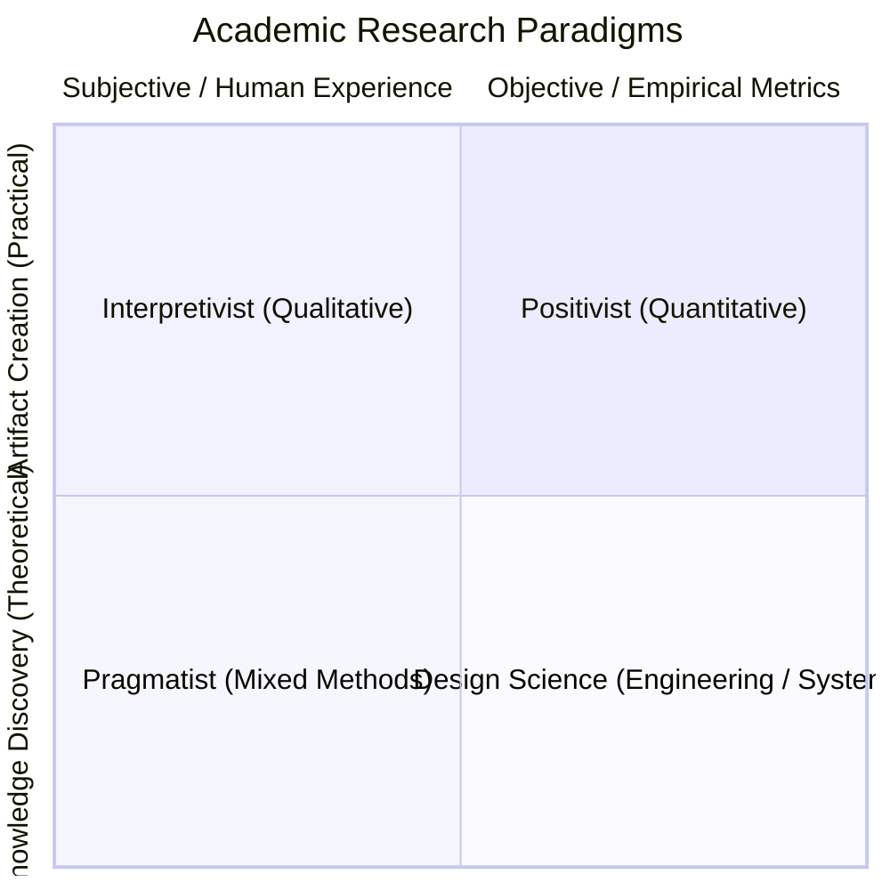

# Paradigm Refraction & Epistemological Stances Reference

When a researcher provides an unrefined, broad idea, the agent must refract the idea across the **Four Academic Epistemological Paradigms** before committing to a research design.

---

## The Four Epistemological Stances

---

### 1. Positivist Paradigm (Quantitative / Deductive)
- **Epistemology**: Objective truth exists independently of the observer and can be measured empirically through observable phenomena.
- **Goal**: Measure causality, correlation, statistical significance, and effect size.
- **Rigor Criteria**: Internal validity, external validity, reliability, statistical power ($\ge 0.80$).
- **Allowed Vocabulary**: *Hypothesis ($H_1, H_0$), statistical significance ($p < 0.05$), effect size (Cohen's $d$), control group, independent/dependent variables, bias.*
- **Banned Misconceptions**: Using qualitative open-ended interviews without structured coding rubrics; making causal claims without controlled baselines.

---

### 2. Interpretivist / Constructivist Paradigm (Qualitative / Inductive)
- **Epistemology**: Reality is socially constructed and understood through human subjective experiences, meanings, and contextual interpretation.
- **Goal**: Unpack *how* and *why* individuals perceive, experience, and navigate phenomena.
- **Rigor Criteria (Lincoln & Guba)**: Credibility (internal validity equivalent), Transferability (external validity equivalent), Dependability (reliability equivalent), Confirmability (objectivity equivalent).
- **Allowed Vocabulary**: *Lived experiences, perceptions, thematic saturation, reflexivity, member-checking, audit trail, thick description.*
- **Banned Vocabulary**: *Statistical power, sample representativeness, objective bias, $p$-values.*

---

### 3. Pragmatist Paradigm (Mixed Methods / Convergent)
- **Epistemology**: Knowledge is judged by what works in practice to solve concrete problems, combining empirical metrics with experiential narratives.
- **Goal**: Triangulate quantitative patterns with qualitative depth.
- **Rigor Criteria**: Multi-method triangulation, explanatory/exploratory sequential design validity.
- **Allowed Vocabulary**: *Triangulation, sequential explanatory design, concurrent mixed methods, qualitative-quantitative divergence.*

---

### 4. Design Science Paradigm (Computational / Engineering)
- **Epistemology**: Knowledge is gained through the creation, iteration, and evaluation of novel artifacts (software, architectures, algorithms, frameworks).
- **Goal**: Solve an identified class of problems with a demonstrable, evaluated artifact.
- **Rigor Criteria (Hevner et al.)**: Design artifact relevance, design evaluation, research rigor, design search process, research contribution.
- **Allowed Vocabulary**: *Artifact, benchmark evaluation, baseline comparison, ablation study, latency/throughput, algorithmic complexity.*

---

## Case Study: Refracting a Raw Idea

### Input Thought:
> *"I want to explore using AI coding assistants for junior developers."*

### Refracted Matrix:

| Paradigm | Formulated Research Question | Required Evidence & Data Collection |
| :--- | :--- | :--- |
| **Positivist** | *"What is the statistically significant effect of LLM autocomplete on unit test coverage and cyclomatic complexity among junior developers?"* | Controlled experiment with randomized A/B developer cohorts, code repository metrics. |
| **Interpretivist** | *"How do junior software engineers experience their sense of professional identity and problem-solving agency when relying on AI generation tools?"* | In-depth semi-structured interviews, thematic analysis, coding transcripts. |
| **Pragmatist** | *"How does LLM code suggestion adoption impact sprint velocity (Quant), and what team dynamics or review bottlenecks emerge as a result (Qual)?"* | Git velocity logs triangulated with developer survey and retrospective feedback. |
| **Design Science** | *"Can a context-aware AST-grounded LLM plugin reduce runtime syntax and type errors in Python by $\ge 20\%$ compared to standard autocomplete baselines?"* | Novel plugin artifact evaluated against standard benchmark repositories and ablation suites. |
