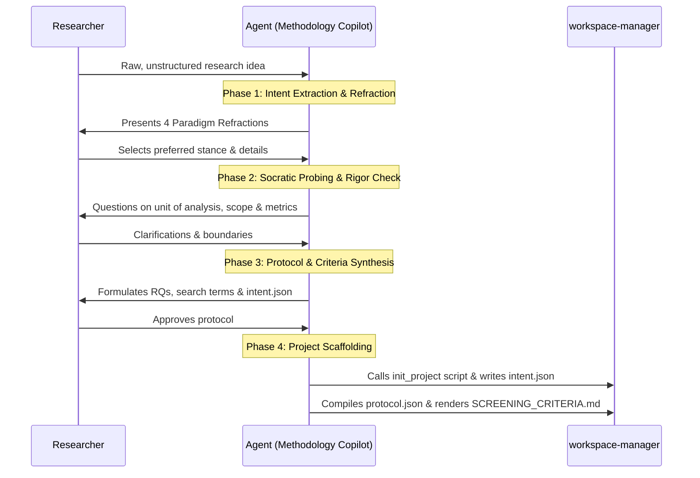

# Socratic Interview Framework & Protocol Formulation

This reference guides the conversational interaction loop between the agent (acting as a Socratic PhD advisor) and the researcher.

---

## 1. The 4-Phase Socratic Loop



---

## 2. Phase-by-Phase Conversational Protocol

### Phase 1: Intent Extraction & Refraction
1. Listen carefully to the user's messy, informal problem description.
2. Identify latent keywords:
   - *Impact, measure, compare, speed* $\to$ Positivist lean.
   - *Experience, perceive, feel, understand* $\to$ Interpretivist lean.
   - *Build, create, algorithm, tool, framework* $\to$ Design Science lean.
3. Present the **Four Refractions Table** side-by-side to illuminate what the research looks like across each paradigm.

### Phase 2: Socratic Probing & Boundary Definition
Once the researcher selects a paradigm, probe on 3 core dimensions:
1. **Unit of Analysis**: What is the discrete entity being studied (individual, code diff, organization, algorithm)?
2. **Gold Standard Evidence**: What specific proof or data must be presented to convince a top-tier peer reviewer?
3. **Boundaries & Scope**: What is explicitly *out of scope* (e.g. non-English studies, pre-2020 papers, proprietary models)?

### Phase 3: Protocol Formulation
Generate a clean research bundle comprising:
- **Research Questions**: 2 to 4 structured, numbered questions (`RQ1`, `RQ2`, `RQ3`).
- **Target Keywords & Boolean Queries**: Formatted for `scholar-search-kit`.
- **Inclusion & Exclusion Criteria**: Formatted as an `IntentPacket` schema in `intent.json`.

### Phase 4: Automated Scaffolding
Invoke the `init_project.py` script from `workspace-manager`:
```bash
uv run python .agents/skills/workspace-manager/scripts/init_project.py "<Project Title>" --slug <project-slug> --description "<Abstract>" --rq "<RQ1>" --rq "<RQ2>" --keyword "<k1>" --keyword "<k2>"
```
Write `intent.json` directly into `workspaces/<project-slug>/intent.json`.
Then compile the deterministic protocol and render criteria:
```bash
scholar-protocol compile workspaces/<project-slug>/intent.json > workspaces/<project-slug>/protocol.json
scholar-protocol render-criteria workspaces/<project-slug>/protocol.json > workspaces/<project-slug>/SCREENING_CRITERIA.md
```
