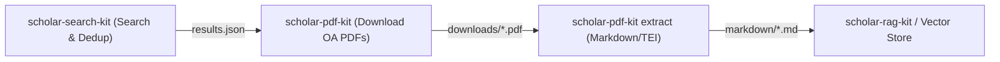

# Pipeline Integration & Downstream RAG Handoff

This guide demonstrates end-to-end integration across `scholar-search-kit`, `scholar-pdf-kit`, and downstream RAG / vector pipelines.

---

## 1. End-to-End Search $\rightarrow$ Download $\rightarrow$ Extract Flow



### Command Line Workflow
```bash
# Step 1: Discover & deduplicate literature
uv run scholar-search search "retrieval augmented generation" --limit 20 --output results.json

# Step 2: Download Open Access PDFs with smart naming
uv run scholar-pdf download --input results.json --output downloads/ --smart-names --export json

# Step 3: Extract structured Markdown for RAG embedding
uv run scholar-pdf extract downloads/ --output markdown/ --engine docling
```

---

## 2. Python Script Automation

```python
import asyncio
from pathlib import Path
from scholar_pdf.downloader import AsyncPDFDownloader
from scholar_pdf.extract import DoclingEngine

async def automated_pipeline(dois: list[str]):
    downloads_dir = Path("my_downloads")
    markdown_dir = Path("my_markdown")
    
    # 1. Download Open Access PDFs
    downloader = AsyncPDFDownloader(output_dir=downloads_dir, use_smart_names=True)
    results = await downloader.download_batch(dois)
    
    # 2. Extract Markdown for successful downloads
    for res in results:
        if res.success and res.file_path:
            md_path = DoclingEngine.extract_markdown(res.file_path, markdown_dir)
            print(f"Extracted: {res.doi} -> {md_path}")
        else:
            print(f"Skipped (Paywalled / Error): {res.doi} -> {res.error_message}")

if __name__ == "__main__":
    asyncio.run(automated_pipeline(["10.1371/journal.pbio.3000246", "10.7717/peerj.4375"]))
```
