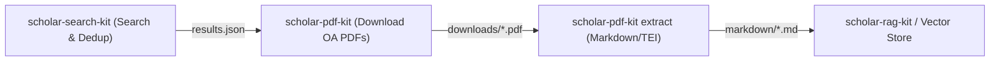

# Pipeline Integration & Downstream RAG Handoff

> **Two lanes.** The commands below use the legacy discovery lane (download +
> raw-path `extract`) for exploration. The **authoritative** lane is parent-bound:
> `scholar-pdf acquire` (WP01-E1) → `scholar-pdf extract-run` (WP01-E2) →
> `scholar-harness extract publish` (harness acceptance). Never cite legacy-lane
> output as a committed acquisition or an accepted extraction.

This guide demonstrates end-to-end integration across `scholar-search-kit`, `scholar-pdf-kit`, and downstream RAG / vector pipelines.

---

## 1. End-to-End Search $\rightarrow$ Download $\rightarrow$ Extract Flow


```mermaid
flowchart LR
    S["scholar-search-kit (Search & Dedup)"] -->|results.json| P["scholar-pdf-kit (Download OA PDFs)"]
    P -->|downloads/*.pdf| E["scholar-pdf-kit extract (Markdown/TEI)"]
    E -->|markdown/*.md| R["scholar-rag-kit / Vector Store"]
```

### Command Line Workflow (legacy discovery lane)

```bash
# Step 1: Discover & deduplicate literature
uv run scholar-search search "retrieval augmented generation" --limit 20 --output results.json

# Step 2: Download Open Access PDFs (outputs land content-addressed: DOC-<32hex>.pdf)
uv run scholar-pdf download --input results.json --output downloads/ --export json

# Step 3: Extract structured Markdown for RAG embedding (non-authoritative)
uv run scholar-pdf extract downloads/ --output markdown/ --engine docling
```

### Authoritative lane (committed, citable)

```bash
# Parent-bound acquisition + extraction, then harness acceptance
uv run scholar-pdf acquire workspaces/<project-slug>/acquisition_run.json \
  --audit-logger .agents/skills/workspace-manager/scripts/log_event.py
uv run scholar-pdf extract-run workspaces/<project-slug>/extraction_run.json \
  --audit-logger .agents/skills/workspace-manager/scripts/log_event.py
uv run scholar-harness extract publish workspaces/<project-slug> --index
```

---

## 2. Python Script Automation

```python
import asyncio
from pathlib import Path
from scholar_pdf.downloader import AsyncPDFDownloader
from scholar_pdf.extract import PyMuPDFEngine

async def automated_pipeline(dois: list[str]):
    downloads_dir = Path("my_downloads")
    markdown_dir = Path("my_markdown")

    # 1. Download Open Access PDFs (content-addressed DOC-<32hex>.pdf outputs)
    downloader = AsyncPDFDownloader(output_dir=downloads_dir)
    results = await downloader.download_batch(dois)

    # 2. Extract Markdown for successful downloads, with citable frontmatter
    for res in results:
        if res.success and res.file_path:
            md_path = PyMuPDFEngine.extract_markdown(
                res.file_path, markdown_dir, metadata={"doi": res.doi}
            )
            print(f"Extracted: {res.doi} -> {md_path}")
        else:
            print(f"Skipped (Unresolved / Error): {res.doi} -> {res.error_message}")

if __name__ == "__main__":
    asyncio.run(automated_pipeline(["10.1371/journal.pbio.3000246", "10.7717/peerj.4375"]))
```
