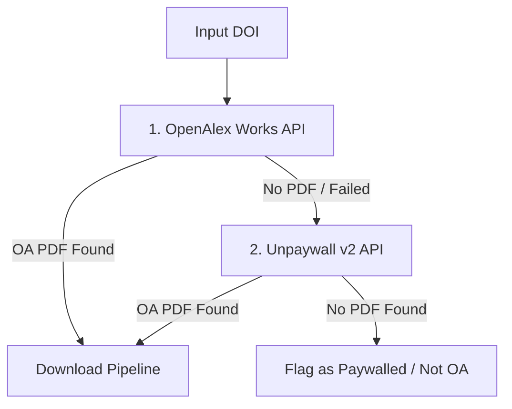

# Open Access Resolution & Download Mechanics

This reference details how `scholar-pdf-kit` resolves DOIs to legal Open Access PDFs, manages concurrent downloading, validates file integrity, and avoids publisher paywalls.

---

## 1. Dual-Engine OA Resolution

The toolkit resolves DOIs through a two-stage discovery fallback:



1. **OpenAlex Resolution**: Queries `https://api.openalex.org/works/https://doi.org/{doi}` using polite `mailto` headers. If `best_oa_location.pdf_url` is present, it is selected.
2. **Unpaywall Fallback**: If OpenAlex has no direct PDF link or fails, queries `https://api.unpaywall.org/v2/{doi}` for `best_oa_location.url_for_pdf`.
3. **Paywall Status**: If neither returns a direct PDF endpoint, the document is flagged as `was_oa=False` ("Not Open Access").

---

## 2. Download Pipeline & Resiliency

Downloads are executed asynchronously using `aiohttp` and `tenacity`:
- **Concurrency Limiting**: Managed via `asyncio.Semaphore(max_concurrent)` (default: 5) to prevent socket starvation and CDN IP blocking.
- **Paywall / HTML Trap Detection**: Inspects the HTTP response header `Content-Type`. If `text/html` is returned (indicating a login portal or publisher paywall redirect), the download is aborted immediately.
- **Exponential Backoff**: Uses `tenacity` with exponential retries (min 2s, max 10s, up to 3 attempts) for transient connection errors and timeouts.
- **Polite User-Agent**: Injects `User-Agent: scholar-pdf-kit/0.1.0 (mailto:{mailto})`.

---

## 3. Magic Byte Integrity Validation

Publisher CDNs occasionally return `200 OK` responses containing error HTML instead of binary PDFs. `scholar-pdf-kit` protects against corrupt files using header signature inspection:

```python
def is_valid_pdf(file_path: Path) -> bool:
    if not file_path.exists() or file_path.stat().st_size < 5:
        return False
    with open(file_path, "rb") as f:
        header = f.read(5)
        return header == b"%PDF-"
```
If magic bytes do not match `%PDF-`, the file is automatically purged from disk (`clean_invalid_pdf`) and marked as failed.
