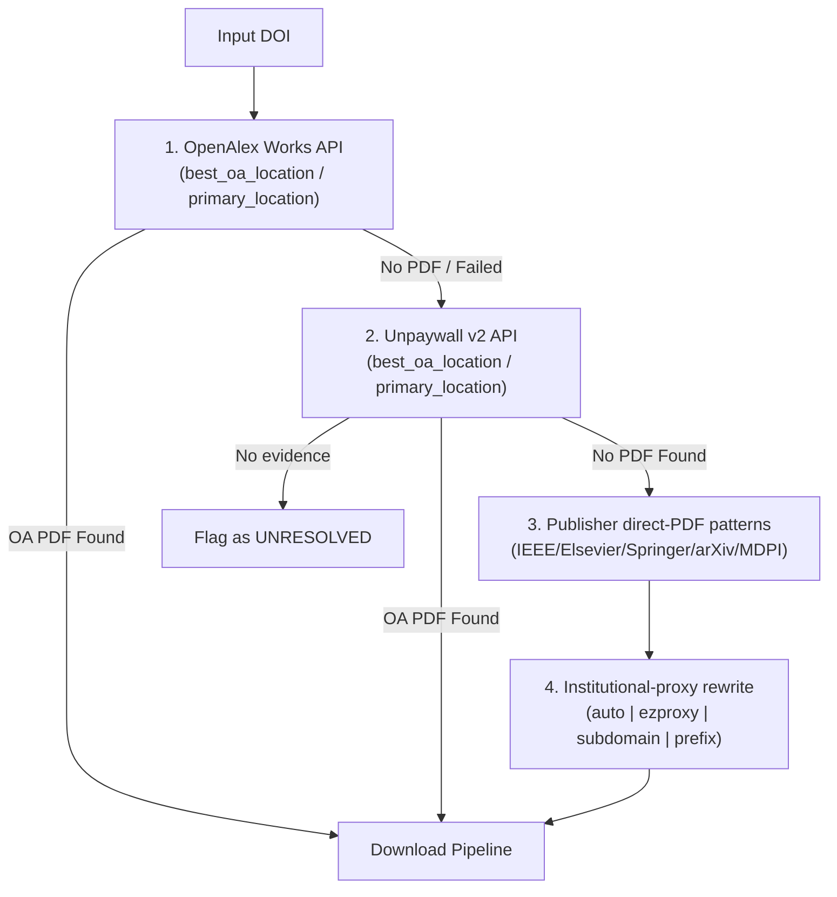

# Open Access Resolution & Download Mechanics

This reference details how `scholar-pdf-kit` resolves DOIs to legal Open Access PDFs, manages concurrent downloading, validates file integrity, and avoids publisher paywalls.

---

## 1. Multi-Stage OA Resolution

The toolkit resolves DOIs through a staged discovery fallback
(`process_doi` in `tools/scholar-pdf-kit/src/scholar_pdf/downloader.py`):


```mermaid
flowchart TD
    DOI["Input DOI"] --> OA["1. OpenAlex Works API\n(best_oa_location / primary_location)"]
    OA -- "OA PDF Found" --> DL["Download Pipeline"]
    OA -- "No PDF / Failed" --> UP["2. Unpaywall v2 API\n(best_oa_location / primary_location)"]
    UP -- "OA PDF Found" --> DL
    UP -- "No PDF Found" --> DIR["3. Publisher direct-PDF patterns\n(IEEE/Elsevier/Springer/arXiv/MDPI)"]
    DIR --> PROX["4. Institutional-proxy rewrite\n(auto | ezproxy | subdomain | prefix)"]
    PROX --> DL
    UP -- "No evidence" --> FAIL["Flag as UNRESOLVED"]
```

1. **OpenAlex Resolution**: Queries `https://api.openalex.org/works/https://doi.org/{doi}` via the search-kit's httpx client. If a location carries `pdf_url`/`url_for_pdf`, it is selected.
2. **Unpaywall Fallback**: If OpenAlex yields no direct PDF link, queries `https://api.unpaywall.org/v2/{doi}` for `url_for_pdf`/`pdf_url`.
3. **Publisher Direct-PDF Patterns**: When enabled (`ENABLE_PUBLISHER_DIRECT_PATTERNS`, default on), computes direct-PDF URLs for known publisher patterns to bypass landing-page blocks.
4. **Institutional Proxy Rewrite**: When a gateway URL is configured (`--proxy`/`PROXY_URL` with `--proxy-style`), proxied variants are appended as extra candidates.
5. **Access Status**: Only explicit provider OA evidence yields `VERIFIED_OPEN_ACCESS`. Anything else is `UNRESOLVED` — never a paywall determination, and HTTP success alone never counts as acquisition (`_provider_access_status` projects evidence, never transport success).

> Authoritative note: raw `download` is the discovery convenience. The **authoritative**
> acquisition path is the parent-bound WP01-E1 `acquire` CLI/API (see SKILL.md) —
> never cite a discovery download as a committed acquisition.

---

## 2. Download Pipeline & Resiliency

Downloads are executed asynchronously using `aiohttp` and `tenacity`:
- **Concurrency Limiting**: Managed via `asyncio.Semaphore(max_concurrent)` (default: 5) to prevent socket starvation and CDN IP blocking.
- **Staged, Validated Promotion**: Bytes stream to a per-candidate temp file; only candidates passing binary validation are atomically promoted to their content-addressed final path (`DOC-<32 hex>.pdf`). Staging files are always unlinked. There is no `Content-Type` header gate — paywall/error HTML is rejected by the signature check below.
- **Exponential Backoff**: Uses `tenacity` with exponential retries (min 2s, max 10s, up to 3 attempts) for transient connection errors and timeouts.
- **Transport Identity**: PDF bytes stream via `aiohttp` with a Chrome user-agent; OA metadata lookups use the search-kit's httpx client with polite `mailto`.

---

## 3. Magic Byte Integrity Validation

Publisher CDNs occasionally return `200 OK` responses containing error HTML instead of binary PDFs. `scholar-pdf-kit` protects against corrupt files using binary signature inspection (`is_valid_pdf` in `tools/scholar-pdf-kit/src/scholar_pdf/validator.py`):

```python
MIN_PDF_SIZE_BYTES = 10 * 1024  # 10 KB floor: block-pages are typically smaller
_HEADER_SCAN = 1024             # versioned header may sit behind leading garbage
_TRAILER_SCAN = 8 * 1024        # %%EOF must appear in the final 8 KB

def is_valid_pdf(file_path: Path) -> bool:
    ...
    if file_path.stat().st_size < MIN_PDF_SIZE_BYTES:
        return False
    head = f.read(_HEADER_SCAN)
    if _HEADER_RE.search(head) is None:   # regex: rb"%PDF-\d+\.\d+"
        return False
    f.seek(max(0, size - _TRAILER_SCAN))
    return b"%%EOF" in f.read(_TRAILER_SCAN)
```

A real PDF must be at least 10 KB, carry a versioned `%PDF-<major>.<minor>` header within the first 1024 bytes, and end with a `%%EOF` trailer within the last 8 KB — deliberately stricter than a 5-byte prefix check, so `%PDF-`-prefixed HTML abuse fails the trailer test. Candidates failing validation are never promoted (staging unlinked). Optional `--strict-validate` adds a pypdf structural parse as a second, encryption-tolerant gate.
