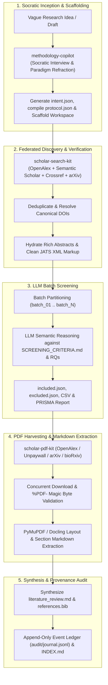

# 🛰️ Nexus-Scholar / Harness-Agri

> **Agent-Native Academic Research & Systematic Literature Inception Harness**  
> An autonomous, audited, multi-tool environment for conducting rigorous academic literature reviews, epistemological problem framing, federated search discovery, Open Access PDF harvesting, full-text extraction, and synthesis.

---

## 🌟 Architecture Overview



---

## 🧠 Specialized Skills & Capabilities

The harness provides six agent-native skills located in `.agents/skills/` (and `.agents/plugins/nexus-scholar/`):

### 1. `methodology-copilot` / `scholar-protocol-kit`
- **Purpose**: Socratic advisor and deterministic protocol compiler. Guides researchers through epistemological paradigm selection (Positivist, Constructivist, Critical Realist, Design Science), research question formulation, PRISMA criteria generation, and compiles `intent.json` into canonical `protocol.json` with SHA-256 fingerprinting.
- **Key CLI**: `uv run scholar-protocol compile -i intent.json -o protocol.json --fingerprint`

### 2. `scholar-search-kit`
- **Purpose**: High-throughput federated search, citation snowballing, deduplication, and PRISMA 2020 screening across OpenAlex, Semantic Scholar, Crossref, and arXiv.
- **Key CLI**: `uv run scholar-search query`, `uv run scholar-search dedup`, `uv run scholar-search verify`, `uv run scholar-search screen`

### 3. `scholar-pdf-kit`
- **Purpose**: Automated Open Access full-text discovery, concurrent downloading, and structured section Markdown extraction with YAML frontmatter.
- **Key CLI**: `uv run scholar-pdf download`, `uv run scholar-pdf extract --engine pymupdf`

### 4. `scholar-rag-kit`
- **Purpose**: Structural AST sectional chunking, local ChromaDB vector indexing, dynamic protocol extraction matrix generation, and grounded synthesis with claim entailment verification.
- **Key CLI**: `uv run scholar-rag index`, `uv run scholar-rag query`, `uv run scholar-rag matrix --protocol protocol.json`, `uv run scholar-rag synthesize`

### 5. `scholar-graph-kit`
- **Purpose**: Constructs citation and co-citation knowledge networks from OpenAlex, computes normalized PageRank centrality metrics, and generates interactive PyVis HTML visualizations.
- **Key CLI**: `uv run scholar-graph build --input included.json --output graph.html --json-output graph.json`, `uv run scholar-graph pagerank graph.json`

### 6. `workspace-manager`
- **Purpose**: Standardized research workspace initialization, data routing, and append-only provenance auditing (`audit/journal.jsonl`).

---

## 🛠️ Prerequisites & Setup

### Requirements
- **Python**: Version `3.11` or higher.
- **Package Manager**: [`uv`](https://github.com/astral-sh/uv) (fast Python package installer and resolver).
- **Git**: Version `2.30` or higher.

### 1. Install `uv`
If `uv` is not yet installed on your system:
```bash
# Windows (PowerShell)
powershell -ExecutionPolicy ByPass -c "irm https://astral.sh/uv/install.ps1 | iex"

# macOS / Linux
curl -LsSf https://astral.sh/uv/install.sh | sh
```

### 2. Clone the Repository
```bash
git clone https://github.com/nexus-scholar-org/nexus-scholar-harness.git
cd nexus-scholar-harness
```

### 3. Install Nexus Scholar Plugins
Plugins are installed into a shared root virtual environment (`.venv`) using the unified installer:

```bash
# Automatic plugin discovery (local checkouts preferred, Git fallback)
python scripts/install_plugins.py

# Or, if you only have Git repos available (no local checkouts):
python scripts/install_plugins.py --git-only

# To force editable installs from local developer checkouts:
python scripts/install_plugins.py --dev-path ~/nexus-scholar-dev

# Clean up legacy per-tool .venv directories (one-time cleanup):
python scripts/install_plugins.py --clean
```

The installer reads `.agents/plugins/nexus-scholar/plugins.json` and:
1. **Searches for local checkouts** in priority order: `--dev-path`, `$NEXUS_PLUGIN_PATH`, `tools/`, `../`, `../../`
2. **Installs editable** (`-e`) if found locally → single source of truth for development
3. **Falls back to Git** if no local checkout exists → uses remote repo at specified branch/tag
4. **Installs in dependency order** → `scholar-search-kit` first, then dependents

After installation, all console scripts are available via `uv run`:
```bash
uv run scholar-protocol --help
uv run scholar-search --help
uv run scholar-pdf --help
uv run scholar-bib --help
uv run scholar-graph --help
uv run scholar-rag --help
uv run scholar-agent --help
```


---

## 🚀 End-to-End Workflow Execution

### Step 1: Scaffold a Research Workspace
Create a structured project directory with `workspace-manager`:
```bash
uv run python .agents/skills/workspace-manager/scripts/init_project.py \
  --title "Your Research Title" \
  --slug "my-research-project" \
  --paradigm "Design Science & Quantitative Benchmark"
```

This generates:
```text
workspaces/my-research-project/
├── intent.json               # Socratic LLM protocol generation intent
├── protocol.json             # Canonical deterministic research protocol
├── SCREENING_CRITERIA.md     # Rendered PRISMA inclusion/exclusion criteria
├── INDEX.md                  # Master project index catalog
├── audit/
│   └── journal.jsonl         # Append-only provenance event ledger
├── exports/                  # CSV and JSON tabular exports
├── pdfs/                     # Harvested Open Access PDFs
├── extracted/                # Full-text structured Markdown extracts
└── synthesis/                # Synthesis report and BibTeX library
```

---

### Step 2: Federated Literature Discovery
Search academic databases using multi-query clusters:
```bash
# Run scholar-search via unified environment
uv run scholar-search query \
  --query "multispectral weed segmentation" \
  --providers openalex semanticscholar crossref arxiv \
  --year-min 2018 \
  --limit 50 \
  --export json \
  --output workspaces/my-research-project/literature/raw_search.json
```

Deduplicate candidates:
```bash
uv run scholar-search dedup \
  --input workspaces/my-research-project/literature/raw_search.json \
  --output workspaces/my-research-project/literature/deduped.json \
  --export csv \
  --csv-output workspaces/my-research-project/exports/search_summary.csv
```

---

### Step 3: Verification & Abstract Hydration
Verify citation authenticity against Crossref and OpenAlex, resolve canonical DOIs, and hydrate full abstracts:
```bash
uv run scholar-search verify \
  --input workspaces/my-research-project/literature/deduped.json \
  --output workspaces/my-research-project/literature/verified.json \
  --export csv \
  --csv-output workspaces/my-research-project/exports/verified_summary.csv
```

---

### Step 4: Semantic LLM Screening
Screen verified candidates against `SCREENING_CRITERIA.md` and research questions using LLM batch evaluation, outputting:
- `literature/included.json` (Eligible papers with assigned RQs and reasoning)
- `literature/excluded.json` (Excluded papers with logged rejection reasons)
- `literature/prisma_screening_report.md` (PRISMA 2020 flow breakdown)
- `exports/screening_decisions.csv` (Full decision spreadsheet)

---

### Step 5: Open Access PDF Harvesting
Download full-text Open Access PDFs concurrently with magic byte validation:
```bash
uv run scholar-pdf download \
  --input workspaces/my-research-project/literature/included.json \
  --output workspaces/my-research-project/pdfs/ \
  --smart-names \
  --export json
```

---

### Step 6: Full-Text Structured Markdown Extraction
Extract section-indexed Markdown documents from harvested PDFs:
```bash
uv run scholar-pdf extract \
  --input workspaces/my-research-project/pdfs/ \
  --output workspaces/my-research-project/extracted/ \
  --engine pymupdf
```

---

### Step 7: Synthesis & BibTeX Library Generation
Synthesize findings into a publication-grade literature review document and export a clean `.bib` file:
- `synthesis/literature_review.md` (Comparative matrices, literature gaps, and baseline positioning)
- `synthesis/references.bib` (Curated BibTeX entries for all included studies)

---

## 📜 Provenance & Audit Ledger

Every action executed in this harness is recorded to `workspaces/<project>/audit/journal.jsonl`. Each entry follows the canonical event schema:

```json
{
  "timestamp": "2026-08-28T19:27:18.546691+00:00",
  "event_id": "EVT-20260828192718-f98507",
  "action": "LITERATURE_SYNTHESIS",
  "agent_or_tool": "methodology-copilot",
  "description": "Generated comprehensive literature review synthesis across 4 RQs and curated BibTeX library.",
  "parameters": {},
  "inputs": ["literature/included.json", "extracted/*.md", "SCREENING_CRITERIA.md"],
  "outputs": ["synthesis/literature_review.md", "synthesis/references.bib"],
  "metrics": {
    "included_studies_synthesized": 129,
    "bibtex_entries_generated": 129,
    "fulltext_extracts_integrated": 20
  },
  "status": "SUCCESS"
}
```

To manually log an event and refresh the master catalog:
```bash
uv run python .agents/skills/workspace-manager/scripts/log_event.py \
  my-research-project \
  --action "CUSTOM_ANALYSIS" \
  --agent "my-tool" \
  --desc "Completed custom evaluation" \
  --inputs "data/input.json" \
  --outputs "results/output.csv"
```

---

## 📁 Repository Structure

```text
nexus-scholar-harness/
├── .agents/
│   ├── plugins/
│   │   └── nexus-scholar/      # Plugin registry manifest & console scripts config
│   └── skills/
│       ├── methodology-copilot/ # Socratic research advisor & criteria generator
│       └── workspace-manager/  # Project scaffolder & audit event logger
├── scripts/
│   └── install_plugins.py      # Unified plugin installer (searches local → Git fallback)
├── brainstorming/              # Research design notes and architecture specs
├── workspaces/                 # Generated research project workspaces
├── .gitignore                  # Ignores generated workspaces and external plugins
├── pyproject.toml              # Harness orchestrator dependencies
└── README.md                   # This documentation file
```

**Note**: External plugin packages (`scholar-search-kit`, `scholar-pdf-kit`, etc.) are **not vendored** in this repository.
They are installed into the shared `.venv/` by `scripts/install_plugins.py`, which supports:
- Local development clones (editable installs) in `tools/` or custom paths
- Remote Git repository fallback
- Single shared environment for all tools (no per-tool virtual environments)

---

## 📄 License & Attribution

Designed and developed for academic research acceleration. Free for academic and open-source use.
