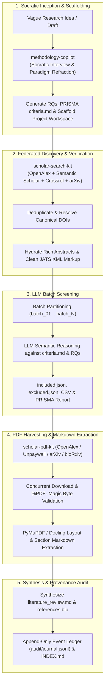

# 🛰️ Nexus-Scholar / Harness-Agri

> **Agent-Native Academic Research & Systematic Literature Inception Harness**  
> An autonomous, audited, multi-tool environment for conducting rigorous academic literature reviews, epistemological problem framing, federated search discovery, Open Access PDF harvesting, full-text extraction, and synthesis.

---

## 🌟 Architecture Overview



---

## 🧠 Specialized Skills & Capabilities

The harness provides four agent-native skills located in `.agents/skills/` (and `.agents/plugins/nexus-scholar/`):

### 1. `methodology-copilot`
- **Purpose**: Socratic advisor that guides researchers through epistemological paradigm selection (Positivist, Constructivist, Critical Realist, Design Science), question refinement, and PRISMA criteria generation.
- **Key Modules**:
  - `paradigm_refraction_guide.md`: Mapping research problems to appropriate methodological designs.
  - `socratic_interview_framework.md`: 4-phase elicitation protocol (Core Tension, Target Artifact, Baseline Contrast, Empirical Protocol).
  - `criteria_generator_spec.md`: Generates structured `criteria.md` with explicit RQ mappings.

### 2. `scholar-search-kit`
- **Purpose**: High-throughput federated search, citation snowballing, deduplication, and verification across 4 academic APIs.
- **Capabilities**:
  - Multi-source query clustering across OpenAlex, Semantic Scholar, Crossref, and arXiv.
  - Title normalization & DOI cluster deduplication.
  - Crossref JATS XML markup tag stripping (`<scp>`, `<i>`, `<b>`) and multiline whitespace normalization.
  - arXiv DataCite DOI fallback resolution via OpenAlex.

### 3. `scholar-pdf-kit`
- **Purpose**: Automated Open Access full-text discovery, concurrent downloading, and structured section Markdown extraction.
- **Capabilities**:
  - Multi-source OA resolution (OpenAlex primary & alternate locations, Unpaywall, bioRxiv/medRxiv CSHL, arXiv direct links).
  - Automatic `%PDF-` magic byte inspection (pruning HTML login/paywall redirect traps).
  - Smart filename formatting: `{year}_{author}_{title}.pdf`.
  - `PyMuPDFEngine` / `DoclingEngine`: Converts PDFs into clean, heading-structured GitHub Markdown with tables and equations preserved.

### 4. `workspace-manager`
- **Purpose**: Standardized research workspace initialization, data routing, and append-only provenance auditing.
- **Capabilities**:
  - Scaffolds canonical project structures under `workspaces/<project_slug>/`.
  - Append-only event journaling in `audit/journal.jsonl` tracking timestamps, actions, agents, inputs, outputs, and metrics.
  - Automatic `INDEX.md` catalog synchronization after every workflow event.

---

## 🛠️ Prerequisites & Setup

### Requirements
- **Python**: Version `3.11` or higher.
- **Package Manager**: [`uv`](https://github.com/astral-sh/uv) (fast Python package installer and resolver).
- **Git**: Version `2.30` or higher.

### 1. Install `uv`
If `uv` is not yet installed on your system:
```bash
# Windows (PowerShell)
powershell -ExecutionPolicy ByPass -c "irm https://astral.sh/uv/install.ps1 | iex"

# macOS / Linux
curl -LsSf https://astral.sh/uv/install.sh | sh
```

### 2. Clone the Repository
```bash
git clone https://github.com/nexus-scholar-org/nexus-scholar-harness.git
cd nexus-scholar-harness
```

### 3. Synchronize Tool Virtual Environments
The harness includes self-contained Python tool packages under `tools/`. Synchronize their dependencies using `uv`:

```bash
# Set up scholar-search-kit
uv sync --project tools/scholar-search-kit

# Set up scholar-pdf-kit
uv sync --project tools/scholar-pdf-kit
```

---

## 🚀 End-to-End Workflow Execution

### Step 1: Scaffold a Research Workspace
Create a structured project directory with `workspace-manager`:
```bash
uv run python .agents/skills/workspace-manager/scripts/init_project.py \
  --title "Your Research Title" \
  --slug "my-research-project" \
  --paradigm "Design Science & Quantitative Benchmark"
```

This generates:
```text
workspaces/my-research-project/
├── project.json              # Project manifest and research questions
├── INDEX.md                  # Master project index catalog
├── audit/
│   └── journal.jsonl         # Append-only provenance event ledger
├── literature/
│   └── criteria.md           # PRISMA inclusion/exclusion criteria
├── exports/                  # CSV and JSON tabular exports
├── pdfs/                     # Harvested Open Access PDFs
├── extracted/                # Full-text structured Markdown extracts
└── synthesis/                # Synthesis report and BibTeX library
```

---

### Step 2: Federated Literature Discovery
Search academic databases using multi-query clusters:
```bash
uv run --project tools/scholar-search-kit python -m scholar_search.cli search \
  --query "multispectral weed segmentation" \
  --providers openalex semanticscholar crossref arxiv \
  --year-min 2018 \
  --limit 50 \
  --export json \
  --output workspaces/my-research-project/literature/raw_search.json
```

Deduplicate candidates:
```bash
uv run --project tools/scholar-search-kit python -m scholar_search.cli dedup \
  --input workspaces/my-research-project/literature/raw_search.json \
  --output workspaces/my-research-project/literature/deduped.json \
  --export csv \
  --csv-output workspaces/my-research-project/exports/search_summary.csv
```

---

### Step 3: Verification & Abstract Hydration
Verify citation authenticity against Crossref and OpenAlex, resolve canonical DOIs, and hydrate full abstracts:
```bash
uv run --project tools/scholar-search-kit python -m scholar_search.cli verify \
  --input workspaces/my-research-project/literature/deduped.json \
  --output workspaces/my-research-project/literature/verified.json \
  --export csv \
  --csv-output workspaces/my-research-project/exports/verified_summary.csv
```

---

### Step 4: Semantic LLM Screening
Screen verified candidates against `criteria.md` and research questions using LLM batch evaluation, outputting:
- `literature/included.json` (Eligible papers with assigned RQs and reasoning)
- `literature/excluded.json` (Excluded papers with logged rejection reasons)
- `literature/prisma_screening_report.md` (PRISMA 2020 flow breakdown)
- `exports/screening_decisions.csv` (Full decision spreadsheet)

---

### Step 5: Open Access PDF Harvesting
Download full-text Open Access PDFs concurrently with magic byte validation:
```bash
uv run --project tools/scholar-pdf-kit python -m scholar_pdf.cli download \
  --input workspaces/my-research-project/literature/included.json \
  --output workspaces/my-research-project/pdfs/ \
  --smart-names \
  --export json
```

---

### Step 6: Full-Text Structured Markdown Extraction
Extract section-indexed Markdown documents from harvested PDFs:
```bash
uv run --project tools/scholar-pdf-kit python -m scholar_pdf.cli extract \
  --input workspaces/my-research-project/pdfs/ \
  --output workspaces/my-research-project/extracted/ \
  --engine pymupdf
```

---

### Step 7: Synthesis & BibTeX Library Generation
Synthesize findings into a publication-grade literature review document and export a clean `.bib` file:
- `synthesis/literature_review.md` (Comparative matrices, literature gaps, and baseline positioning)
- `synthesis/references.bib` (Curated BibTeX entries for all included studies)

---

## 📜 Provenance & Audit Ledger

Every action executed in this harness is recorded to `workspaces/<project>/audit/journal.jsonl`. Each entry follows the canonical event schema:

```json
{
  "timestamp": "2026-08-28T19:27:18.546691+00:00",
  "event_id": "EVT-20260828192718-f98507",
  "action": "LITERATURE_SYNTHESIS",
  "agent_or_tool": "methodology-copilot",
  "description": "Generated comprehensive literature review synthesis across 4 RQs and curated BibTeX library.",
  "parameters": {},
  "inputs": ["literature/included.json", "extracted/*.md", "literature/criteria.md"],
  "outputs": ["synthesis/literature_review.md", "synthesis/references.bib"],
  "metrics": {
    "included_studies_synthesized": 129,
    "bibtex_entries_generated": 129,
    "fulltext_extracts_integrated": 20
  },
  "status": "SUCCESS"
}
```

To manually log an event and refresh the master catalog:
```bash
uv run python .agents/skills/workspace-manager/scripts/log_event.py \
  my-research-project \
  --action "CUSTOM_ANALYSIS" \
  --agent "my-tool" \
  --desc "Completed custom evaluation" \
  --inputs "data/input.json" \
  --outputs "results/output.csv"
```

---

## 📁 Repository Structure

```text
harness-agri/
├── .agents/
│   ├── plugins/
│   │   └── nexus-scholar/      # Bundled plugin manifest & skills
│   └── skills/
│       ├── methodology-copilot/ # Socratic research advisor & criteria generator
│       ├── scholar-search-kit/ # Federated search documentation & skill spec
│       ├── scholar-pdf-kit/    # PDF download & extraction skill spec
│       └── workspace-manager/  # Project scaffolder & audit event logger
├── tools/
│   ├── scholar-search-kit/     # Python package for federated literature search
│   └── scholar-pdf-kit/        # Python package for PDF download & extraction
├── brainstorming/              # Research design notes and architecture specs
├── .gitignore                  # Ignores generated workspaces and scratch files
└── README.md                   # This documentation file
```

---

## 📄 License & Attribution

Designed and developed for academic research acceleration. Free for academic and open-source use.
