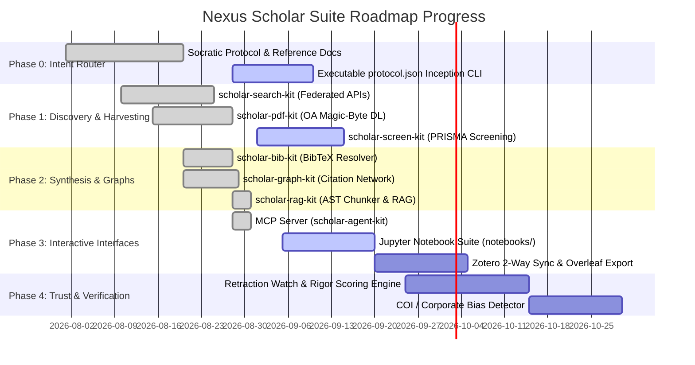

# Nexus Scholar Suite: Roadmap State Assessment & Detailed Task List

> **Document Status:** Active Progress Assessment  
> **Last Updated:** 2026-09-01  
> **Repository Context:** `test-harness-claude-free` (Nexus Scholar Harness)  
> **Reference Specs:** [`OPEN_SCIENCE_ROADMAP_v1.md`](./brainstorming/OPEN_SCIENCE_ROADMAP_v1.md), [`PHASE_0_INTENT_ROUTER_DEEP_DIVE.md`](./brainstorming/PHASE_0_INTENT_ROUTER_DEEP_DIVE.md), [`PHASE_1_DISCOVERY_HARVESTING_DEEP_DIVE.md`](./brainstorming/PHASE_1_DISCOVERY_HARVESTING_DEEP_DIVE.md), [`PHASE_2_SYNTHESIS_KNOWLEDGE_GRAPHS_DEEP_DIVE.md`](./brainstorming/PHASE_2_SYNTHESIS_KNOWLEDGE_GRAPHS_DEEP_DIVE.md), [`PHASE_3_INTERACTIVE_INTERFACES_DEEP_DIVE.md`](./brainstorming/PHASE_3_INTERACTIVE_INTERFACES_DEEP_DIVE.md), [`PHASE_4_VERIFICATION_TRUST_DEEP_DIVE.md`](./brainstorming/PHASE_4_VERIFICATION_TRUST_DEEP_DIVE.md)

---

## 1. Executive Roadmap Dashboard

### Phase Completion Status

| Phase | Focus Area | Status | Maturity | Key Delivered Kits |
| :--- | :--- | :---: | :---: | :--- |
| **Phase 0** | Intent Router & Methodology Inception | 🟡 **70%** | Beta | `methodology-copilot`, `workspace-manager` |
| **Phase 1** | Auditable Discovery & Harvesting | 🟢 **85%** | Production-Ready | `scholar-search-kit`, `scholar-pdf-kit` |
| **Phase 2** | Transparent Synthesis & Graphs | 🟢 **95%** | Production-Ready | `scholar-rag-kit`, `scholar-graph-kit`, `scholar-bib-kit` |
| **Phase 3** | Interactive Interfaces & MCP | 🟡 **50%** | Alpha | `scholar-agent-kit` (MCP Server active) |
| **Phase 4** | Verification & Trust Layers | ⚪ **15%** | Specification | Deep dive spec completed |
| **Phase 5** | Shared Workspaces & No-Code Builder | ⚪ **10%** | Planning | Roadmap architecture defined |

---

## 2. Phase-by-Phase Detailed Breakdown & Task List

### 🎯 Phase 0: Intent Router & Methodology Inception
> **Vision:** Convert raw user curiosity into formal research questions, epistemological paradigms, and machine-readable `research_protocol.json` before querying databases.

- [x] **Socratic Refraction Framework**: Defined 4 paradigms (Positivist, Interpretivist, Design Science, Pragmatist/Mixed) in `methodology-copilot`.
- [x] **Workspace Genesis & Audit Scaffolding**: `init_project.py`, `log_event.py`, `batch_log.py`, `query_project.py` in `workspace-manager`.
- [x] **Rigor & Lexicon Guides**: `paradigm_refraction_guide.md`, `socratic_interview_framework.md`, `criteria_generator_spec.md`.
- [ ] **Task 0.1: Interactive Inception CLI (`scholar-inception`)**: Build an interactive CLI tool (`scholar-inception start`) prompting the user through the 4-stage Socratic interview.
- [ ] **Task 0.2: Machine-Readable `protocol.json` Generator**: Formalize JSON schema emission containing RQs, boolean query clusters, target databases, and inclusion/exclusion criteria.
- [ ] **Task 0.3: Research Playbook Archetypes**: Implement preset protocol templates for SLR (PRISMA 2020), Scoping Review (JBI), Rapid Evidence Assessment (REA - 48h), and Dissertation Starter.

---

### 🔍 Phase 1: Auditable Research Discovery & Harvesting
> **Vision:** Multi-database search, deterministic entity deduplication, automated PRISMA screening, and resilient Open Access PDF harvesting.

- [x] **Federated Multi-Provider Search**: `scholar-search-kit` queries OpenAlex, Semantic Scholar, Crossref, arXiv, PubMed, bioRxiv.
- [x] **Deterministic Deduplication**: Persistent ID matching (DOI, PMID, arXiv) + $\ge 97\%$ fuzzy title normalization.
- [x] **Open Access PDF Harvesting**: `scholar-pdf-kit` with concurrent `aiohttp` downloading and `%PDF-` magic-byte verification.
- [x] **Structured Layout Extraction**: Docling & PyMuPDF integration converting PDFs to structured Markdown.
- [ ] **Task 1.1: Automated PRISMA Title/Abstract Screening Engine (`scholar-screen-kit`)**:
  - LLM-powered batch screening classifying candidates against `criteria.md`.
  - Machine-readable exclusion logging with explicit reason codes (`EXC-01`, `EXC-02`).
  - Automated PRISMA 2020 flow chart generator (`prisma_screening_report.md`).
- [ ] **Task 1.2: Backward & Forward Citation Snowballing**:
  - Implement 1-to-2 hop reference list and citation traversal directly in `scholar-search-kit`.

---

### 🧠 Phase 2: Transparent Synthesis & Knowledge Graphs
> **Vision:** Grounded RAG with structural AST sectional chunking, hybrid citation graph PageRank boosting, atomic citation tokens, and methodology comparison matrices.

- [x] **Structural AST Sectional Chunker**: `MarkdownChunker` with heading hierarchy breadcrumbs, section categorization, and size guards.
- [x] **Methodology Metadata Tagging**: Integrates `references.bib` into ChromaDB with deterministic upserts (`collection.upsert`).
- [x] **Hybrid Graph-Boosted Retrieval**: $\text{Score} = \text{CosineSim}(q, d) + \alpha \cdot \text{PageRank}(d) + \beta \cdot \mathbb{I}_{\text{seed}}(d)$.
- [x] **Grounded Synthesis & Entailment Verifier**: `GroundedSynthesisEngine` with `[WORKSPACE#SECTION#CHUNK_ID]` tokens and `VERIFIED`/`AMBIGUOUS`/`UNSUPPORTED` status.
- [x] **7-Dimension Cross-Study Methodology Matrix**: `generate_methodology_matrix` exporting `matrix.md` and `matrix.json`.
- [x] **Citation Graph Cartography**: `scholar-graph-kit` interactive D3/PyVis network visualizer (`map.html`).
- [x] **BibTeX Resolution & Linting**: `scholar-bib-kit` parsing, cleaning, and resolving missing metadata from Crossref.
- [ ] **Task 2.1: Dialectical Consensus & Disagreement Cartographer**:
  - Group synthesized claims into high consensus ($\ge 75\%$), active debates, and declared evidence gaps in `consensus_map.md`.

---

### 💻 Phase 3: Interactive Research Interfaces & Ecosystem Integrations
> **Vision:** Conversational agent integration, reproducible Jupyter notebooks, production CLI harness, and reference manager sync.

- [x] **MCP Server (`scholar-agent-kit`)**: Exposes `nexus_discover`, `nexus_bib_clean`, `nexus_extract_pdf`, `nexus_rag_index`, `nexus_rag_query`, `nexus_rag_synthesize`, `nexus_graph_build`.
- [ ] **Task 3.1: Reproducible Jupyter Notebook Suite (`notebooks/`)**:
  - `00_research_inception.ipynb`: Interactive Socratic interview & protocol builder with IPyWidgets.
  - `01_federated_discovery_and_screening.ipynb`: Live multi-DB search, visual dedup grid, and interactive PRISMA screening.
  - `02_grounded_synthesis_and_matrices.ipynb`: ChromaDB RAG explorer, pandas comparison matrix, and claim entailment reviewer.
  - `03_knowledge_graph_and_cartography.ipynb`: PyVis interactive citation graph with Louvain community clusters.
- [ ] **Task 3.2: Reference Manager Sync (Zotero)**:
  - Two-way sync with Zotero Web API: exports included papers with PDF attachments and standardized citation keys; imports user libraries as seeds.
- [ ] **Task 3.3: Overleaf / Typst Export Bridge**:
  - Git-backed export pushing synthesized literature review draft and canonical `.bib` directly to Overleaf.

---

### 🛡️ Phase 4: Verification & Trust Layers
> **Vision:** Automated retraction checking, methodology rigor scoring, conflict of interest detection, and replication tracking.

- [x] **Phase 4 Specification**: Complete architectural design in `PHASE_4_VERIFICATION_TRUST_DEEP_DIVE.md`.
- [ ] **Task 4.1: Retraction Watch & Provenance Checker**:
  - Crossref Event Data and OpenAlex retraction API auditor flagging retracted papers and corrigenda.
- [ ] **Task 4.2: Automated Methodology Rigor Scorer**:
  - Multi-paradigm quality heuristics (study design hierarchy, sample size, power analysis, Lincoln & Guba qualitative trustworthiness).
- [ ] **Task 4.3: Open Science & Reproducibility Auditor**:
  - AST scanner detecting Data Availability Statements (DAS) with persistent DOIs, Code Availability Statements (CAS) with public git repos, and study preregistration numbers.
- [ ] **Task 4.4: Funding & Corporate Conflict of Interest (COI) Detector**:
  - Parses disclosure sections to classify commercial bias risk and annotate claims with warning badges (`[SCI-XXXX ⚠️ Industry Sponsored]`).
