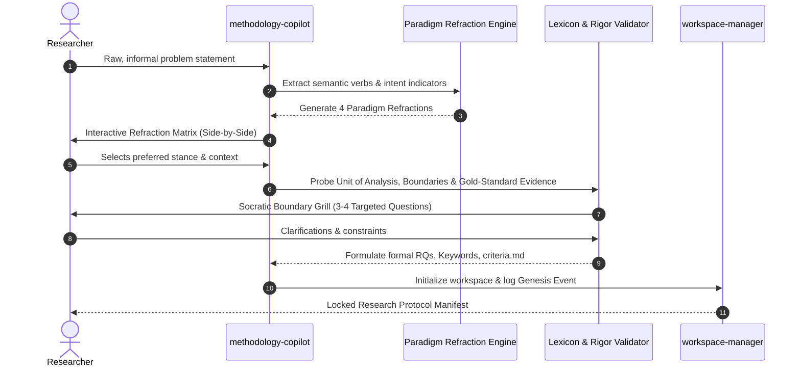
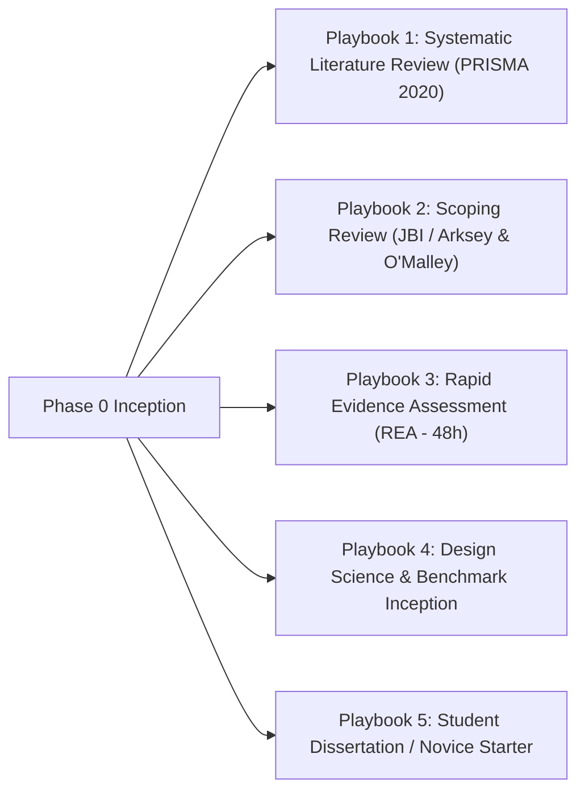
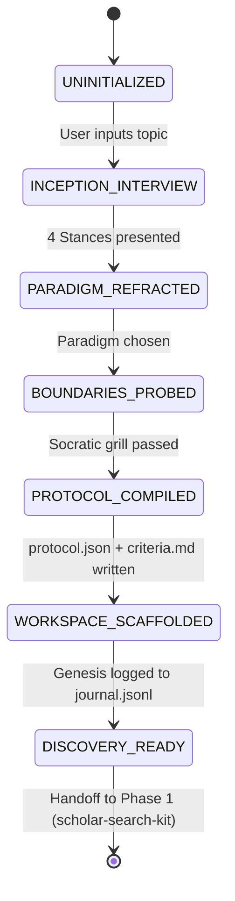

# Phase 0 Deep Dive & Architectural Propositions: Intent Router & Methodology Inception

> **Vision:** Transform raw, unstructured research curiosity into deterministic, auditable, and methodologically sound project blueprints before any searching begins.  
> **Status:** Proposal & Architectural Specification  
> **Date:** 2026-08-30  
> **Version:** 1.0.0  

---

## 1. Executive Vision & The "Blank Page" Problem

### 1.1 The Core Epistemological Bottleneck
Current academic research tools (Google Scholar, PubMed, Consensus, Scopus) assume the researcher arrives with:
1. A well-defined, testable research question.
2. A conscious understanding of their epistemological paradigm (e.g., Positivist, Interpretivist, Design Science).
3. A calibrated set of inclusion/exclusion criteria.
4. An understanding of what constitutes valid proof in their domain.

In practice, **90% of students, early-career researchers, and cross-domain practitioners start with fuzzy curiosity** (e.g., *"How does AI impact healthcare?"* or *"What are climate tech solutions?"*). If fed directly into search engines, this produces thousands of disjointed papers, scope paralysis, and low-rigor synthesis.


### 1.2 Phase 0 Invariants
1. **Idempotency**: Given identical interview responses, the intent router generates identical research questions, boolean search clusters, and `criteria.md` specifications.
2. **Auditability**: The full transcript, chosen paradigm, rejected refractions, and reasoning are immutably recorded in `workspaces/<slug>/audit/journal.jsonl`.
3. **Pedagogical Empowerment**: The system does not simply execute tasks; it actively educates the researcher on *why* specific methodological constraints exist.

---

## 2. Proposition 0.1: The 4-Stage Socratic Inception Engine (`methodology-copilot`)

We formalize the Socratic Inception into four sequential conversational stages:



### Stage 1: Latent Intent & Semantic Mining
The user enters a raw prompt without requiring academic jargon. The engine analyzes verbs and semantic constructs to detect latent leanings:
* **Positivist Indicators**: *impact, measure, correlation, effect size, optimize, benchmark, benchmark accuracy, compare statistically*.
* **Interpretivist / Constructivist Indicators**: *experience, perceive, understand, lived experience, cultural nuance, sense-making*.
* **Design Science Indicators**: *build, construct, prototype, pipeline, architecture, harness, benchmark suite*.
* **Critical Realist / Pragmatic Indicators**: *under what conditions, mechanisms, organizational friction, socio-technical tradeoffs*.

### Stage 2: The 4-Way Paradigm Refraction Grid
Instead of asking *"What is your paradigm?"*, the engine renders a **Refraction Matrix** showing how their raw curiosity manifests across 4 distinct paradigms:

#### Example: Raw Input = *"I want to study developer productivity with AI tools"*

| Paradigm | Epistemological Goal | Sample Refined Research Question (RQ) | Required Primary Evidence | Disallowed / Incompatible Concepts |
| :--- | :--- | :--- | :--- | :--- |
| **Positivist (Quantitative)** | Measure objective, generalizable statistical effects. | *“What is the statistically significant impact of LLM autocompletion on developer cyclomatic complexity and unit test pass rates across 500 mid-level Python engineers?”* | Quantitative telemetry, git diff metrics, commit velocity, controlled A/B test logs. | Subjective emotional state as primary proof; non-replicable anecdotes. |
| **Interpretivist (Qualitative)** | Understand human meaning, perceptions, and identity. | *“How do senior software architects perceive the shift in their sense of authorial ownership and intellectual agency when integrating generative AI into code reviews?”* | Semi-structured interviews, thematic coding, contextual inquiry transcripts. | Statistical p-values, claims of global generalizability, arbitrary numerical scoring. |
| **Design Science (Computational)** | Engineer a novel artifact that solves an operational utility problem. | *“Can a context-aware structural RAG plugin reduce hallucinated library calls in Python IDEs by ≥20% compared to baseline Copilot autocompletion?”* | Benchmark suites, ablation studies, latency profiling, error rate delta. | Mere descriptive opinion without an evaluated computational artifact. |
| **Pragmatist / Mixed Methods** | Solve a socio-technical problem by triangulating metrics with narratives. | *“To what extent do AI coding tools accelerate commit frequency (Quant), and what friction mechanisms emerge during team PR reviews (Qual)?”* | Triangulated telemetry data + post-sprint retrospective interview coding. | Purely theoretical models without empirical grounding in practice. |

### Stage 3: Socratic Boundary Grill & Lexicon Enforcement
Once the researcher selects their path, the engine asks **3 to 4 non-negotiable probing questions**:
1. **Unit of Analysis**: *"What is the atomic unit being observed? (A developer, a commit diff, a team, an LLM token output, an enterprise organization)?"*
2. **Gold Standard Proof**: *"What specific artifact or metric would convince a top-tier peer reviewer that your finding is true?"*
3. **Explicit Negative Scope (Exclusion)**: *"What is strictly out of scope? (e.g., proprietary closed-source models, pre-2022 studies, non-English publications, student hobby projects)?"*
4. **Lexicon Constraint Enforcement**: If the user chose *Interpretivist*, the engine enforces Lincoln & Guba trustworthiness terms (*Credibility, Transferability, Dependability, Confirmability*) and flags misuse of Positivist terms (*"Internal Validity"*, *"Sample Randomization"*).

### Stage 4: Protocol & Question Synthesis
The engine synthesizes a finalized, numbered question suite (`RQ1`, `RQ2`, `RQ3`), maps each RQ to target search facets, and generates machine-executable inclusion/exclusion logic.

---

## 3. Proposition 0.2: Machine-Readable Research Protocol Schema (`protocol.json`)

To ensure complete downstream automation for `scholar-search-kit` and `scholar-pdf-kit`, Phase 0 outputs a standardized `research_protocol.json` alongside human-readable `criteria.md`.

```json
{
  "$schema": "https://nexus-scholar.org/schemas/v1/protocol.json",
  "protocol_id": "proto-20260830-ai-dev-productivity",
  "version": "1.0.0",
  "created_at": "2026-08-30T22:45:00Z",
  "project_slug": "ai-developer-productivity-slr",
  "metadata": {
    "title": "Impact of Generative AI on Developer Productivity & Code Quality",
    "lead_researcher": "Researcher",
    "target_venue_type": "Journal / Conference (PRISMA-compliant)",
    "timeline_weeks": 6
  },
  "epistemology": {
    "primary_paradigm": "Design Science",
    "secondary_paradigm": "Positivist",
    "trustworthiness_framework": "Hevner Design Science Research Guidelines",
    "unit_of_analysis": "Software code contributions & developer task completion"
  },
  "research_questions": [
    {
      "id": "RQ1",
      "text": "What automated metrics are currently utilized to benchmark LLM code generation quality in empirical literature?",
      "target_facet": "evaluation_metrics",
      "synthesis_type": "Taxonomy / Categorization"
    },
    {
      "id": "RQ2",
      "text": "What is the measured delta in completion time and defect density when using context-aware RAG assistants?",
      "target_facet": "empirical_benchmark",
      "synthesis_type": "Comparative Matrix"
    }
  ],
  "search_strategy": {
    "core_concepts": [
      {
        "concept": "Generative AI Code Assistants",
        "synonyms": ["LLM code completion", "AI pair programmer", "Copilot", "neural code synthesis"]
      },
      {
        "concept": "Developer Productivity & Quality",
        "synonyms": ["defect density", "cyclomatic complexity", "time-to-complete", "code churn"]
      }
    ],
    "target_databases": ["openalex", "semanticscholar", "arxiv", "crossref"],
    "date_range": {
      "start_year": 2021,
      "end_year": 2026
    },
    "language": ["en"],
    "open_access_preferred": true
  },
  "screening_criteria": {
    "inclusion": [
      {"id": "INC-01", "criterion": "Empirical study measuring code generation quality or developer time on task", "maps_to_rq": ["RQ1", "RQ2"]},
      {"id": "INC-02", "criterion": "Evaluates LLMs (>= 7B parameters) or commercial coding assistants", "maps_to_rq": ["RQ1"]},
      {"id": "INC-03", "criterion": "Provides open benchmark data or verifiable quantitative metrics", "maps_to_rq": ["RQ2"]}
    ],
    "exclusion": [
      {"id": "EXC-01", "criterion": "Opinion pieces, blog summaries, or non-peer-reviewed short editorials (< 4 pages)"},
      {"id": "EXC-02", "criterion": "Studies focusing purely on natural language translation without code evaluation"},
      {"id": "EXC-03", "criterion": "Duplicate reports or superseded preprints"}
    ]
  }
}
```

---

## 4. Proposition 0.3: Domain-Specific Protocol Archetypes (The 5 Research Playbooks)



### Playbook 1: Systematic Literature Review (SLR)
* **Audience**: Doctoral researchers, academic journal authors.
* **Standard**: Strict **PRISMA 2020** compliance.
* **Characteristics**: Exhaustive multi-database search (target 500–2,000 papers), 2-stage screening (Title/Abstract $\to$ Full Text), append-only exclusion logging with exact reason codes (`EXC-01`, `EXC-02`).

### Playbook 2: Scoping Review
* **Audience**: Policy makers, research grant writers, lab directors.
* **Standard**: **JBI (Joanna Briggs Institute) / Arksey & O’Malley framework**.
* **Characteristics**: Broad thematic landscape mapping, conceptual overlap detection, knowledge gap identification, visual bibliometric clusters.

### Playbook 3: Rapid Evidence Assessment (REA)
* **Audience**: Industry practitioners, tech leads, healthcare executives.
* **Standard**: Time-bounded (24–72 hour turnaround).
* **Characteristics**: High-precision semantic filtering, top 30–50 high-impact papers, immediate synthesis matrix of consensus vs disagreement.

### Playbook 4: Design Science & Benchmark Inception
* **Audience**: AI/ML engineers, systems researchers.
* **Standard**: **Hevner Design Science Research (DSR)** framework.
* **Characteristics**: Artifact utility evaluation, baseline contrast matrix, dataset benchmark taxonomy, ablation test planning.

### Playbook 5: Student Thesis & Novice Literature Review
* **Audience**: Undergraduate / Master's students writing their first literature review.
* **Standard**: Pedagogical guided workflow.
* **Characteristics**: Step-by-step Socratic explanations, jargon translation, scaffolded thesis section drafting (`background.md`, `related_work.md`).

---

## 5. Proposition 0.4: Workspace Inception & State Machine Topology

When Phase 0 completes, it triggers `workspace-manager` to instantiate a standardized workspace layout:

```
workspaces/<project_slug>/
├── project.json                 # Top-level workspace metadata & active state
├── protocol.json                # Machine-readable Phase 0 protocol
├── INDEX.md                     # Auto-synchronized workspace catalog
├── literature/
│   ├── criteria.md              # Human-readable PRISMA screening criteria
│   ├── research_intent.json     # Socratic interview transcript & paradigm decisions
│   └── queries.json             # Formatted search strings for APIs
├── audit/
│   └── journal.jsonl            # Append-only ledger starting with GENESIS event
├── data/                        # Discovery & screening results (Phase 1)
│   ├── raw/
│   ├── processed/
│   └── batches/
└── papers/                      # Harvested PDFs & Markdown (Phase 1)
    ├── pdfs/
    └── extracted/
```

### The State Machine Lifecycle


### The Immutable Genesis Event in `audit/journal.jsonl`
```json
{
  "event_id": "evt-000000-genesis",
  "timestamp": "2026-08-30T22:50:00Z",
  "action": "WORKSPACE_GENESIS",
  "agent": "methodology-copilot",
  "version": "1.0.0",
  "input": {
    "raw_query": "I want to study developer productivity with AI tools",
    "selected_paradigm": "Design Science",
    "playbook": "PRISMA_SLR"
  },
  "output": {
    "project_slug": "ai-developer-productivity-slr",
    "protocol_hash": "sha256:7f83b1657ff1fc53b92dc18148a1d65dfc2d4b1fa3d677284addd200126d9069",
    "num_rqs": 2,
    "num_criteria": 6
  },
  "rationale": "Researcher locked Design Science paradigm focusing on artifact benchmark comparison."
}
```

---

## 6. Proposition 0.5: Multi-Modal Interface Experiences

### Modality A: Interactive CLI Harness (`scholar-harness`)
A terminal wizard with rich ASCII cards and interactive selection menus:
```bash
$ scholar-harness init "climate tech solutions" --interactive
? Analyzing latent intent... Detected: [Positivist 65%, Design Science 35%]
? Select your Research Stance:
  ❯ 1) Positivist (Statistical & Quant Impact)
    2) Interpretivist (Human Experience & Perceptions)
    3) Design Science (Building & Benchmarking Solutions)
    4) Pragmatist / Mixed Methods (Triangulated Strategy)

? Probing Unit of Analysis:
  [1] Carbon capture facilities
  [2] Grid battery storage systems
  [3] Enter custom unit of analysis: _
```

### Modality B: Conversational Chat & Web UI
* Side-by-side interactive refraction cards.
* Visual slider for rigor vs speed trade-offs (e.g., "48h Rapid Assessment" vs "6-Week Journal SLR").
* One-click "Lock Protocol" button that generates the workspace breadcrumb.

### Modality C: Guided Jupyter Inception Notebook
* `00_research_inception.ipynb`: A runnable notebook with interactive `ipywidgets` for researchers who prefer a Python environment.
* Runs the Socratic loop inside notebook cells and visualizes the search term Boolean graph.

---

## 7. Edge Cases, Failure Modes & Guardrails

| Failure Mode / Edge Case | Risk | Proposed Guardrail in Phase 0 |
| :--- | :--- | :--- |
| **"Grandiosity Trap" (Overly Broad Scope)** | User asks to research *"All of AI in Healthcare"* ($\to$ 500,000+ papers). | **Scope Limiter Heuristic**: The copilot flags scope explosion and forces a choice of (a) specific disease class, (b) specific clinical modality, or (c) specific time window (e.g., 2024–2026). |
| **Methodology-Data Incompatibility** | User selects *Positivist* but can only access qualitative interviews or subjective blogs. | **Feasibility Interlock**: The Socratic probe specifically tests whether quantitative ground-truth data exists for their chosen unit of analysis before allowing protocol locking. |
| **Paradigm Drift / Mixed Metaphors** | User attempts to measure statistical p-values on subjective phenomenology interviews. | **Lexicon Linter**: The copilot detects terminology violations and prompts the user to either split into a formal Mixed Methods study or adopt appropriate qualitative rigor terms. |
| **Non-Academic Practitioner Intent** | User just wants a quick decision matrix for an engineering team, not an academic paper. | **Playbook Fast-Path**: Routes the user directly to *Playbook 3 (Rapid Evidence Assessment)*, skipping academic PRISMA overhead. |

---

## 8. Summary of Decision Framework

| Strategic Question | Recommendation | Rationale |
| :--- | :--- | :--- |
| **Protocol Schema Depth** | Full JSON Schema with RQ $\leftrightarrow$ Criteria mapping | Guarantees machine-readability for automated LLM screening in Phase 1. |
| **Playbook Coverage** | 5 Core Archetypes (SLR, Scoping, REA, DSR, Student Thesis) | Covers 95% of researcher use cases from novice to PhD. |
| **Lexicon Strictness** | Socratic Advisory with strict warning gates | Guides users toward academic rigor without causing friction or frustration. |
| **Initial Flagship Interface** | CLI Harness + Jupyter Notebook | Fastest path to validation with no web server dependencies. |
