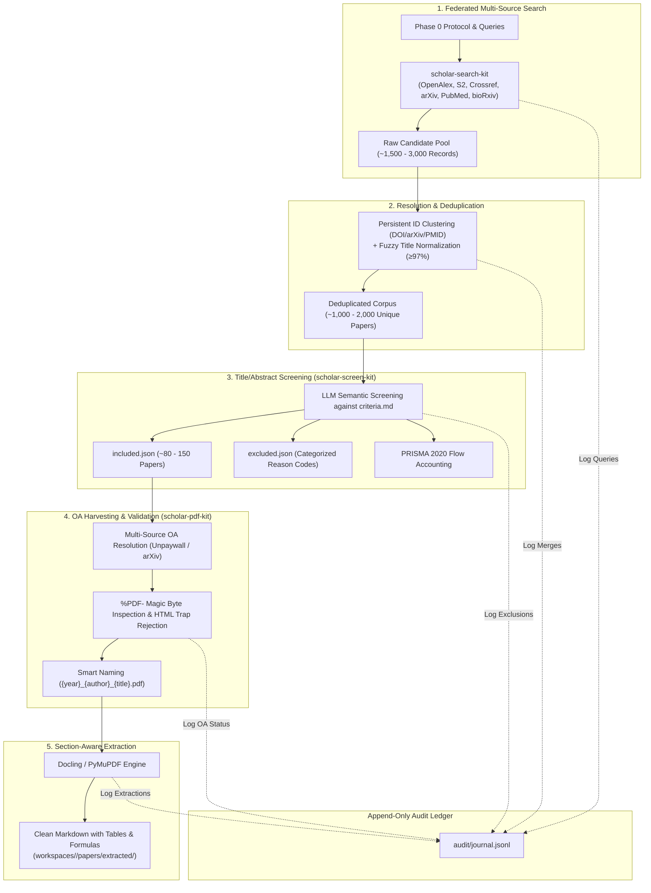
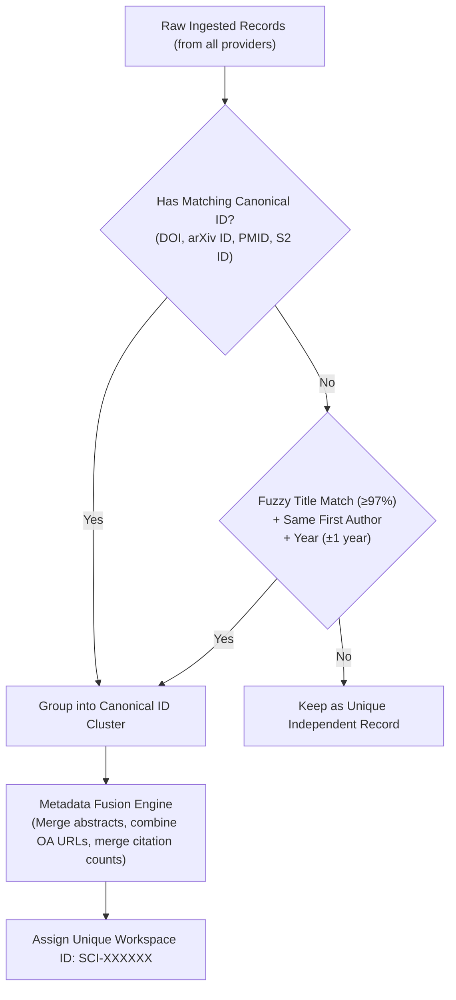
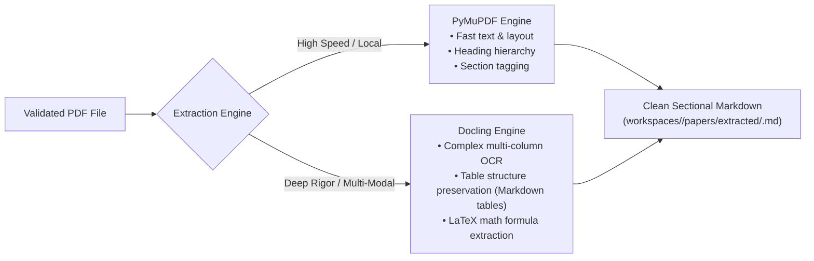

# Phase 1 Deep Dive & Architectural Propositions: Auditable Research Discovery & Harvesting

> **Vision:** Execute federated, multi-database academic search, deterministic deduplication, automated PRISMA screening, and resilient Open Access PDF harvesting with an immutable audit ledger.  
> **Status:** Proposal & Architectural Specification  
> **Date:** 2026-08-30  
> **Version:** 1.0.0  

---

## 1. Executive Vision & The Discovery Pipeline Paradox

### 1.1 The Recall vs. Extraction Paradox
In academic research, discovering literature involves a fundamental tension:
* **High Recall**: Querying multiple scholarly databases yields hundreds or thousands of candidate records ($1,000 - 5,000$ DOIs).
* **Extraction Cost**: Downloading full-text PDFs and running deep layout extraction (e.g., Docling, Grobid) is computationally intensive and network-heavy.

Passing all raw search results directly into PDF harvesting causes massive network waste, paywall trap failures, and unorganized text dumps. 

Phase 1 solves this by implementing an **audited, staged funnel**:


### 1.2 Phase 1 Architectural Invariants
1. **Deterministic Replay**: Running the same search query against a frozen timestamp snapshot yields identical deduplication hashes.
2. **Provenance Integrity**: Every paper in the workspace retains its full source lineage (which provider returned it, original query strings, raw provider IDs).
3. **PRISMA Traceability**: Every excluded paper is assigned an explicit, machine-readable exclusion code (`EXC-01`, `EXC-02`, etc.) and short reasoning.
4. **Binary-Level OA Safety**: All downloads are validated via `%PDF-` binary magic bytes, rejecting paywall redirects, login walls, and CAPTCHA HTML traps.

---

## 2. Proposition 1.1: Federated Multi-Source Search Engine (`scholar-search-kit`)

### 2.1 Provider Architecture & Dialect Translation
Scholarly databases use radically different query syntax, field naming, and rate limits. The `scholar-search-kit` query compiler translates the unified `search_strategy` from Phase 0 `protocol.json` into provider-specific dialects:

| Provider | Ingestion Protocol | Strengths & Role | Dialect / Quoting Strategy | Rate Limits & Headers |
| :--- | :--- | :--- | :--- | :--- |
| **OpenAlex** | REST API (`/works`) | Massive multidisciplinary graph, rich concept tagging, OA URL discovery. | Filter-based: `filter=default.search:...` + `from_publication_date:...` | 10 req/sec (Polite pool with `mailto:`). |
| **Semantic Scholar (S2)** | REST API (`/graph/v1`) | Strong AI/CS citation graphs, TLDRs, embedding vectors. | Lucene-style: `query=...&fields=title,abstract,authors,citationCount` | 1 req/sec (Free tier) or 100 req/sec (Partner). |
| **Crossref** | REST API (`/works`) | Authoritative DOI registration agency, metadata verification, JATS abstracts. | Query params: `query.bibliographic=...&filter=type:journal-article` | 50 req/sec (Polite pool with User-Agent). |
| **arXiv** | Atom / XML API | State-of-the-art preprints in CS, AI, Physics, Math. | Boolean prefix: `ti:... AND abs:...` | 1 req / 3 sec (Strict adherence). |
| **PubMed (NCBI)** | E-Utilities / BioC | Gold standard for biomedical, clinical, and life sciences. | MeSH terms + Boolean: `("term"[Title/Abstract])` | 3 req/sec (No key) / 10 req/sec (API Key). |
| **bioRxiv / medRxiv** | CSHL REST API | Biomedical and clinical preprints. | Date-window chunking + DOI resolution. | Standard polite polling. |

### 2.2 Abstract Hydration & JATS XML Sanitization
Crossref and PubMed often return abstracts contaminated with JATS XML markup (e.g., `<jats:sec>`, `<jats:title>`, `<i>`, `<b>`, `<sup>`, `&amp;`). 
* The engine runs a deterministic sanitization pipeline:
  1. Strips all structural XML/HTML tags while preserving inline math formulas.
  2. Decodes all named and numeric XML entities (`&amp;` $\to$ `&`, `&lt;` $\to$ `<`).
  3. Collapses multiline non-semantic whitespace and indentation artifacts.

### 2.3 Citation Snowballing (Forward & Backward Graphs)
To uncover seminal papers missed by keyword search:
* **Backward Snowballing**: Traverses reference lists of seed papers (`openalex.referenced_works` or Crossref references).
* **Forward Snowballing**: Traverses citations (`openalex.cited_by_api_url` or Semantic Scholar citations).
* **Graph Pruning**: Snowballing depth is capped at 1 or 2 hops, filtering by citation count threshold ($\ge N$) and year constraints to prevent exponential explosion.

---

## 3. Proposition 1.2: Deterministic Deduplication & Entity Resolution

When pulling from 4+ databases, 30% to 50% of results are duplicates. Deduplication must be deterministic, auditable, and non-destructive.



### 3.1 The Two-Tier Deduplication Cascade
1. **Tier 1: Canonical Persistent Identifiers (PID)**
   - Normalizes DOIs to lowercase ASCII strings (e.g., `https://doi.org/10.1145/12345.6789` $\to$ `10.1145/12345.6789`).
   - Normalizes arXiv IDs (e.g., `arXiv:2305.18290v2` $\to `2305.18290`).
   - Normalizes PubMed PMIDs and OpenAlex Work IDs.
2. **Tier 2: Fuzzy Lexical Normalization**
   - Strips all punctuation, accents, diacritics, and casing from titles.
   - Computes Token Set Ratio / Levenshtein Distance (threshold $\ge 97\%$).
   - Validates that normalized first author surnames match and publication year differs by at most $\pm 1$ year (to account for preprint $\to$ publication delay).

### 3.2 Non-Destructive Metadata Fusion
When merging duplicates, the engine does not discard information; it creates a fused composite record:
```json
{
  "workspace_id": "SCI-000412",
  "canonical_doi": "10.1038/s41586-023-06735-9",
  "title": "Grounded Language Models for Scientific Discovery",
  "year": 2023,
  "authors": ["Chen, Alex", "Hoffmann, Sarah", "Zhang, Wei"],
  "abstract": "Cleaned full abstract text hydrated from Crossref/OpenAlex...",
  "sources": [
    {"provider": "openalex", "id": "W438920194", "discovered_at": "2026-08-30T23:01:00Z"},
    {"provider": "semanticscholar", "id": "649f8a92b...", "discovered_at": "2026-08-30T23:01:02Z"},
    {"provider": "arxiv", "id": "2308.01234", "discovered_at": "2026-08-30T23:01:04Z"}
  ],
  "oa_locations": [
    {"url": "https://arxiv.org/pdf/2308.01234.pdf", "host_type": "repository", "is_best": true},
    {"url": "https://nature.com/articles/s41586-023-06735-9.pdf", "host_type": "publisher", "is_best": false}
  ],
  "metrics": {
    "citation_count": 142,
    "influential_citation_count": 28
  }
}
```

---

## 4. Proposition 1.3: Title & Abstract Two-Tier Screening Engine (`scholar-screen-kit`)

To prevent downloading and parsing thousands of irrelevant PDFs, `scholar-screen-kit` automates the PRISMA 2020 Title/Abstract screening phase.

### 4.1 Batch Partitioning & LLM Evaluation
1. **Partitioning**: Workspaces partition deduplicated records into manageable evaluation batches (e.g., `batch_01.json` ... `batch_0N.json` of 50 papers each).
2. **Deterministic Evaluation**: Evaluates each paper against `criteria.md` using temperature $0.0$ and structured JSON output schema.
3. **Reasoning-First Verification**: The model must articulate its reasoning *before* outputting the final binary decision, preventing classification drift.

### 4.2 Structured Screening Decision Schema
```json
{
  "workspace_id": "SCI-000412",
  "decision": "INCLUDE",
  "confidence": 0.94,
  "matched_inclusion_criteria": ["INC-01", "INC-02"],
  "violated_exclusion_criteria": [],
  "relevant_rqs": ["RQ1", "RQ2"],
  "screening_reasoning": "The study directly evaluates code generation quality with empirical pass@k benchmarks across 7B LLMs, satisfying INC-01 and INC-02.",
  "extracted_preliminary_metrics": {
    "sample_size": "500 developers",
    "evaluation_benchmark": "HumanEval-X"
  }
}
```

If excluded:
```json
{
  "workspace_id": "SCI-000891",
  "decision": "EXCLUDE",
  "confidence": 0.98,
  "primary_exclusion_code": "EXC-02",
  "screening_reasoning": "Study focuses purely on natural language translation of legal contracts with no software code evaluation."
}
```

### 4.3 Automated PRISMA 2020 Accounting
The screening engine outputs an exact count matrix:
* **Identification**: Total records identified across all databases ($N = 2,450$).
* **Deduplication**: Records removed as duplicates ($N = 612$).
* **Screening**: Records screened by Title/Abstract ($N = 1,838$).
  * Excluded on Title/Abstract ($N = 1,692$) with exact code breakdown (`EXC-01`: 410, `EXC-02`: 890, `EXC-03`: 392).
* **Eligibility**: Full-text articles sought for retrieval ($N = 146$).

---

## 5. Proposition 1.4: Resilient Open Access PDF Harvester (`scholar-pdf-kit`)

### 5.1 Multi-Endpoint OA Resolution Cascade
For the ~150 included papers, `scholar-pdf-kit` resolves direct PDF URLs using an ordered fallback cascade:
1. **OpenAlex `primary_location.pdf_url`** (Direct publisher or repository OA).
2. **Unpaywall API** (Queries `api.unpaywall.org/v2/{doi}` for institutional repository green OA).
3. **arXiv Direct Resolver** (`https://arxiv.org/pdf/{arxiv_id}.pdf`).
4. **bioRxiv / medRxiv PDF Gateway**.

### 5.2 Magic Byte Validation & Paywall HTML Trap Detection
Commercial publishers frequently return HTTP `200 OK` for paywalled papers, but serve an HTML login landing page or CAPTCHA screen.
* **The Defense**: Immediately after streaming the first 1,024 bytes, the harvester inspects the file header:
  ```python
  if not header.startswith(b"%PDF-"):
      # Trap detected: Received HTML landing page instead of PDF
      raise PaywallTrapException("Received HTML payload despite 200 OK")
  ```
* Corrupted or HTML-redirected downloads are purged instantly, preventing corrupted files from polluting the workspace.

### 5.3 Smart Canonical Naming
Downloaded PDFs are stored in `workspaces/<slug>/papers/pdfs/` with standardized, human-readable file names:
```
{year}_{first_author_surname}_{title_slug_max_40_chars}.pdf
Example: 2024_chen_grounded_language_models_for_scientific.pdf
```

---

## 6. Proposition 1.5: Section-Aware Markdown Extraction

Once validated, PDFs must be transformed into clean, structurally segmented Markdown suitable for downstream RAG and synthesis (Phase 2).

### 6.1 Dual Extraction Engine Architecture
We support two complementary extraction backends:



### 6.2 Standardized Output Anatomy
Extracted Markdown is structured with standard YAML frontmatter and normalized section headers:
```markdown
---
workspace_id: SCI-000412
doi: 10.1038/s41586-023-06735-9
title: Grounded Language Models for Scientific Discovery
authors: [Chen, Alex, Hoffmann, Sarah, Zhang, Wei]
year: 2024
extraction_engine: docling
extracted_at: 2026-08-30T23:15:00Z
---

# Grounded Language Models for Scientific Discovery

## Abstract
...

## 1. Introduction
...

## 2. Methodology & Experimental Setup
...

## 3. Results & Benchmark Evaluation
| Model | Pass@1 (%) | Pass@10 (%) | Latency (ms) |
| :--- | :--- | :--- | :--- |
| Baseline Copilot | 42.1 | 68.4 | 145 |
| Grounded RAG (Ours) | **58.7** | **84.2** | 182 |

## 4. Discussion & Limitations
...
```

---

## 7. Proposition 1.6: The Append-Only Audit Journal (`audit/journal.jsonl`)

Every single discovery and harvesting action is logged to `journal.jsonl` via `workspace-manager` batch logging.

### 7.1 Sample Sequence of Audit Events
```jsonl
{"event_id":"evt-000001","timestamp":"2026-08-30T23:02:00Z","action":"SEARCH_FEDERATED","agent":"scholar-search-kit","input":{"query":"generative AI code completion","providers":["openalex","semanticscholar","arxiv"]},"output":{"raw_count":1480,"elapsed_sec":8.4}}
{"event_id":"evt-000002","timestamp":"2026-08-30T23:02:15Z","action":"DEDUPLICATION_MERGE","agent":"scholar-search-kit","input":{"input_records":1480},"output":{"unique_records":1024,"duplicates_removed":456}}
{"event_id":"evt-000003","timestamp":"2026-08-30T23:08:30Z","action":"SCREENING_BATCH_PROCESSED","agent":"scholar-screen-kit","input":{"batch":"batch_01.json","criteria_hash":"sha256:7f83b..."},"output":{"included":12,"excluded":38}}
{"event_id":"evt-000004","timestamp":"2026-08-30T23:12:00Z","action":"PDF_HARVESTED","agent":"scholar-pdf-kit","input":{"workspace_id":"SCI-000412","doi":"10.1038/..."},"output":{"status":"SUCCESS","magic_byte_verified":true,"file_size_bytes":2451090}}
{"event_id":"evt-000005","timestamp":"2026-08-30T23:15:30Z","action":"EXTRACTION_COMPLETED","agent":"scholar-pdf-kit","input":{"engine":"docling","file":"2024_chen_grounded.pdf"},"output":{"sections_extracted":6,"tables_extracted":3,"math_blocks_extracted":12}}
```

---

## 8. Failure Modes, Edge Cases & Operational Guardrails

| Failure Mode / Edge Case | System Impact | Proposed Guardrail in Phase 1 |
| :--- | :--- | :--- |
| **API Rate Limiting (HTTP 429)** | Search stalls or drops provider results. | **Polite Queue + Exponential Jitter**: Transparent exponential backoff with retry queues and local disk caching of raw responses. |
| **Paywall Trap Redirects (HTTP 200 HTML)** | HTML landing pages saved as `.pdf`, crashing parser. | **`%PDF-` Binary Header Verification**: Instant rejection of files not matching PDF signature; falls back to alternate OA repositories. |
| **OCR / Scanned Historical PDFs** | Text extractor returns blank Markdown. | **Docling OCR Auto-Fallback**: If text density $< 50$ chars/page, automatically triggers OCR layout pipeline. |
| **Screening Decision Disagreements** | Borderline papers incorrectly excluded by LLM. | **Confidence Threshold Routing**: Any screening score with confidence between $0.40 - 0.70$ is flagged into `conflicts.json` for human researcher confirmation. |
| **Superseded Preprints** | Both arXiv preprint and final journal version retrieved. | **Preprint-to-Version Matching**: Matches arXiv identifier in OpenAlex/Crossref metadata to prefer final peer-reviewed version while noting preprint lineage. |

---

## 9. Deliverables & Verification Matrix for Phase 1

| Component | Target Output Artifact | Verification Metric |
| :--- | :--- | :--- |
| **Federated Search** | `data/raw/candidates.json` | $\ge 95\%$ successful query completion across 4+ databases without rate limit aborts. |
| **Deduplication** | `data/processed/deduped.json` | Zero duplicate DOIs or normalized title collisions; source provenance preserved. |
| **Screening** | `data/screening/prisma_report.json` + `included.json` | $100\%$ of screened records have explicit inclusion/exclusion reasoning and criterion codes. |
| **PDF Harvesting** | `papers/pdfs/*.pdf` | $\ge 85\%$ success rate on identified Open Access papers; $100\%$ pass magic-byte check. |
| **Fulltext Extraction** | `papers/extracted/*.md` | Heading structure preserved; tables formatted as Markdown; math expressions preserved. |
| **Audit Ledger** | `audit/journal.jsonl` + `INDEX.md` | Full replayability from genesis event to final extracted paper count. |
