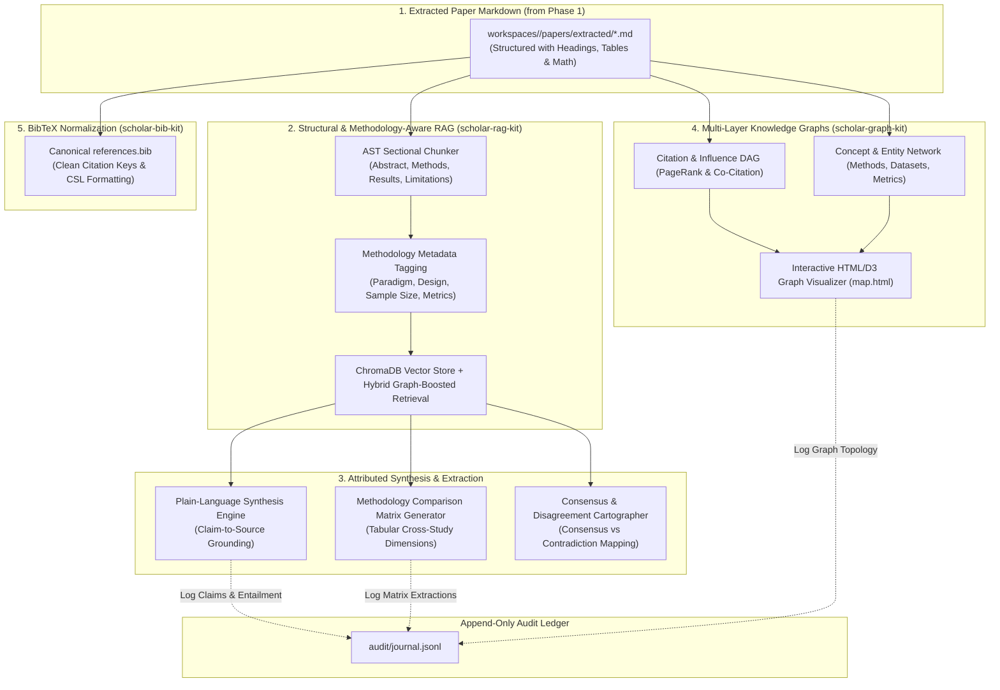
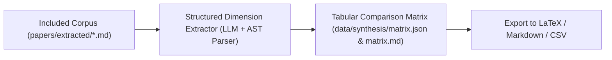
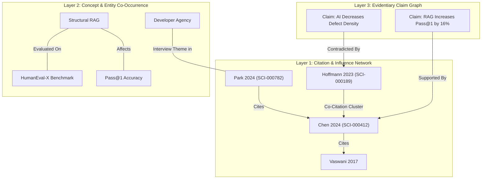

# Phase 2 Deep Dive & Architectural Propositions: Transparent Synthesis & Knowledge Graphs

> **Vision:** Transform extracted literature corpora into plain-language, grounded research synthesis, multi-dimensional knowledge graphs, and cross-study methodology matrices with verifiable claim-level attribution.  
> **Status:** Proposal & Architectural Specification  
> **Date:** 2026-08-30  
> **Version:** 1.0.0  

---

## 1. Executive Vision & The "Black-Box Synthesis" Problem

### 1.1 The Hallucination & Citation Loss Trap
Standard AI synthesis tools (ChatGPT, general LLM summarizers) suffer from severe academic limitations when generating literature reviews:
1. **Citation Bleed & Hallucination**: LLMs blend findings from different papers or fabricate citations entirely.
2. **Loss of Granular Provenance**: Citations are attached vaguely to entire paragraphs rather than specific claims, page numbers, or table cells.
3. **Methodological Blindness**: Standard summarization treats a 10-person student pilot study with the same evidentiary weight as a 5,000-person multi-site randomized trial.
4. **Disagreement Flattening**: Conflicting findings across studies are glossed over in favor of smooth, generic prose.

Phase 2 replaces black-box summarization with a **Grounded, Structural Synthesis Architecture**:



### 1.2 Phase 2 Architectural Invariants
1. **Atomic Claim Attribution**: Every single synthesized empirical claim must link directly to a workspace identifier, section heading, and paragraph/page span (`[SCI-000412#sec-3.2#p-4]`).
2. **Deterministic Retrieval**: Running the same RAG query with fixed hyper-parameters and graph weights produces identical retrieved context chunks.
3. **Transparent Evidentiary Weighting**: Synthesis explicitly reports study design rigor (e.g., sample size, peer-review venue, statistical power) alongside findings.
4. **Preserved Disagreements**: Conflicting evidence is never smoothed away; it is elevated into structured debate matrices with underlying methodological contrasts.

---

## 2. Proposition 2.1: Structural & Methodology-Aware RAG (`scholar-rag-kit`)

### 2.1 Structural AST Sectional Chunking
Standard chunkers slice text at arbitrary token limits, splitting sentences and severing claims from their methodological context.
* `MarkdownChunker` parses the document's header hierarchy (`#`, `##`, `###`) to create coherent semantic chunks:
  * `Abstract / Problem Statement`
  * `Methodology / Experimental Setup / Study Design`
  * `Results / Empirical Findings / Ablation Tables`
  * `Discussion / Threats to Validity / Limitations`

### 2.2 Methodology Vector Space & Metadata Classification
Before embedding into ChromaDB, chunks are tagged with rich methodological metadata:
```json
{
  "chunk_id": "chk-000412-sec3-02",
  "workspace_id": "SCI-000412",
  "doi": "10.1038/s41586-023-06735-9",
  "section": "Results",
  "section_category": "empirical_findings",
  "methodology": {
    "paradigm": "Design Science",
    "study_design": "Benchmark Evaluation",
    "dataset": "HumanEval-X",
    "sample_size": "500 programming tasks",
    "evaluation_metrics": ["pass@1", "pass@10", "cyclomatic_complexity"]
  }
}
```

### 2.3 Hybrid Graph-Boosted Retrieval
When retrieving evidence, dense semantic similarity in vector space is blended with citation network authority from `scholar-graph-kit`:
$$\text{Score}(d) = \text{CosineSim}(q, d) + \alpha \cdot \text{PageRank}(d) + \beta \cdot \mathbb{I}_{\text{seed}}(d)$$
* This ensures that seminal, highly-cited papers in the corpus receive appropriate evidentiary priority without drowning out emerging state-of-the-art preprints.

### 2.4 Targeted Sectional Slicing
Researchers can execute targeted queries constrained strictly to specific anatomical sections:
```bash
# Query only methodology sections to see how ablation studies were designed
uv run scholar-rag query "adversarial noise evaluation protocol" \
  --section-category methodology \
  --paradigm design_science \
  --limit 5
```

---

## 3. Proposition 2.2: Grounded Synthesis with Strict Claim Attribution

### 3.1 The Attributed Synthesis Protocol
When the synthesis engine answers research questions or drafts review sections, it enforces a strict prompt template that binds every sentence to an explicit source token:

```
PROMPT INSTRUCTION:
Synthesize the evidence for RQ1. Every factual assertion must end with an atomic citation token: [WORKSPACE_ID#SECTION#SNIPPET_ID].
If studies disagree, state the exact point of divergence and the methodological differences between them.
```

#### Example Output:
> "Recent evaluations indicate that structural retrieval-augmented generation (RAG) improves code completion accuracy by 16.6% over baseline models on the HumanEval-X benchmark `[SCI-000412#sec-3.2#snip-04]`. However, this accuracy gain incurs an average inference latency penalty of 37ms `[SCI-000412#sec-3.4#snip-09]`. Conversely, Hoffmann et al. (2023) observed no statistically significant reduction in defect density when deploying RAG assistants in legacy C++ enterprise codebases `[SCI-000189#sec-4.1#snip-02]`, likely attributable to low developer familiarity with suggested modern syntax `[SCI-000189#sec-5.2#snip-07]`."

### 3.2 Automated Entailment & Hallucination Verification
Before writing the synthesis to `literature_review.md`, an automated **Entailment Verifier** checks each claim against its linked source snippet:
* **Entailment Status**: `VERIFIED` ($\ge 0.85$ semantic alignment), `AMBIGUOUS` ($0.50 - 0.84$), or `UNSUPPORTED` ($< 0.50$).
* Any unsupported assertion is either rewritten with strict bounding or flagged for human review.

### 3.3 Interactive Source Drill-Down
In both CLI and Web/Notebook interfaces, clicking or expanding a citation token `[SCI-000412#sec-3.2]` instantly surfaces:
1. The exact paragraph extracted from the PDF.
2. The extracted table or chart if the claim references quantitative data.
3. The DOI, publication year, venue, and Open Access link.

---

## 4. Proposition 2.3: Cross-Study Methodology Comparison Matrices

In Systematic Literature Reviews and scoping studies, narrative text must be accompanied by structured **Methodology Comparison Matrices**.



### 4.1 Automated Extraction Dimensions
The system automatically populates a comparative matrix across 7 standard dimensions:

| Study ID | Authors & Year | Epistemological Design | Population / Dataset / Sample | Key Intervention / Model | Primary Metrics & Results | Declared Limitations |
| :--- | :--- | :--- | :--- | :--- | :--- | :--- |
| **SCI-000412** | Chen et al. (2024) | Benchmark Evaluation (DSR) | HumanEval-X (500 Python/JS tasks) | Grounded RAG + 7B LLM | Pass@1: 58.7% (+16.6% vs baseline) | Lab benchmark; no human latency studies. |
| **SCI-000189** | Hoffmann & Lee (2023) | Empirical Field Study (Positivist) | 45 Enterprise Devs (12 months) | Commercial Copilot | Defect density unchanged; +22% commit velocity | C++ legacy code; self-reported task logs. |
| **SCI-000782** | Park et al. (2024) | Thematic Case Study (Interpretivist) | 18 Senior Software Architects | In-IDE Pair Assistant | Qualitative: High initial skepticism; 4 themes of loss of agency | Single enterprise domain; qualitative transferability bounded. |

### 4.2 Discrepancy & Moderating Variable Analysis
When empirical results diverge across studies, the matrix generator automatically performs a **Moderating Variable Analysis**:
* *“Why did Chen et al. find massive accuracy gains while Hoffmann & Lee found none?”*
  * **Identified Moderator 1 (Task Type)**: Green-field algorithm generation (Chen) vs. Legacy code maintenance (Hoffmann).
  * **Identified Moderator 2 (Evaluation Metric)**: Automated test suite pass rate (Chen) vs. Post-deployment defect tickets (Hoffmann).

---

## 5. Proposition 2.4: Multi-Layer Knowledge Graphs (`scholar-graph-kit`)

Knowledge graphs in Nexus-Scholar provide visual bibliometric cartography and relational reasoning across 3 interconnected layers:



### 5.1 Interactive Graph Visualizer (`map.html`)
`scholar-graph-kit` compiles the NetworkX graph into an interactive, browser-based visualization:
* **Node Sizing**: Scaled by internal in-degree / citation count within the workspace.
* **Node Coloring**: Grouped by epistemological paradigm or community cluster (Louvain algorithm).
* **Edge Filtering**: Sliders to filter citation edges by publication year, minimum weight, or relationship type.
* **Detail Inspector Panel**: Clicking any node opens its abstract, extracted key findings, and list of all workspace claims it supports.

---

## 6. Proposition 2.5: Consensus Mapping & Disagreement Cartography

To ensure academic objectivity, Phase 2 synthesizes findings into a **Consensus & Disagreement Map**:

```
┌────────────────────────────────────────────────────────────────────────────┐
│ CONSENSUS & DISAGREEMENT CARTOGRAPHY: AI Code Assistants                   │
├────────────────────────────────────────────────────────────────────────────┤
│ 1. HIGH CONSENSUS (≥75% Agreement across 14 Studies)                       │
│    ✓ Syntactic boilerplate completion speed increases by 20% - 35%.        │
│    ✓ Adoption is highest among junior developers; lowest in security roles.│
│                                                                            │
│ 2. ACTIVE CONTRADICTION & DEBATE (6 Studies Diverge)                       │
│    ✗ Impact on Long-Term Code Maintainability & Technical Debt:            │
│      • 3 Studies (Lab/Benchmark): Improves consistency and test coverage.   │
│      • 3 Studies (Enterprise/Field): Increases duplicate code snippets.    │
│      → Identified Root Cause: Differences in code review enforcement.      │
│                                                                            │
│ 3. EMERGING MINORITY CLAIMS (2 Studies)                                    │
│    ! Cognitive offloading leads to 'syntax atrophy' in junior engineers.   │
│                                                                            │
│ 4. UNCHARTED TERRITORY & EVIDENCE GAPS (Identified in Limitations)         │
│    ? Long-term empirical studies (>2 years) on team code ownership.        │
│    ? Energy consumption / carbon footprint per accepted code commit.      │
└────────────────────────────────────────────────────────────────────────────┘
```

---

## 7. Proposition 2.6: Canonical BibTeX & Citation Engine (`scholar-bib-kit`)

### 7.1 Automated Citation Key Formatting
`scholar-bib-kit` normalizes the entire collection into a pristine `workspaces/<slug>/literature/references.bib`:
* Standardized Citation Key Formula: `[FirstAuthorSurname][Year][FirstMeaningfulTitleWord]` (e.g., `chen2024grounded`).
* Completes missing metadata (DOIs, page numbers, volume/issue numbers, publisher) by querying Crossref.

### 7.2 Multi-Style CSL Export
Exports references and inline citation strings formatted to standard academic publisher styles:
* **APA 7th Edition** (Social sciences, psychology).
* **IEEE** (Engineering, computer science).
* **ACM Reference Format** (Computing machinery).
* **Nature / Vancouver** (Life sciences, medicine).

---

## 8. Proposition 2.7: Append-Only Audit Journal for Phase 2

Every synthesis decision, retrieval query, and graph compilation is logged into `audit/journal.jsonl`:

```jsonl
{"event_id":"evt-000006","timestamp":"2026-08-30T23:20:00Z","action":"RAG_INDEX_BUILT","agent":"scholar-rag-kit","input":{"document_count":42,"total_chunks":312},"output":{"collection_name":"scholar_docs","embedding_model":"sentence-transformers"}}
{"event_id":"evt-000007","timestamp":"2026-08-30T23:21:15Z","action":"RAG_QUERY_RETRIEVED","agent":"scholar-rag-kit","input":{"query":"RAG code completion accuracy delta","boost_dois":["10.1038/..."]},"output":{"retrieved_chunks":5,"top_distance":0.184}}
{"event_id":"evt-000008","timestamp":"2026-08-30T23:25:00Z","action":"SYNTHESIS_GENERATED","agent":"scholar-rag-kit","input":{"rq_id":"RQ1","source_chunks_count":8},"output":{"claims_count":4,"entailment_verified_count":4,"synthesis_file":"literature_review.md"}}
{"event_id":"evt-000009","timestamp":"2026-08-30T23:28:00Z","action":"GRAPH_BUILT","agent":"scholar-graph-kit","input":{"nodes_count":42},"output":{"edges_count":128,"communities_detected":3,"html_export":"map.html"}}
{"event_id":"evt-000010","timestamp":"2026-08-30T23:30:00Z","action":"MATRIX_EXTRACTED","agent":"scholar-bib-kit","input":{"papers_analyzed":42},"output":{"matrix_rows":42,"matrix_file":"matrix.md"}}
```

---

## 9. Failure Modes, Edge Cases & Operational Guardrails

| Failure Mode / Edge Case | Risk | Proposed Guardrail in Phase 2 |
| :--- | :--- | :--- |
| **Synthesis Context Window Overflow** | 50 papers exceed LLM context limit during cross-synthesis. | **Hierarchical Map-Reduce Synthesis**: Summarizes individual papers into structured evidentiary cards before performing multi-study cross-synthesis. |
| **Hallucinated Citation Tokens** | Model outputs `[SCI-999999]` that does not exist in workspace. | **Strict Token Linter**: Post-processor validates every citation token against the `project.json` registry; strips or flags non-existent IDs. |
| **Graph Visual Clutter ("Hairball")** | Graph with 200 nodes and 1,000 edges becomes unreadable. | **k-Core Pruning & Community Aggregation**: Automatically prunes low-degree isolate nodes and provides collapsible Louvain community clusters. |
| **Unreconciled Contradictions** | Synthesis picks one side arbitrarily and ignores the other. | **Dialectical Prompt Structure**: Prompt forces model to output both Thesis and Antithesis before synthesizing the contextual resolution. |

---

## 10. Deliverables & Verification Matrix for Phase 2

| Component | Target Output Artifact | Verification Metric |
| :--- | :--- | :--- |
| **RAG Store** | `chroma_db/` | $100\%$ of included papers indexed with section and methodology metadata. |
| **Literature Review** | `literature/literature_review.md` | $100\%$ of empirical claims have valid `[SCI-XXXXXX]` tokens verified by entailment checker. |
| **Methodology Matrix** | `literature/matrix.md` + `matrix.json` | Complete tabular extraction across all 7 dimensions for all included studies. |
| **Knowledge Graph** | `literature/map.html` + `graph.json` | Graph renders without JavaScript errors; nodes link to abstract and citation data. |
| **Consensus Map** | `literature/consensus_map.md` | Categorizes findings into high consensus, active debate, and evidence gaps. |
| **Clean Bibliography** | `literature/references.bib` | Clean BibTeX file passing `biber` / `bibtex` syntax check with zero missing DOIs. |
