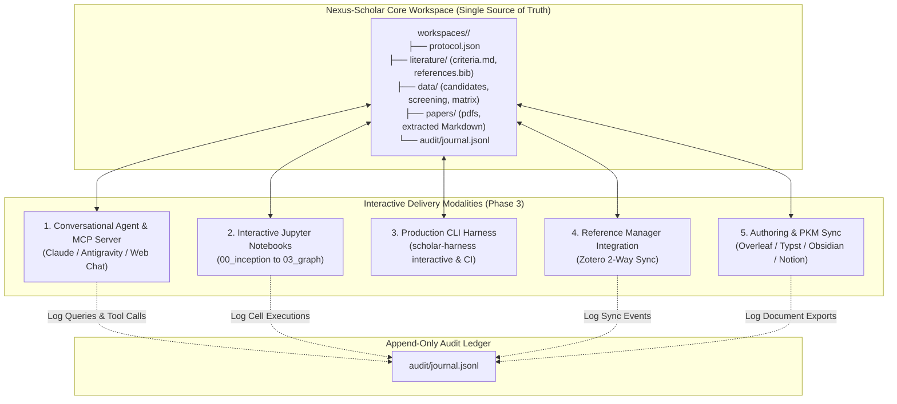
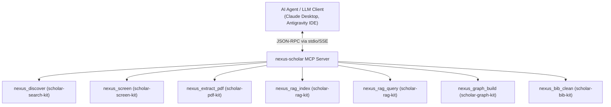
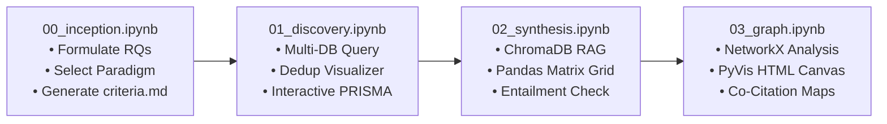
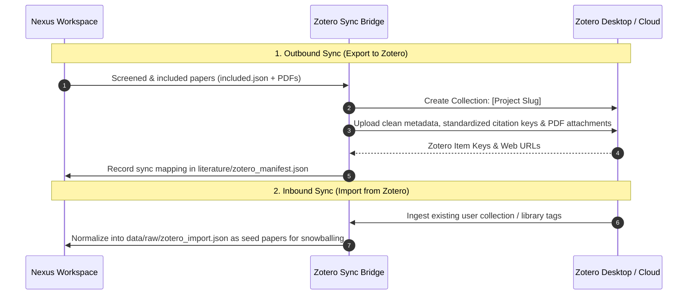

# Phase 3 Deep Dive & Architectural Propositions: Interactive Research Interfaces & Ecosystem Integrations

> **Vision:** Deliver multi-modal access to the Nexus-Scholar research harness across conversational chat agents, reproducible Jupyter notebooks, production CLI tools, and seamless integrations with Zotero, Overleaf, and Obsidian/Notion.  
> **Status:** Proposal & Architectural Specification  
> **Date:** 2026-08-31  
> **Version:** 1.0.0  

---

## 1. Executive Vision & The Multi-Modal Interface Strategy

### 1.1 The "One UI Does Not Fit All" Reality
Researchers across disciplines work through fundamentally different cognitive modalities and software ecosystems:
* **Computational Researchers & Data Scientists**: Demand interactive, reproducible **Jupyter Notebooks** where data frames, embeddings, and graphs can be inspected and manipulated in Python.
* **Academic Authors & PhD Students**: Live in **Zotero** for citation tracking and **Overleaf / LaTeX / Typst** for manuscript composition.
* **Exploratory & Literature Reviewers**: Want a fast, conversational **Chat Interface** that can answer questions, challenge hypotheses, and highlight exact PDF text spans.
* **Automation Engineers & CI/CD Pipelines**: Require a headless, scriptable **Production CLI** (`scholar-harness`) that can run multi-hour batch extractions overnight.
* **Autonomous AI Agents**: Require standardized **Model Context Protocol (MCP)** tools to execute research workflows autonomously without human intervention.

Phase 3 unifies these modalities around a **Single Source of Truth** (`workspaces/<slug>/`):



### 1.2 Phase 3 Architectural Invariants
1. **Zero State Desynchronization**: All interfaces read from and write to the standardized workspace directory structure; no interface maintains private, uncommitted state.
2. **Deterministic Reproducibility**: Any research output generated via the conversational chat or CLI can be reproduced identically inside a Jupyter notebook.
3. **Transparent Audit Trails**: Every user query, notebook execution, Zotero export, or Overleaf sync writes an immutable event to `audit/journal.jsonl`.
4. **Credential Isolation**: External API keys (Zotero, Overleaf, Semantic Scholar, OpenAI/Anthropic) are handled strictly via environment variables and OS keyring, never saved to workspace files.

---

## 2. Proposition 3.1: Conversational Research Agent & Model Context Protocol (MCP)

### 2.1 The Nexus-Scholar MCP Server Architecture
To enable autonomous research and conversational discovery across AI platforms (Claude Desktop, Antigravity IDE, Cursor, OpenDevin), we expose the entire toolkit via the **Model Context Protocol (MCP)**:



### 2.2 Core MCP Tool Specifications

| Tool Name | Input Parameters | Output Response | Underlying Engine |
| :--- | :--- | :--- | :--- |
| `nexus_discover` | `query: str`, `providers: list[str]`, `year_min: int`, `limit: int` | Deduplicated list of candidates with DOI, title, abstract, and OA status. | `scholar-search-kit` |
| `nexus_screen` | `workspace_slug: str`, `criteria_file: str`, `batch_size: int` | Filtered list with `included`, `excluded`, reason codes, and PRISMA counts. | `scholar-screen-kit` |
| `nexus_extract_pdf` | `doi: str`, `smart_naming: bool`, `engine: "docling" \| "pymupdf"` | Local path to downloaded PDF and clean extracted Markdown file. | `scholar-pdf-kit` |
| `nexus_rag_index` | `workspace_slug: str`, `embedding_model: str` | Vector collection status, total chunks indexed by section. | `scholar-rag-kit` |
| `nexus_rag_query` | `query: str`, `section_category: str`, `boost_seminal: bool`, `limit: int` | Ranked chunks with atomic attribution tokens and metadata. | `scholar-rag-kit` |
| `nexus_graph_build` | `workspace_slug: str`, `include_concepts: bool` | Graph topology metrics, Louvain clusters, and path to `map.html`. | `scholar-graph-kit` |
| `nexus_bib_clean` | `bib_file: str`, `style: "apa" \| "ieee" \| "acm" \| "nature"` | Normalized `.bib` with resolved DOIs and formatted citation keys. | `scholar-bib-kit` |

### 2.3 Conversational Socratic Research Assistant
When interacting through a chat interface, the agent does not merely act as a passive lookup engine; it operates as an **Active PhD Research Collaborator**:
* **Challenge & Probe**: *"You are concluding that RAG always improves code quality, but Study SCI-000189 found no effect in C++ legacy systems. Do you want to restrict your claim scope to modern languages?"*
* **Evidence Cards**: Automatically renders rich expandable cards showing paper title, authors, venue, extracted methodology snippet, and direct link to local Markdown text.

---

## 3. Proposition 3.2: Reproducible Interactive Jupyter Notebook Suite

For computational researchers, data scientists, and educators, Phase 3 provides four pre-built, production-grade Jupyter notebooks inside `notebooks/`:

```
notebooks/
├── 00_research_inception.ipynb              # Socratic interview & protocol formulation
├── 01_federated_discovery_and_screening.ipynb # Live API search, deduplication & PRISMA screening
├── 02_grounded_synthesis_and_matrices.ipynb  # RAG queries, tabular matrix rendering & debate mapping
└── 03_knowledge_graph_and_cartography.ipynb # PyVis interactive networks & community detection
```

### 3.1 Notebook Workflow & Features


* **Interactive IPyWidgets**: Visual sliders for date ranges, drop-down menus for paradigm selection, and interactive tables (via `itables` / `ipydatagrid`) allowing researchers to click-and-inspect individual papers.
* **Audit Hooks**: Every cell execution automatically registers its parameters and outputs into the project's `journal.jsonl`, guaranteeing complete auditability.

---

## 4. Proposition 3.3: Reference Manager Ecosystem Integrations (Zotero & Mendeley)

To fit naturally into existing academic workflows, Nexus-Scholar provides seamless, two-way integration with **Zotero** via the Zotero Web API and local translation server.



### 4.1 Automated Zotero Features
* **Smart Collection Scaffolding**: Automatically creates a dedicated collection under `My Library > Nexus-Scholar > [Project Slug]`.
* **Standardized Citation Keys**: Automatically populates the `extra` field with `Citation Key: [FirstAuthorYearTitle]` matching `references.bib` exactly.
* **Full-Text Attachment**: Attaches harvested open-access PDFs directly to the Zotero item records.

---

## 5. Proposition 3.4: Authoring & LaTeX Integrations (Overleaf, Typst, PKM)

### 5.1 Git-Backed Overleaf Sync
Because Overleaf supports Git remotes, `scholar-harness` can sync synthesized literature sections directly to an Overleaf project:
```bash
# Push literature review section and clean bib to Overleaf
uv run scholar-harness export overleaf \
  --project-id "64f128ab9..." \
  --target-section "sections/related_work.tex" \
  --bib-file "references.bib"
```
* Automatically converts `literature/literature_review.md` into clean LaTeX using pandoc/custom templates, mapping all `[SCI-XXXXXX]` tokens to standard `\cite{authorYearTitle}` keys.

### 5.2 Typst Modern Typesetting Export
For researchers adopting [Typst](https://typst.app/), Nexus-Scholar exports:
* `literature_review.typ` styled with academic paper templates (IEEE, ACM, Springer, Nature).
* Native `#bibliography("references.bib")` binding.

### 5.3 Obsidian & Notion Relational PKM Export
For personal knowledge management (PKM) users:
* **Obsidian Vault Export**: Generates a linked folder of Markdown notes with YAML frontmatter, tags (`#paradigm/design_science`), and bidirectional wikilinks (`[[SCI-000412]]`).
* **Notion Database Sync**: Automatically creates a Notion database with custom properties (Status, Year, Citations, PDF Link, Inclusion Status, Methodological Paradigm).

---

## 6. Proposition 3.5: Production CLI Harness (`scholar-harness`)

For terminal power users and automation pipelines, `scholar-harness` provides a rich, interactive CLI built with `typer` and `rich`:

```
$ uv run scholar-harness status --slug ai-dev-productivity

┏━━━━━━━━━━━━━━━━━━━━━━━━┳━━━━━━━━━━━━━━━━━━━━━━━━━━━━━━━━━━━━━━━━━━━━━━━━┓
┃ Metric                 ┃ Value                                          ┃
┡━━━━━━━━━━━━━━━━━━━━━━━━╇━━━━━━━━━━━━━━━━━━━━━━━━━━━━━━━━━━━━━━━━━━━━━━━━┩
│ Project Title          │ Impact of Generative AI on Code Quality        │
│ Active Paradigm        │ Design Science (DSR)                           │
│ Phase State            │ PHASE_2_SYNTHESIS_COMPLETED                    │
│ Raw Candidates         │ 1,480 papers                                   │
│ Deduplicated Corpus    │ 1,024 unique papers                            │
│ Screened & Included    │ 42 papers (PRISMA compliant)                   │
│ Harvested OA PDFs      │ 39 / 42 (92.8% success)                        │
│ Vector Store (Chroma)  │ 312 chunks indexed                             │
│ Knowledge Graph        │ 42 nodes, 128 edges (map.html)                 │
│ references.bib         │ 42 entries (100% valid DOIs)                   │
└────────────────────────┴────────────────────────────────────────────────┘
```

### 6.1 Headless CI/CD Mode for Automated Tracking
Researchers can set up recurring GitHub Actions cron jobs to track emerging literature:
```bash
# Non-interactive automated update
uv run scholar-harness update \
  --slug ai-dev-productivity \
  --since "2026-08-01" \
  --auto-screen \
  --auto-harvest \
  --ci
```

---

## 7. Proposition 3.6: Append-Only Audit Journal for Phase 3

Every interface interaction is transparently recorded into `audit/journal.jsonl`:

```jsonl
{"event_id":"evt-000011","timestamp":"2026-08-31T01:55:00Z","action":"MCP_TOOL_INVOKED","agent":"claude-desktop","input":{"tool":"nexus_rag_query","params":{"query":"effect size of RAG on code pass rate"}},"output":{"chunks_returned":3,"top_similarity":0.91}}
{"event_id":"evt-000012","timestamp":"2026-08-31T01:58:30Z","action":"NOTEBOOK_SESSION_RECORDED","agent":"jupyter-runtime","input":{"notebook":"02_grounded_synthesis.ipynb","cells_executed":14},"output":{"matrix_updated":true,"elapsed_sec":42.1}}
{"event_id":"evt-000013","timestamp":"2026-08-31T02:02:10Z","action":"ZOTERO_SYNC_DISPATCHED","agent":"scholar-harness","input":{"target_collection":"AI Dev Productivity SLR","items_count":42},"output":{"zotero_items_created":42,"pdfs_attached":39,"status":"SUCCESS"}}
{"event_id":"evt-000014","timestamp":"2026-08-31T02:05:00Z","action":"OVERLEAF_GIT_PUSHED","agent":"scholar-harness","input":{"project_id":"64f128ab9...","branch":"main"},"output":{"commit_sha":"a8f3b9c...","files_changed":["related_work.tex","references.bib"]}}
```

---

## 8. Operational Guardrails, Security & Edge Cases

| Area / Failure Mode | Risk | Proposed Guardrail in Phase 3 |
| :--- | :--- | :--- |
| **API Token Exposure** | User commits Zotero API key or Overleaf Git credentials to repository. | **Git-Ignore & Keyring Security**: Tokens are loaded exclusively from OS environment variables or keyring; `.env` is hardcoded into `.gitignore`. |
| **External Edit Desync** | User manually edits `references.bib` inside Overleaf while local workspace updates it. | **Three-Way Merge Verifier**: Pre-push check fetches remote Overleaf git log; if remote commits exist, warns user and creates a distinct `.diff` file for review. |
| **Jupyter State Non-Determinism** | User runs notebook cells out of order, producing corrupt data artifacts. | **Idempotent Cell Guards**: Each notebook cell validates prerequisites (e.g., asserts `included.json` exists before running PDF extraction). |
| **MCP Tool Timeout** | Long-running PDF extraction triggers client-side MCP timeout ($> 60\text{s}$). | **Async Job Polling**: Long-running operations return an immediate `job_id` and allow the agent to poll `nexus_job_status` or receive completion events. |

---

## 9. Deliverables & Verification Matrix for Phase 3

| Component | Target Output Artifact | Verification Metric |
| :--- | :--- | :--- |
| **MCP Server** | `src/scholar_mcp/server.py` | Passes standard MCP compliance suite; all 7 tools callable via stdio/SSE. |
| **Jupyter Notebooks** | `notebooks/00_*.ipynb` ... `03_*.ipynb` | All 4 notebooks run top-to-bottom with `jupyter nbconvert --execute` without errors. |
| **Zotero Integration** | `scholar_harness/integrations/zotero.py` | Successfully creates collection, uploads metadata, and attaches PDFs via Zotero API. |
| **Overleaf / LaTeX Export** | `scholar_harness/integrations/overleaf.py` | Compiles valid `.tex` section and syncs to Overleaf Git remote. |
| **Obsidian / Typst Export** | `literature/vault/` + `literature_review.typ` | Obsidian vault renders valid graph links; Typst document compiles to PDF. |
| **Audit Ledger** | `audit/journal.jsonl` | $100\%$ of external export and chat query events logged with timestamp and inputs. |
