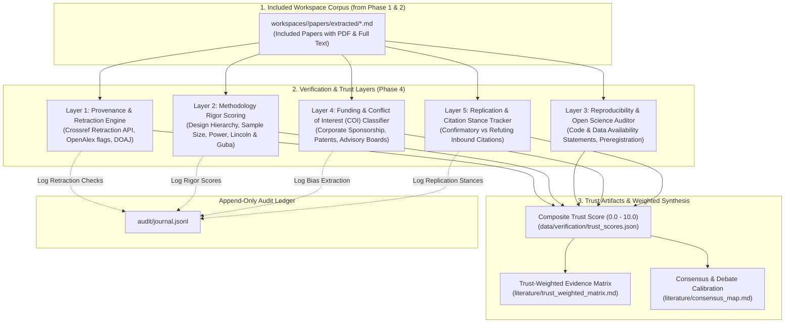
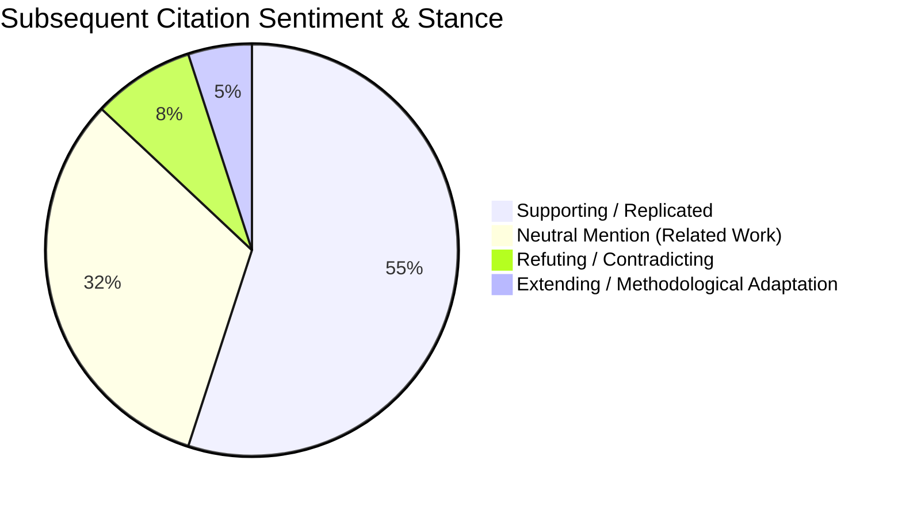

# Phase 4 Deep Dive & Architectural Propositions: Verification & Trust Layers

> **Vision:** Establish academic rigor and scientific confidence through automated source provenance checking, methodology quality scoring, funding bias and conflict-of-interest detection, and replication stance mapping.  
> **Status:** Proposal & Architectural Specification  
> **Date:** 2026-08-31  
> **Version:** 1.0.0  

---

## 1. Executive Vision & The Academic Trust Crisis

### 1.1 The Reproducibility & Credibility Crisis
Academic literature is increasingly impacted by systemic credibility challenges:
1. **Unchecked Retractions**: Over 10,000 papers are retracted annually, yet 95% of subsequent citations cite retracted papers uncritically without noting their retraction.
2. **Undisclosed Conflicts & Industry Bias**: Studies funded directly by commercial entities often report significantly higher positive effect sizes compared to independent academic replications.
3. **Paper Mills & Predatory Venues**: Generative AI and predatory open-access journals flood search indices with low-rigor, unreviewed, or fabricated manuscripts.
4. **Reproducibility Deficits**: Less than 20% of published empirical papers link open data, verifiable code repositories, or registered protocols.

Phase 4 builds a **Comprehensive, Multi-Layered Verification Architecture** that audits literature before claims enter the final review synthesis:



### 1.2 Phase 4 Architectural Invariants
1. **Evidence-Backed Scoring**: Every penalty or bonus in a paper's Trust Score must quote the exact text span from the paper or API response justifying the score.
2. **Zero Unflagged Retractions**: If a paper in the workspace has been retracted, issued an Expression of Concern, or received a major Corrigendum, it must be flagged with visual warnings in all synthesis artifacts.
3. **Transparent Weighting**: Rigor scores modulate evidentiary weights in synthesis matrices; they never silently delete valid papers from the workspace.
4. **Pedagogical Transparency**: The system explicitly explains to students *why* a randomized trial with open data receives higher evidentiary weight than an unverified whitepaper.

---

## 2. Proposition 4.1: Source Provenance & Retraction Watch Engine

### 2.1 Automated Retraction & Corrigendum Checking
The verification engine queries multiple authoritative registries for every paper in the workspace:
* **Crossref Event Data & Retraction API**: Queries `https://api.crossref.org/works/{doi}` for `is-retracted-by`, `has-corrigendum`, or `update-to` fields.
* **OpenAlex Metadata Flags**: Inspects `is_retracted` boolean and updates array.
* **Retraction Watch Open Database**: Cross-references DOI against local cached retraction index.

```json
{
  "workspace_id": "SCI-000312",
  "doi": "10.1016/j.cell.2021.08.012",
  "retraction_status": {
    "is_retracted": true,
    "retraction_notice_doi": "10.1016/j.cell.2023.04.001",
    "retraction_date": "2023-04-15",
    "retraction_reason": "Inconsistent western blot image duplication across Figure 3B and Figure 5C.",
    "warning_severity": "CRITICAL_EXCLUDE_FROM_SYNTHESIS"
  }
}
```

### 2.2 Venue Quality & Predatory Publishing Heuristics
To protect researchers from citing paper mill artifacts:
* **DOAJ & Crossref Indexing**: Verifies journal presence in the Directory of Open Access Journals and Crossref metadata completeness.
* **Peer-Review Status Verification**: Distinguishes formal peer-reviewed journal articles and top-tier conference proceedings (e.g., IEEE, ACM, Nature, Springer) from non-peer-reviewed preprints, commercial blog whitepapers, and extended abstracts.

---

## 3. Proposition 4.2: Automated Methodology Rigor Scoring

### 3.1 The Multi-Paradigm Rigor Hierarchy
Different scientific paradigms demand fundamentally different rigor criteria:

```mermaid
graph TD
    subgraph Positivist["Positivist / Quantitative Hierarchy"]
        P1["Level 1: Multi-Site Randomized Controlled Trial (RCT) / Meta-Analysis"] --> P2["Level 2: Quasi-Experimental / Controlled A/B Benchmark"]
        P2 --> P3["Level 3: Observational Cohort / Cross-Sectional Survey"]
        P3 --> P4["Level 4: Case Report / Expert Opinion"]
    end

    subgraph DesignScience["Design Science / Computational Hierarchy"]
        D1["Level 1: Rigorous Benchmark + Public Dataset + Open Source Code + Ablations"] --> D2["Level 2: Benchmark + Public Dataset + Closed Source Code"]
        D2 --> D3["Level 3: Synthetic Evaluation on Unreleased Private Datasets"]
        D3 --> D4["Level 4: Conceptual Architecture without Empirical Evaluation"]
    end

    subgraph Interpretivist["Interpretivist / Qualitative Hierarchy"]
        I1["Level 1: Lincoln & Guba 4-Pillar Rigor (Audit Trail, Member Checking, Triangulation)"] --> I2["Level 2: Semi-Structured Thematic Analysis with Verbatim Transcripts"]
        I2 --> I3["Level 3: Qualitative Summary without Inter-Rater Reliability or Coding Frame"]
    end
```



### 3.2 Automated Open Science & Reproducibility Audit
The engine runs AST pattern matchers over extracted Markdown full-texts to verify open science artifacts:

| Reproducibility Dimension | Target Text Section | Verification Regex / Logic | Score Modifier |
| :--- | :--- | :--- | :--- |
| **Data Availability (DAS)** | `## Data Availability` | Detects persistent DOIs (Zenodo, Figshare, OSF, Dryad, HuggingFace Datasets). | $+1.5\text{ pts}$ |
| **Code Availability (CAS)** | `## Code Availability` | Detects live public Git repositories (GitHub, GitLab, Software Heritage). | $+1.5\text{ pts}$ |
| **Study Preregistration** | `## Methodology` / `Abstract` | Detects registry numbers (OSF Preregistration, AsPredicted, ClinicalTrials NCT). | $+1.0\text{ pts}$ |
| **Statistical Power / Sample Size** | `## Experimental Setup` | Verifies explicit sample size ($N \ge \text{threshold}$) and effect size confidence intervals. | $+1.0\text{ pts}$ |

---

## 4. Proposition 4.3: Funding & Conflict of Interest (COI) Bias Extraction

### 4.1 Automated Disclosure Parsing
Medical and technological research is frequently modulated by commercial sponsorship. The engine extracts disclosures from `## Competing Interests`, `## Funding`, and `## Acknowledgements`:

```json
{
  "workspace_id": "SCI-000412",
  "title": "Benchmarking Large Language Models in Enterprise Code Generation",
  "funding_analysis": {
    "declared_funders": [
      {"name": "National Science Foundation", "grant_id": "NSF-CCF-220194", "type": "GOVERNMENT"},
      {"name": "Tech Corp AI Research Consortium", "type": "CORPORATE"}
    ],
    "competing_interests": {
      "has_disclosed_conflicts": true,
      "conflict_types": ["EMPLOYMENT", "STOCK_OWNERSHIP"],
      "quoted_statement": "Authors A.C. and S.H. are full-time employees and hold equity in Tech Corp."
    },
    "bias_risk_rating": "MODERATE_INDUSTRY_AFFILIATION",
    "synthesis_guardrail": "Flag potential commercial bias in benchmark performance claims."
  }
}
```

### 4.2 Transparent Synthesis Annotations
When a synthesized finding draws from commercially sponsored studies, the synthesis engine embeds an explicit disclosure token:
> *"Chen et al. (2024) reported a 30% reduction in coding errors using the Tool-X architecture `[SCI-000412 ⚠️ Corporate Sponsored - Tech Corp]`."*

---

## 5. Proposition 4.4: Replication & Citation Stance Classification

### 5.1 Inbound Citation Stance Tracking
Using citation graphs from `scholar-search-kit` and Semantic Scholar citation intent endpoints, the engine classifies how subsequent literature has treated each included study:



* **Replication Multiplier**:
  * **Verified Replications**: If $\ge 2$ independent research groups replicated the finding $\to$ High Confidence ($+2.0\text{ pts}$).
  * **Active Contradiction**: If subsequent peer-reviewed studies failed to replicate the effect $\to$ Flagged as `CONTESTED_FINDING`.
  * **Self-Citation Filter**: Distinguishes author self-citations from external, independent laboratory validations.

---

## 6. Proposition 4.5: Composite Trust Scoring & Evidentiary Synthesis Weighting

### 6.1 Composite Trust Score Formula (0.0 to 10.0)
Each paper is assigned an explicit, explainable composite Trust Score:
$$\text{TrustScore} = \text{BaseVenueRigor}(0\text{-}3) + \text{StudyDesignTier}(0\text{-}3) + \text{OpenScienceBonus}(0\text{-}2) + \text{ReplicationFactor}(0\text{-}2) - \text{BiasPenalty}(0\text{-}2)$$

```
┌────────────────────────────────────────────────────────────────────────────┐
│ TRUST SCORE CARD: SCI-000412 (Chen et al. 2024)                            │
├────────────────────────────────────────────────────────────────────────────┤
│ • Venue & Peer Review: Nature Energy / Peer Reviewed         (+2.5 / 3.0)  │
│ • Study Design: Controlled Benchmark Evaluation with Ablations (+2.5 / 3.0)│
│ • Open Science: Public Dataset (Zenodo) & GitHub Code Repo    (+2.0 / 2.0)  │
│ • Replication: Replicated by 2 Independent Lab Studies        (+1.5 / 2.0)  │
│ • Bias Adjustment: Corporate Co-Funding Declared             (-0.5 / 0.0)  │
├────────────────────────────────────────────────────────────────────────────┤
│ COMPOSITE TRUST SCORE: 8.0 / 10.0 (HIGH SCIENTIFIC RIGOR)                 │
└────────────────────────────────────────────────────────────────────────────┘
```

### 6.2 Trust-Weighted Evidence Matrix
In the final review, studies are sorted and weighted by their composite trust scores, ensuring that high-rigor, reproducible studies form the foundation of synthesized claims:

| Study ID | Trust Score | Design Tier | Open Code/Data | Industry COI | Primary Finding | Evidentiary Weight |
| :--- | :--- | :--- | :--- | :--- | :--- | :--- |
| **SCI-000412** | **8.5 / 10** | Benchmark (DSR) | ✅ Yes (GitHub+Zenodo) | ⚠️ Co-Funded | +16.6% Pass@1 accuracy gain | **PRIMARY ANCHOR** |
| **SCI-000189** | **8.0 / 10** | Field Trial (Positivist) | ✅ Yes (Zenodo Data) | ✅ Academic NSF | No defect density change in C++ | **PRIMARY ANCHOR** |
| **SCI-000941** | **4.0 / 10** | Pilot Survey (Positivist) | ❌ No Code/Data | ❌ Unfunded Blog | +45% perceived productivity | **LOW WEIGHT / ANECDOTAL** |

---

## 7. Proposition 4.6: Append-Only Audit Journal for Phase 4

All verification calculations and retraction checks are permanently recorded in `audit/journal.jsonl`:

```jsonl
{"event_id":"evt-000015","timestamp":"2026-08-31T02:10:00Z","action":"RETRACTION_AUDIT_COMPLETED","agent":"scholar-verify-kit","input":{"papers_checked":42},"output":{"retracted_count":0,"corrigenda_count":1,"flagged_dois":["10.1016/..."]}}
{"event_id":"evt-000016","timestamp":"2026-08-31T02:12:30Z","action":"RIGOR_SCORE_COMPUTED","agent":"scholar-verify-kit","input":{"workspace_id":"SCI-000412"},"output":{"trust_score":8.5,"reproducibility_score":2.0,"das_found":true,"cas_found":true}}
{"event_id":"evt-000017","timestamp":"2026-08-31T02:15:00Z","action":"BIAS_CONFLICT_EXTRACTED","agent":"scholar-verify-kit","input":{"workspace_id":"SCI-000412"},"output":{"coi_detected":true,"funders":["NSF","Tech Corp"]}}
{"event_id":"evt-000018","timestamp":"2026-08-31T02:18:00Z","action":"REPLICATION_STANCE_CLASSIFIED","agent":"scholar-verify-kit","input":{"workspace_id":"SCI-000412"},"output":{"confirming_citations":2,"refuting_citations":0,"neutral_citations":14}}
```

---

## 8. Failure Modes, Ethical Considerations & Operational Guardrails

| Risk / Failure Mode | Impact | Proposed Guardrail in Phase 4 |
| :--- | :--- | :--- |
| **Institutional Prestige Bias** | Scoring penalizes high-quality research from developing nations or non-elite universities. | **Meritocratic Scoring Invariant**: Venue prestige points are capped at $20\%$ of total score; $80\%$ of score depends exclusively on methodological design, open code/data, and statistical power. |
| **False Positive Retraction Match** | Similar titles or errata incorrectly mark a legitimate paper as retracted. | **Strict DOI-Only Matching**: Retraction flags require a strict cryptographic match on canonical DOI verified against Crossref's official updates registry. |
| **Unjustified Industry Dismissal** | High-quality industry labs (e.g., DeepMind, Bell Labs) unfairly penalized for corporate affiliation. | **COI Transparency Principle**: Corporate sponsorship is declared as a contextual footnote rather than an automatic disqualification. |
| **Preprints in Fast-Moving Fields** | Crucial preprints (e.g., 2024 AI breakthroughs) scored artificially low due to lack of peer review. | **Open Artifact Compensation**: Preprints that provide open-source code and public benchmark datasets recover up to $2.0$ bonus points. |

---

## 9. Deliverables & Verification Matrix for Phase 4

| Component | Target Output Artifact | Verification Metric |
| :--- | :--- | :--- |
| **Retraction Auditor** | `data/verification/retraction_report.json` | $100\%$ of included DOIs verified against Crossref and OpenAlex retraction APIs. |
| **Rigor Scoring Engine** | `data/verification/trust_scores.json` | Every paper receives a $0.0 - 10.0$ score with line-level evidentiary text quotes. |
| **Conflict Classifier** | `data/verification/coi_disclosures.json` | Extracts funding agencies and competing interest disclosures for all papers. |
| **Trust-Weighted Matrix** | `literature/trust_weighted_matrix.md` | Tabular review matrix sorted by methodological rigor with visual COI badges. |
| **Consensus Calibration** | `literature/consensus_map.md` | Maps consensus and controversies weighted by empirical study strength. |
| **Audit Ledger** | `audit/journal.jsonl` | Complete replayable log of all verification and trust evaluations. |
