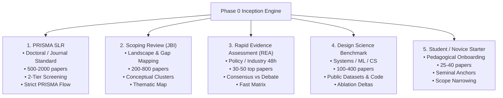

# Phase 0: The 5 Canonical Research Playbook Templates

> **Core Objective:** Provide pre-calibrated research protocol archetypes that automatically adjust database selection, sample pool sizes, screening strictness, and matrix extraction dimensions based on the researcher's publication standard and timeline.

---

## 1. The 5 Playbook Archetypes at a Glance



---

## 2. Playbook 1: Systematic Literature Review (PRISMA 2020)

### Profile & Objectives
* **Audience**: Doctoral researchers, academic journal authors, medical scientists.
* **Standard**: Strict **PRISMA 2020** compliance and Cochrane Risk of Bias guidelines.
* **Corpus Scale**: 500 – 2,000 candidate papers $\to$ 80 – 150 included.
* **Databases**: OpenAlex, Semantic Scholar, Crossref, PubMed, bioRxiv, arXiv.
* **Screening**: Strict 2-tier screening (Title/Abstract $\to$ Full Text) with mandatory reason codes (`EXC-01` to `EXC-05`) for every rejected paper.

### Protocol Preset (`prisma_slr_preset.json`)
```json
{
  "playbook_type": "PRISMA_SLR",
  "metadata": {
    "target_venue_type": "Peer-Reviewed Journal (PRISMA-compliant)",
    "timeline_weeks": 8
  },
  "epistemology": {
    "primary_paradigm": "Positivist",
    "trustworthiness_framework": "PRISMA 2020 Statement & Cochrane Handbook for Systematic Reviews",
    "unit_of_analysis": "Peer-reviewed empirical studies reporting quantifiable effect sizes or comparative outcomes",
    "epistemological_rationale": "Synthesize global statistical evidence with transparent inclusion criteria and risk-of-bias auditing.",
    "incompatible_concepts": [
      "Unverified blog posts",
      "Short opinion editorials (< 4 pages)",
      "Non-peer-reviewed commercial whitepapers"
    ]
  },
  "search_strategy": {
    "target_databases": ["openalex", "semanticscholar", "crossref", "pubmed", "arxiv"],
    "target_candidate_pool_size": {"min": 500, "max": 2000},
    "open_access_preferred": false
  },
  "screening_criteria": {
    "two_tier_screening": true,
    "inclusion": [
      {"id": "INC-01", "criterion": "Controlled empirical trial, observational cohort, or comparative experimental evaluation", "maps_to_rqs": ["RQ1"]},
      {"id": "INC-02", "criterion": "Reports numerical effect sizes, confidence intervals, p-values, or standard benchmark metrics", "maps_to_rqs": ["RQ1", "RQ2"]}
    ],
    "exclusion": [
      {"id": "EXC-01", "criterion": "Non-peer-reviewed whitepapers, blog summaries, or student essays", "reason_category": "UNVETTED_SOURCE"},
      {"id": "EXC-02", "criterion": "Duplicate reports or superseded preprint revisions", "reason_category": "DUPLICATE_REPORT"},
      {"id": "EXC-03", "criterion": "Sample size N < 20 or insufficient statistical power", "reason_category": "UNDERPOWERED"},
      {"id": "EXC-04", "criterion": "Wrong outcome measure or missing primary quantitative endpoints", "reason_category": "WRONG_OUTCOME"}
    ]
  },
  "matrix_dimensions": [
    {"id": "study_id", "name": "Study ID", "description": "Unique workspace ID e.g. SCI-000412", "target_section_category": "abstract_intro", "data_type": "categorical", "required": true},
    {"id": "authors_year", "name": "Authors & Year", "description": "Lead author and publication year", "target_section_category": "abstract_intro", "data_type": "free_text", "required": true},
    {"id": "study_design", "name": "Study Design", "description": "Classify: RCT, Quasi-experimental, Cohort, or Case-control", "target_section_category": "methodology", "data_type": "categorical", "required": true},
    {"id": "population_sample", "name": "Population / Sample (N)", "description": "Total sample size N, age/demographics, and inclusion criteria", "target_section_category": "methodology", "data_type": "free_text", "required": true},
    {"id": "intervention", "name": "Intervention vs Control", "description": "Experimental treatment or model compared against baseline control", "target_section_category": "methodology", "data_type": "free_text", "required": true},
    {"id": "primary_outcomes", "name": "Primary Metrics & Effect Sizes", "description": "Quantitative effect sizes, percentage delta, p-values, and confidence intervals", "target_section_category": "results_empirical", "data_type": "numeric", "required": true},
    {"id": "risk_of_bias", "name": "Declared Limitations & Confounders", "description": "Methodological limitations, potential selection bias, or unmeasured confounders", "target_section_category": "discussion_limitations", "data_type": "free_text", "required": false}
  ],
  "verification": {
    "retraction_check_required": true,
    "coi_and_funding_audit_required": true,
    "reproducibility_das_cas_check": true,
    "minimum_trust_score_threshold": 6.5
  }
}
```

---

## 3. Playbook 2: Scoping Review (JBI / Arksey & O'Malley)

### Profile & Objectives
* **Audience**: Policy makers, research grant writers, multidisciplinary research labs.
* **Standard**: **Joanna Briggs Institute (JBI) Scoping Review Methodology** / Arksey & O’Malley framework.
* **Corpus Scale**: 200 – 800 candidate papers $\to$ 50 – 120 included.
* **Databases**: OpenAlex, Crossref, arXiv, Semantic Scholar.
* **Key Deliverables**: Conceptual taxonomy, thematic cluster map, declared research gaps.

### Protocol Preset (`scoping_review_preset.json`)
```json
{
  "playbook_type": "SCOPING_REVIEW",
  "metadata": {
    "target_venue_type": "Scoping Review Journal / Grant Application",
    "timeline_weeks": 4
  },
  "epistemology": {
    "primary_paradigm": "Pragmatist / Mixed Methods",
    "trustworthiness_framework": "JBI Manual for Evidence Synthesis (Scoping Reviews Chapter)",
    "unit_of_analysis": "Thematic concepts, definitions, operational frameworks, and domain boundaries",
    "epistemological_rationale": "Clarify definitions, map research landscape, and identify unexplored gaps in literature.",
    "incompatible_concepts": ["Pure algorithmic benchmarking without conceptual discussion"]
  },
  "search_strategy": {
    "target_databases": ["openalex", "semanticscholar", "crossref", "arxiv"],
    "target_candidate_pool_size": {"min": 200, "max": 800},
    "open_access_preferred": true
  },
  "matrix_dimensions": [
    {"id": "study_id", "name": "Study ID", "description": "Workspace ID", "target_section_category": "abstract_intro", "data_type": "categorical", "required": true},
    {"id": "authors_year", "name": "Authors & Year", "description": "Citation", "target_section_category": "abstract_intro", "data_type": "free_text", "required": true},
    {"id": "conceptual_definition", "name": "Conceptual Definition", "description": "How the core concept is defined in this paper", "target_section_category": "abstract_intro", "data_type": "free_text", "required": true},
    {"id": "target_domain", "name": "Target Sector / Domain", "description": "Application sector (e.g. Healthcare, Finance, Education, Manufacturing)", "target_section_category": "methodology", "data_type": "categorical", "required": true},
    {"id": "methodological_approach", "name": "Research Approach", "description": "Qualitative, Quantitative, Mixed, or Computational", "target_section_category": "methodology", "data_type": "categorical", "required": true},
    {"id": "key_challenges", "name": "Identified Challenges & Bottlenecks", "description": "Main technical, ethical, or operational blockers reported", "target_section_category": "discussion_limitations", "data_type": "free_text", "required": true},
    {"id": "research_gaps", "name": "Declared Research Gaps", "description": "Specific unexplored research opportunities identified by authors", "target_section_category": "discussion_limitations", "data_type": "free_text", "required": true}
  ]
}
```

---

## 4. Playbook 3: Rapid Evidence Assessment (REA - 48h Turnaround)

### Profile & Objectives
* **Audience**: Industry practitioners, tech leads, healthcare executives, policy advisors.
* **Standard**: **UK Government Social Research (GSR) Rapid Evidence Assessment Guidelines**.
* **Timeline**: 24 to 72 hours.
* **Corpus Scale**: 50 – 150 high-impact candidate papers $\to$ 20 – 35 included.
* **Databases**: OpenAlex, Semantic Scholar (filtered by citation count and top venues).
* **Key Deliverables**: Consensus vs. debate matrix, high-confidence takeaways.

### Protocol Preset (`rapid_evidence_preset.json`)
```json
{
  "playbook_type": "RAPID_EVIDENCE",
  "metadata": {
    "target_venue_type": "Executive Briefing / Technical Whitepaper",
    "timeline_weeks": 1
  },
  "epistemology": {
    "primary_paradigm": "Positivist",
    "trustworthiness_framework": "Government Social Research (GSR) REA Protocol",
    "unit_of_analysis": "High-impact empirical studies and seminal syntheses",
    "epistemological_rationale": "Rapidly triangulate consensus and debate on urgent operational questions."
  },
  "search_strategy": {
    "target_databases": ["openalex", "semanticscholar"],
    "target_candidate_pool_size": {"min": 50, "max": 150},
    "open_access_preferred": true
  },
  "screening_criteria": {
    "two_tier_screening": false,
    "inclusion": [
      {"id": "INC-01", "criterion": "Published in recognized peer-reviewed venue or >= 10 citations", "maps_to_rqs": ["RQ1"]}
    ],
    "exclusion": [
      {"id": "EXC-01", "criterion": "Unreviewed speculative preprints without peer review", "reason_category": "UNREVIEWED"}
    ]
  },
  "matrix_dimensions": [
    {"id": "study_id", "name": "Study ID", "description": "Workspace ID", "target_section_category": "abstract_intro", "data_type": "categorical", "required": true},
    {"id": "authors_year", "name": "Authors & Year", "description": "Citation", "target_section_category": "abstract_intro", "data_type": "free_text", "required": true},
    {"id": "core_finding", "name": "Core Finding / Claim", "description": "Main verified takeaway with statistical effect", "target_section_category": "results_empirical", "data_type": "free_text", "required": true},
    {"id": "consensus_stance", "name": "Consensus Stance", "description": "Supports, Refutes, or Ambiguous regarding target hypothesis", "target_section_category": "results_empirical", "data_type": "categorical", "required": true},
    {"id": "confidence_rating", "name": "Confidence Level", "description": "High / Medium / Low based on sample size and methodology", "target_section_category": "methodology", "data_type": "categorical", "required": true}
  ]
}
```

---

## 5. Playbook 4: Design Science & Benchmark Evaluation (DSR)

### Profile & Objectives
* **Audience**: Computer scientists, AI/ML researchers, software engineers.
* **Standard**: **Hevner Design Science Research (DSR) Guidelines**.
* **Corpus Scale**: 100 – 400 candidate papers $\to$ 30 – 60 included.
* **Databases**: arXiv, Semantic Scholar, Crossref (ACM, IEEE).
* **Key Deliverables**: Benchmark accuracy table, ablation comparisons, latency profiles.

### Protocol Preset (`design_science_preset.json`)
```json
{
  "playbook_type": "DESIGN_SCIENCE",
  "metadata": {
    "target_venue_type": "ACM / IEEE / NeurIPS / ICML / ICLR",
    "timeline_weeks": 6
  },
  "epistemology": {
    "primary_paradigm": "Design Science",
    "trustworthiness_framework": "Hevner Design Science Research Guidelines",
    "unit_of_analysis": "Computational artifacts, algorithms, benchmark suites, and ablation runs",
    "epistemological_rationale": "Benchmark computational utility, scalability, and error-rate deltas against baselines.",
    "incompatible_concepts": ["Qualitative opinion surveys without code evaluation"]
  },
  "search_strategy": {
    "target_databases": ["arxiv", "semanticscholar", "crossref"],
    "target_candidate_pool_size": {"min": 100, "max": 400}
  },
  "screening_criteria": {
    "inclusion": [
      {"id": "INC-01", "criterion": "Presents a novel computational artifact, algorithm, or model", "maps_to_rqs": ["RQ1"]},
      {"id": "INC-02", "criterion": "Evaluates performance on standardized or public benchmark datasets", "maps_to_rqs": ["RQ1", "RQ2"]}
    ],
    "exclusion": [
      {"id": "EXC-01", "criterion": "Conceptual architectures without empirical evaluation or benchmark runs", "reason_category": "NO_EVALUATION"}
    ]
  },
  "matrix_dimensions": [
    {"id": "model_name", "name": "Artifact / Model Name", "description": "Name and parameter count of proposed model", "target_section_category": "methodology", "data_type": "categorical", "required": true},
    {"id": "baselines", "name": "Baselines Compared", "description": "Prior state-of-the-art models used for comparison", "target_section_category": "methodology", "data_type": "list", "required": true},
    {"id": "datasets", "name": "Benchmark Datasets", "description": "Standard benchmark test suites used", "target_section_category": "methodology", "data_type": "list", "required": true},
    {"id": "accuracy_metric", "name": "Primary Metric (pass@1 / F1)", "description": "Numerical score and percentage gain over baseline", "target_section_category": "results_empirical", "data_type": "numeric", "required": true},
    {"id": "latency_throughput", "name": "Latency / Compute Cost", "description": "Inference time (ms), GPU hours, or parameter efficiency", "target_section_category": "results_empirical", "data_type": "numeric", "required": false},
    {"id": "ablation_insights", "name": "Key Ablation Findings", "description": "Component contribution to overall performance gain", "target_section_category": "results_empirical", "data_type": "free_text", "required": false}
  ],
  "verification": {
    "reproducibility_das_cas_check": true,
    "minimum_trust_score_threshold": 6.0
  }
}
```

---

## 6. Playbook 5: Novice Starter / Student Dissertation

### Profile & Objectives
* **Audience**: Master's/undergraduate students, newcomers to a scientific field.
* **Standard**: Guided Socratic Scaffolding.
* **Corpus Scale**: 50 – 200 candidate papers $\to$ 25 – 40 included.
* **Databases**: OpenAlex, Crossref, Semantic Scholar.
* **Features**: Prioritizes seminal review papers as foundational anchors, provides plain-language reasoning for why papers were included or excluded.
