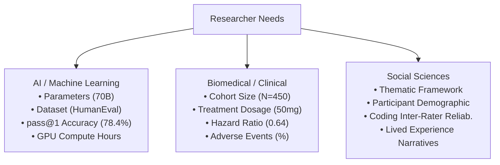
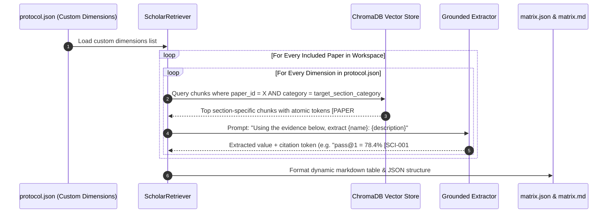

# Phase 0: Dynamic Matrix Dimensions & Extraction Guide

> **Core Principle:** Matrix extraction dimensions are never rigidly fixed. They are fully customizable, domain-adaptive, and grounded directly into structural document sections.

---

## 1. Why Fixed Dimensions Break Multi-Disciplinary Research

A traditional static matrix (e.g. `Author`, `Year`, `Sample`, `Findings`) fails when applied across different disciplines:



Phase 0 solves this by making every column in the synthesis matrix a **structured extraction dimension** (`MatrixDimension`) configured in `protocol.json`.

---

## 2. The `MatrixDimension` Data Specification

```python
class DimensionDataType(str, Enum):
    FREE_TEXT = "free_text"          # Descriptive summary (e.g. "Limitations")
    NUMERIC = "numeric"              # Numbers with units (e.g. "N = 450", "37ms latency")
    CATEGORICAL = "categorical"      # Bounded enum (e.g. "RCT", "Observational", "A/B Benchmark")
    LIST = "list"                    # Array of items (e.g. ["Python", "C++", "Go"])


class MatrixDimension(BaseModel):
    id: str = Field(..., description="Unique slug e.g. 'sample_size', 'pass_accuracy'")
    name: str = Field(..., description="Human-readable column header e.g. 'Sample Size (N)'")
    description: str = Field(..., description="Guidance prompt for LLM/RAG extractor on what specific text to extract")
    target_section_category: Optional[str] = Field(
        None,
        description="Target section: 'methodology', 'results_empirical', 'discussion_limitations', or 'abstract_intro'"
    )
    data_type: DimensionDataType = Field(DimensionDataType.FREE_TEXT)
    required: bool = Field(False, description="If True, flags studies that fail to report this dimension")
    fallback_value: str = Field("Not Reported", description="Default if paper does not state this metric")
```

---

## 3. Domain-Specific Custom Dimension Presets

### 3.1 Computer Science & AI / ML Benchmark Review
```json
"matrix_dimensions": [
  {
    "id": "model_arch",
    "name": "Model Architecture & Parameters",
    "description": "Extract the specific model name and parameter count (e.g. Llama-3-70B, GPT-4o, DeepSeek-Coder-33B).",
    "target_section_category": "methodology",
    "data_type": "categorical",
    "required": true
  },
  {
    "id": "benchmark_split",
    "name": "Benchmark Dataset & Split",
    "description": "Extract evaluation benchmarks and sample counts (e.g. HumanEval 164 problems, MBPP 500 problems).",
    "target_section_category": "methodology",
    "data_type": "list",
    "required": true
  },
  {
    "id": "pass_k_accuracy",
    "name": "pass@1 / Execution Accuracy",
    "description": "Extract primary quantitative accuracy score and relative percentage improvement over baseline.",
    "target_section_category": "results_empirical",
    "data_type": "numeric",
    "required": true
  },
  {
    "id": "compute_cost",
    "name": "Compute Hardware & Latency",
    "description": "Extract GPU hardware used, training time, or inference latency per query.",
    "target_section_category": "methodology",
    "fallback_value": "Compute budget not disclosed"
  },
  {
    "id": "ablation_findings",
    "name": "Key Ablation Insights",
    "description": "Extract which architectural component provided the largest performance delta.",
    "target_section_category": "results_empirical",
    "data_type": "free_text"
  }
]
```

### 3.2 Clinical / Healthcare Systematic Review
```json
"matrix_dimensions": [
  {
    "id": "clinical_design",
    "name": "Clinical Design",
    "description": "Classify study design: Double-Blind RCT, Open-Label Cohort, Case-Control, or Meta-Analysis.",
    "target_section_category": "methodology",
    "data_type": "categorical",
    "required": true
  },
  {
    "id": "cohort_demographics",
    "name": "Participant Cohort (N)",
    "description": "Extract total sample size N, age range, gender distribution, and baseline disease severity.",
    "target_section_category": "methodology",
    "data_type": "free_text",
    "required": true
  },
  {
    "id": "dosage_regimen",
    "name": "Intervention & Dosing",
    "description": "Extract drug name, dosage (mg/kg), frequency, duration, and control placebo details.",
    "target_section_category": "methodology",
    "data_type": "free_text",
    "required": true
  },
  {
    "id": "primary_endpoints",
    "name": "Primary Endpoint (HR / OR / p-value)",
    "description": "Extract primary clinical outcome, Hazard Ratio (HR), Odds Ratio (OR), and p-values.",
    "target_section_category": "results_empirical",
    "data_type": "numeric",
    "required": true
  },
  {
    "id": "adverse_events",
    "name": "Safety & Adverse Events (%)",
    "description": "Extract reported Grade 3/4 adverse event rates and treatment discontinuation percentages.",
    "target_section_category": "results_empirical",
    "data_type": "free_text"
  }
]
```

### 3.3 Qualitative Social Science & Education Review
```json
"matrix_dimensions": [
  {
    "id": "epistemic_framework",
    "name": "Theoretical / Epistemic Lens",
    "description": "Extract theoretical framework (e.g. Critical Race Theory, Constructivism, Activity Theory).",
    "target_section_category": "abstract_intro",
    "data_type": "categorical",
    "required": true
  },
  {
    "id": "data_collection_method",
    "name": "Data Collection Method",
    "description": "Semi-structured interviews, focus groups, classroom ethnography, or document analysis.",
    "target_section_category": "methodology",
    "data_type": "free_text",
    "required": true
  },
  {
    "id": "participant_context",
    "name": "Participant Context & Setting",
    "description": "Sample size N, institutional setting, geographic context, and socioeconomic background.",
    "target_section_category": "methodology",
    "data_type": "free_text",
    "required": true
  },
  {
    "id": "emergent_themes",
    "name": "Emergent Thematic Findings",
    "description": "Extract primary qualitative themes, core tensions, and authorial interpretation.",
    "target_section_category": "results_empirical",
    "data_type": "free_text",
    "required": true
  },
  {
    "id": "transferability_bounds",
    "name": "Transferability & Reflexivity",
    "description": "Author reflexivity statement and declared context boundaries.",
    "target_section_category": "discussion_limitations",
    "data_type": "free_text"
  }
]
```

---

## 4. How Downstream Extraction (`scholar-rag-kit`) Works

When `scholar-rag-kit` generates the comparison matrix:



---

## 5. Customization Workflow in Phase 0

Researchers customize dimensions in three ways:

1. **Socratic Interview Prompt**:
   - In Stage 3, the copilot suggests 4–6 domain dimensions and asks: *"Would you like to track any additional technical, operational, or safety metrics?"*
2. **CLI Parameter**:
   ```bash
   scholar-inception init \
     --playbook design-science \
     --dimension "Energy Cost: Average kWh per 1000 benchmark queries"
   ```
3. **Direct File Editing**:
   Editing `workspaces/<slug>/protocol.json` directly. Downstream kits read the live JSON on every run.
