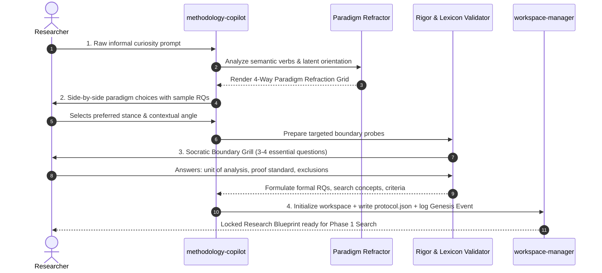

# Phase 0: Socratic Inception Interview Protocol

> **Vision:** A guided Socratic interview that navigates researchers from informal, fuzzy curiosity to calibrated research questions, explicit epistemological paradigms, and machine-readable protocols.

---

## 1. The 4-Stage Inception Architecture

---

## 2. Stage 1: Latent Intent & Semantic Mining

When a user provides an informal prompt (*"I want to research AI in code reviews"*), the engine detects semantic indicators to identify latent leanings:

| Latent Orientation | Characteristic Keywords & Verbs | Default Playbook Recommendation |
| :--- | :--- | :--- |
| **Positivist** | *impact, measure, effect size, correlation, optimize, benchmark, statistically compare, predict* | **PRISMA SLR** or **Rapid Evidence Assessment** |
| **Interpretivist** | *perceive, experience, understand, lived experience, cultural nuance, identity, sense-making* | **Scoping Review (JBI)** |
| **Design Science** | *build, construct, prototype, architecture, pipeline, harness, benchmark suite, latency delta* | **Design Science Benchmark (DSR)** |
| **Pragmatist / Mixed** | *tradeoffs, organizational friction, under what conditions, practical deployment, socio-technical* | **Scoping Review** or **PRISMA SLR** |

---

## 3. Stage 2: The 4-Way Paradigm Refraction Grid

Instead of asking the researcher academic theory questions (*"What is your ontology?"*), the engine presents a **Side-by-Side Refraction Grid** demonstrating how their raw topic manifests across 4 distinct research paradigms:

### Example: Raw Topic = *"Developer Productivity with Generative AI"*

| Paradigm | Epistemological Goal | Sample Refined Research Question (RQ) | Required Primary Evidence | Strict Negative Exclusions |
| :--- | :--- | :--- | :--- | :--- |
| **Positivist (Quantitative)** | Measure objective, generalizable statistical effects. | *“What is the statistically significant impact of LLM autocompletion on developer cyclomatic complexity and unit test pass rates across 500 Python engineers?”* | Quantitative telemetry, git diff metrics, commit velocity, controlled A/B test logs. | Subjective emotional state as primary proof; non-replicable anecdotes. |
| **Interpretivist (Qualitative)** | Understand human meaning, perceptions, and identity. | *“How do senior software architects perceive the shift in their sense of authorial ownership and intellectual agency when integrating AI into code reviews?”* | Semi-structured interviews, thematic coding, contextual inquiry transcripts. | Statistical p-values, claims of global generalizability, arbitrary numerical scoring. |
| **Design Science (Computational)** | Engineer a novel artifact that solves an operational utility problem. | *“Can a context-aware structural RAG plugin reduce hallucinated library calls in Python IDEs by ≥20% compared to baseline Copilot autocompletion?”* | Benchmark suites, ablation studies, latency profiling, error rate delta. | Mere descriptive opinion without an evaluated computational artifact. |
| **Pragmatist / Mixed Methods** | Solve a socio-technical problem by triangulating metrics with narratives. | *“To what extent do AI coding tools accelerate commit frequency (Quant), and what friction mechanisms emerge during team PR reviews (Qual)?”* | Triangulated telemetry data + post-sprint retrospective interview coding. | Purely theoretical models without empirical grounding in practice. |

---

## 4. Stage 3: Socratic Boundary Grill & Lexicon Enforcement

Once the researcher selects their paradigm, the engine asks **3 to 4 non-negotiable probing questions**:

1. **Unit of Analysis**:
   - *"What is the atomic unit being observed? (A developer, a commit diff, a team, an LLM token output, an enterprise organization)?"*
2. **Gold Standard Proof**:
   - *"What specific artifact or metric would convince a top-tier peer reviewer that your finding is true?"*
3. **Explicit Negative Scope (Exclusion Boundary)**:
   - *"What is strictly out of scope? (e.g. closed-source proprietary models, pre-2022 studies, non-English publications, student hobby projects)?"*
4. **Lexicon Enforcement**:
   - If *Interpretivist* is chosen: Enforces Lincoln & Guba trustworthiness vocabulary (*Credibility, Transferability, Dependability, Confirmability*) and flags misuse of Positivist terms (*"Internal Validity"*, *"Sample Randomization"*).
   - If *Positivist* is chosen: Enforces statistical power, control groups, and effect sizes.

---

## 5. Stage 4: Protocol Emission & Workspace Genesis

At the conclusion of the interview:
1. Emits finalized, numbered research questions (`RQ1`, `RQ2`, `RQ3`).
2. Compiles concept clusters with synonyms for downstream database translation.
3. Formulates explicit inclusion (`INC-01`) and exclusion (`EXC-01`) rules.
4. Scaffolds `workspaces/<slug>/`:
   - `protocol.json` (Machine-readable pipeline contract).
   - `literature/criteria.md` (Human-readable PRISMA screening rubric).
   - `audit/journal.jsonl` (Genesis Event recording chosen paradigm, rejected refractions, and decision rationales).
