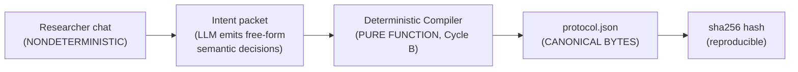

# Phase 0: Cycle A — The Contract Is King (Zero LLM)

> **Specification Version:** 1.0.0
> **Status:** Build Specification (Cycle A of the Phase 0 delivery sequence)
> **Primary Deliverable:** A versioned, schema-validating `scholar-protocol` package whose hand-validated golden `protocol.json` fixtures are the conformance gate for every later cycle.
> **Definition of Done:** *The hand-validated golden contract is the spec. Any generator output that differs fails.*

---

## 1. Why This Cycle Ships First

Phase 0's stated invariant is *"identical inputs → identical protocol"* (see `README.md` §2 and the deep-dive's Idempotency proposition). That invariant only becomes testable if we first fix the **byte boundary** of what "identical protocol" means. This cycle:

1. Locks the `protocol.json` schema into executable code + a validator CLI.
2. Hand-author a set of **golden fixtures** — the ground truth every downstream generator must match.
3. Establishes **canonical serialization** (stable field order, stable key ordering, normalized JSON) so that `sha256` protocol hashes (required by the WORKSPACE_GENESIS audit event, deep-dive §5) are reproducible byte-for-byte.
4. Gives every downstream kit (`scholar-search-kit`, `scholar-screen-kit`, `scholar-rag-kit`, Phase 4 Trust) a single artifact to build against **immediately** — this is the missing "spine."

**Explicitly out of scope:** any LLM, any Socratic interview, any workspace scaffolding, any playbook preset loading, any criterion-ID *generation*. Cycle A is pure schema + validation + canonicalization + conformance. The interview and deterministic compiler arrive in Cycle B; `criteria.md` rendering in Cycle C; matrix-dimension *consumption* in Cycle D (emission as inert config is already valid in Cycle A, since `matrix_dimensions` defaults to `[]` and `target_section_category` is nullable — the data model is already a projection, not a pipeline dependency).

---

## 2. Nondeterminism Boundary (Restated Invariant)

The live conversation is nondeterministic and **will not** produce identical bytes. That is acceptable. The deterministic closure is defined as:

> **Restated invariant:** Identical **intent packets** → identical `protocol.json` (canonical bytes, and therefore identical `sha256` hash).

The boundary, made explicit:



- The **LLM is outside** the deterministic closure. It may emit an intent packet in whatever prose/shape its model chooses.
- The **compiler is inside** the closure. Given the same intent packet, it must emit byte-identical canonical `protocol.json` — RQ numbering, criterion IDs, boolean syntax, enum values, JSON key order. This is a pure function that Cycle B unit-tests with hand-authored transcripts.
- The **golden fixtures authored in this cycle** ARE the canonical serializations that define the closure. They are the input→output contract the compiler must reproduce exactly.

This cycle therefore also **fixes the serialization spec** (below) so that Cycle B's compiler has an unambiguous target.

---

## 3. Deliverables

### 3.1 Package Layout

Mirrors the house convention (hatchling, `src/` layout, `typer` + `rich` CLI, `pydantic` v2, `pytest`):

```
tools/scholar-protocol-kit/
├── pyproject.toml              # name=scholar-protocol-kit, entry point: scholar-protocol
├── src/scholar_protocol/
│   ├── __init__.py             # re-exports models, version
│   ├── models.py               # pydantic models (sole source of truth, mirrors docs/phase_0/01)
│   ├── canonical.py            # deterministic serializer (canonical JSON + sha256)
│   ├── validate.py             # validation entrypoint (parse + cross-field checks)
│   └── cli.py                  # `scholar-protocol validate ...`
├── schemas/
│   └── v1/
│       └── protocol.schema.json  # checked-in JSON Schema; `$schema` field references `schemas/v1/protocol.schema.json`
├── tests/
│   ├── fixtures/
│   │   ├── valid/               # golden .json fixtures (canonical ground truth)
│   │   ├── invalid/             # fixtures that MUST be rejected, with expected error
│   │   └── canonical/           # non-canonical inputs expected to round-trip to canonical form
│   ├── test_models.py
│   ├── test_canonical.py
│   ├── test_validate.py
│   └── test_cli.py
└── README.md
```

### 3.2 The `models.py` Sole Source of Truth

The Pydantic v2 models in `docs/phase_0/01_protocol_schema_specification.md` (§2) become a single `models.py`. Kept byte-for-byte faithful to that spec — this cycle does **not** redesign the schema; it freezes it in code.

Key constraints the models must already express (from the spec):
- `$schema` alias on `schema_version` (schema `1.0.0`).
- `research_questions` `min_length=1`; `search_strategy.core_concepts` `min_length=1`; `screening_criteria.inclusion/exclusion` `min_length=1`.
- `verification.minimum_trust_score_threshold` bounded `[0.0, 10.0]`.
- Enum strictness: `PlaybookType`, `EpistemologicalParadigm`, `DimensionDataType` are `str, Enum` (reject unknown values).
- Optional fields with documented defaults: `matrix_dimensions=[]`, `target_section_category=None`, `fallback_value="Not Reported"`.
- The `data_type` default `FREE_TEXT`; `required` default `False`.

### 3.3 Canonical Serialization (`canonical.py`)

Because the WORKSPACE_GENESIS audit event stores `protocol_hash: sha256:<hex>`, the JSON bytes must be **reproducible**. Requirements:

1. **Stable key order.** JSON object keys serialized in a fixed canonical order. We define the canonical key order as the **declaration order** of the Pydantic model fields (Pydantic v2 preserves field order — serialize `model_dump(mode="json")` then re-serialize with explicit ordered dicts). Document the ordering rule explicitly so it survives schema edits.
2. **Sorted arrays where order is semantically free.** Arrays that are semantically unordered (e.g. `core_concepts`, `matrix_dimensions`, `synonyms`) get a **defined canonical ordering rule** — do NOT silently sort user-authored lists. Instead: preserve author order for *list-like* semantic arrays (synonyms, concept clusters) but require determinism from the compiler. The rule must be stated and tested.
3. **No floating-point ambiguity.** `minimum_trust_score_threshold` serialized in a fixed format so `6.0` ≠ `6` ≠ `6.00` never produce divergent bytes.
4. **Whitespace.** Compact JSON, no trailing newline, single canonical `json.dumps(..., separators=(",", ":"))` with `ensure_ascii=True`.
5. **`sha256`.** `sha256(utf8(canonical_bytes)).hexdigest()`, prefixed `sha256:`.

Deliverable function: `canonical_fingerprint(protocol) -> str` returning `"sha256:<hex>"`.

### 3.4 Validation (`validate.py`)

`validate_protocol(path) -> ValidationReport` returning structured failures (fixture-referencable), covering:

**Schema resolution:** The `$schema` field value `schemas/v1/protocol.schema.json` is a *relative kit path*. `validate_protocol` resolves it against the installed kit's `schemas/` directory (via `importlib.resources`), not against the workspace path or the network. This keeps validation offline and deterministic. `models.py` is the authoritative runtime authority; the checked-in JSON Schema is kept in sync (a CI test compares generated schema from `models.py` against the checked-in `protocol.schema.json`).

**Structural (Pydantic):** schema + enum + min_length + bounds above.

**Cross-field (hand-written rules):**
- Every `ScreeningCriterion.maps_to_rqs` entry references an existing RQ `id`. *(No dangling `RQ3` ref.)*
- `MatrixDimension.id` values are unique; `ResearchQuestion.id` values are unique; `ScreeningCriterion.id` values unique across inclusion∪exclusion.
- `SearchStrategy.date_range` is coherent: `start_year <= end_year`, years within a sane band (e.g. `>= 1960`), `languages` non-empty.
- `target_candidate_pool_size.min <= max` and `>= 0`.
- Epistemology/paradigm ↔ playbook sanity: e.g. `SCOPING_REVIEW` defaulting to a non-pragmatist paradigm is a *warning*, not a hard error (keep the gate permissive; Cycle B's compiler owns presets).
- Warnings (non-fatal) for missing `matrix_dimensions` when `two_tier_screening` is true, missing `verification` flags, etc.

The error/warning taxonomy (`error` vs `warning`) is part of the CLI contract so Cycle B's compiler can be graded against it.

### 3.5 CLI (`cli.py`)

```
scholar-protocol validate <path> [--strict]
    # Validate a protocol.json. Exit 0 = valid, 1 = invalid, 2 = usage error.
    # --strict promotes warnings to errors.

scholar-protocol fingerprint <path>
    # Print the canonical sha256 of a protocol.json.

scholar-protocol canon <path>
    # Print canonical JSON bytes (useful for diffing generator output).
```

Uses `typer` + `rich` per harness convention. `--strict` exit codes must be tested in CI.

---

## 4. Golden Fixture Strategy

This is the heart of the cycle and directly answers a previously open question (*"who hand-authors the golden fixtures?"*).

### 4.1 Authorship

The **golden fixtures are hand-authored by the domain owner** (the researcher building Phase 0). They are the hand-validated ground truth — not generated. Each fixture encodes a realistic, internally-consistent research protocol that a human has reviewed line-by-line for correctness. File headers (JSON comments are invalid, so use a sibling `*.meta.md` or a `//`-free convention) record: author, date, schema version, and the editorial rationale for each non-default field.

### 4.2 What Makes a Fixture "Golden"

Test that *must* pass for every `valid/*.json` fixture:
1. `validate_protocol(...)` → no errors (and no warnings under the chosen strictness level the fixture declares).
2. `canonical(fixture) == fixture` — **idempotent**: re-serializing the canonical form yields the same bytes. This proves the fixture is already canonical reference output.
3. `fingerprint(fixture)` is stable and is **checked into the fixture set** as an expected hash (a `.sha256` sibling file), so byte drift is caught.
4. The fixture exercises cross-fields: at least one `maps_to_rqs` reference, ≥2 RQs, ≥1 inclusion + ≥1 exclusion, a non-trivial `matrix_dimensions` list, and a custom `verification` block.

### 4.3 Fixture Corpus (Minimum)

| Fixture | Coverage Intent |
| :--- | :--- |
| `valid/design_science_min.json` | Minimal-but-valid Design Science protocol (the sample in `01` §3). |
| `valid/prisma_slr_full.json` | Full PRISMA SLR with 3 RQs, 2-tier screening, required dimensions, all four `target_section_category` values. |
| `valid/scoping_empty_matrix.json` | Valid protocol with **no** `matrix_dimensions` (proves emission is inert config — Cycle B/C gate). |
| `valid/interpretivist_min.json` | Interpretivist paradigm with qualitative matrix dimensions and `incompatible_concepts`. |
| `invalid/enum_bad_paradigm.json` | Unknown paradigm value → error. |
| `invalid/bad_rq_ref.json` | `maps_to_rqs` points at nonexistent `RQ9` → cross-field error. |
| `invalid/empty_criteria.json` | `inclusion` or `exclusion` empty → `min_length` error. |
| `invalid/threshold_oob.json` | `minimum_trust_score_threshold` = 11 → bounds error. |
| `canonical/unordered_dims.json` | matrix_dimensions in shuffled order → `canon` output matches the ordered golden bytes. |

Each `invalid/*` fixture carries an expected code (e.g. `CROSS_FIELD_RQ_REF`) so the validator's taxonomy is itself tested.

### 4.4 The Fixture as the Spec

> **Definition of Done (restated):** The hand-validated golden contracts are the specification. Any generator output (Cycle B's compiler, future presets, notebook exporters) that serializes to bytes differing from the canonical fixture *fails conformance*. `validate_protocol` + `canonical_fingerprint` are the executable means of that check.

A new contributor's first task is literally "make a failing test pass": run `pytest tests/test_validate.py::test_golden_fixtures`, see one fixture they broke, fix it, done — on day one, with zero LLM in the loop.

---

## 5. Conformance Test Matrix (Cycle A)

| Test File | Asserts |
| :--- | :--- |
| `test_models.py` | All valid fixtures parse into Pydantic models; enum/`min_length`/bounds rejections; defaults materialize correctly. |
| `test_canonical.py` | Idempotence (`canon(canon(x)) == canon(x)`); expected `.sha256` values; key-order stability; float format stability; unordered-dim canonicalization. |
| `test_validate.py` | Golden fixtures pass; each `invalid/*` fixture fails with its expected error `code`; each `warning` case surfaces as warning (or error under `--strict`); cross-field `maps_to_rqs` reference checks. |
| `test_cli.py` | Exit codes 0/1/2 per `--strict`; `fingerprint` output format; `canon` yields bytes comparable to golden. |

CI must run `pre_commit_check.py` (harness root convention) and `pytest` for this kit. All fixtures are deterministic; no network, no LLM, no mocks needed.

---

## 6. Definition of Done (this cycle)

- `tools/scholar-protocol-kit/` exists, installable via `uv`/pip, with the entry point `scholar-protocol`.
- All golden `valid/*`, `canonical/*` fixtures pass; all `invalid/*` fixtures fail with the documented error codes.
- `fingerprint` outputs are stable and checked in; any byte change to a fixture fails CI.
- `docs/phase_0/` index (README §3) now lists `05` and the `$schema` URL defect is resolved (see §7).
- **Cycle A never imports an LLM SDK or makes a network call.** It is pure.

---

## 7. Related Defects to Close Alongside Cycle A

These were flagged in review and are cheap to fix while the schema is being frozen in code:

1. **`$schema` URL was dead** (`01` §2/, §3 and deep-dive §3 pointed at `https://nexus-scholar.org/...`, which does not resolve). **Resolved for this cycle** following option (b): reference a checked-in relative schema `schemas/v1/protocol.schema.json` (see §3.1 layout). This makes the contract self-contained and CI-checkable. Note: `$schema` in `01` §3 is *also* the `schema_version` alias field; do not confuse the two. The tooling must symlink/validate against the JSON Schema at `schemas/v1/protocol.schema.json`. `01` sample JSON and the deep-dive §3 sample have both been updated to the relative URI.
2. **Playbook 5 truncated** (`02` §6): Novice Starter ends after bullets with no preset JSON and no `matrix_dimensions`. Either complete it or mark it `[TODO]` explicitly. Suggest completing it in Cycle B where presets are authored, but at minimum add an explicit TODO here so it's tracked.
3. **Number drift** (`02` diagram vs presets): REA diagram says pool 30–50, preset says 50–150 candidate / 20–35 included; Student playbook bullet says 50–200 → 25–40 while the diagram implies different. Reconcile to one canonical set (the presets are authoritative).

Each of these is a one-line change or a small fixture addition; none blocks Cycle A's core, but #1 should land **with** Cycle A because it is part of "freezing the contract in code."

---

## 8. Handoff to Cycle B

When Cycle A is green, Cycle B's contract is unambiguous:

- The **deterministic compiler** must reproduce, byte-for-byte, the canonical form of every golden fixture given the corresponding hand-authored intent packet.
- Conformance gate: `scholar-protocol validate` + `scholar-protocol fingerprint` on the compiler's output, compared against the checked-in `.sha256` sibling files.
- The compilation is performed **without** the interview in the loop in Cycle B's tests: hand-authored intents → expected canonical bytes. The live Socratic state machine (deep-dive §5: `INCEPTION_INTERVIEW → PARADIGM_REFRACTED → BOUNDARIES_PROBED → PROTOCOL_COMPILED → WORKSPACE_SCAFFOLDED`) is added on top of the pure compiler and remains separately testable.

This is the seam: Cycle A owns the arrow **protocol → gold bytes**, Cycle B owns **intent → protocol**, and both are checked against the same fixtures.
