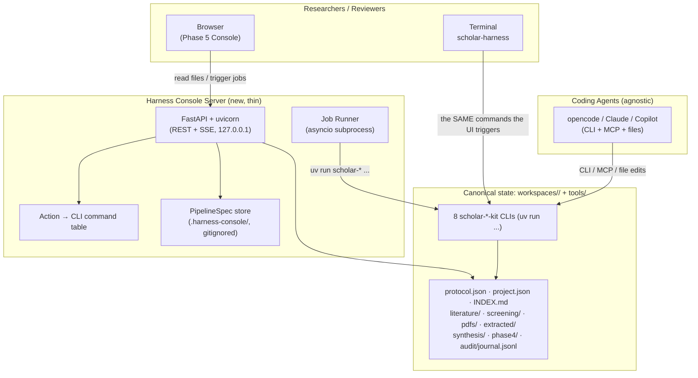

# Phase 5 — Blueprint: The Harness Console

> **Status:** Planning | **Version:** 1.0.0 | Companion docs: [`README.md`](./README.md) · [`PLAN.md`](./PLAN.md) · [`SPECS.md`](./SPECS.md)

## 1. Architecture in one diagram

## 2. The three non-negotiables

1. **The filesystem is the database.** No console-owned DB. Every read endpoint serves files from `workspaces/<slug>/`; every write endpoint lands in the same files agents already read.
2. **The console never re-implements a kit.** Any mutation the console performs is a subprocess call to `uv run <kit-cli>` (or writes the same file an agent would write). Bugs in the console are bugs in wiring, never in research logic.
3. **Agent-agnostic parity (D6).** The console exposes, for every action, the exact `uv run` command (and MCP tool, where one exists) that performs the same step — so anything a human does in the GUI is reproducible by any agent with zero extra knowledge.

## 3. System layer responsibilities

### 3.1 Controls plane: Harness Console Server
- One process: `uv run scholar-harness serve --workspace workspaces/<slug> [--port 8765] [--host 127.0.0.1]`.
- REST (JSON) for reads/actions; **SSE** for job progress and audit-event ticks.
- Serves the static console (`src/scholar_harness/console/static/`) with no build step (vendored JS under `lib/`; see `AGENTS.md`).
- Embeds `orchestrator.get_status()` unchanged for the dashboard payloads.
- No auth in v1 (binds loopback; docs warn about `--host` exposure).

### 3.2 Job Runner
- Maps a console action → `[command, *args]` (e.g. `["uv","run","scholar-search","search","--query",...]`).
- Executes as an asyncio subprocess with cwd = workspace; streams stdout/stderr to a per-job log file under `.harness-console/jobs/<job_id>/` (gitignored).
- Job lifecycle `queued → running → success|failed|cancelled`; versioned, killable by PID; hard timeout per action.
- On completion, writes a canonical event to `audit/journal.jsonl` via the same schema `workspace-manager/log_event.py` uses, so agents and UI agree on what happened.

### 3.3 PipelineSpec store (M5.4)
- `.harness-console/pipelines/*.json` — plain files, gitignored, but exportable/serializable into the repo (a pipeline is just data).
- `PipelineSpec` is a JSON DAG whose nodes reference kit CLIs; schema in `SPECS.md` §3. The CLI will execute the equivalent non-interactively via `scholar-harness run --pipeline <file>` once the M5.4 executor lands (see `PLAN.md` M5.4); the console editor is a *renderer of that schema*, `dry-run` caps each node at a sample limit before a real run.

### 3.4 Frontend (static console app)
- Screens (details in `SPECS.md` §4): **Dashboard · Literature · Screening · Harvest & Extract · Synthesis & Trust · Pipeline Builder · Audit · Agent Exchange · Export**.
- Reuses generated artifacts rather than rebuilding renderers: iframe/embed `knowledge_graph.html`, render `prisma_screening_report.md`, `evidence_matrix.md`, `phase4/trust_consensus*.md` as styled Markdown (marked.js-style parsing, or server-side conversion).
- Reads change-detection: file mtimes reloaded on focus / SSE tick — designed to co-exist with agents editing the same files concurrently.

## 4. Agent parity — the "Agent Exchange" surface

The console's strongest architectural feature is the mapping table:

| Console action | Equivalent CLI (shown in UI) | Equivalent MCP tool (when exists) |
| :-- | :-- | :-- |
| Run discovery | `uv run scholar-search search --query "..." --providers openalex,arxiv` | `nexus_discover` |
| Load screening batch N | `uv run python src/scholar_harness/agent_screen.py status <ws>` | `nexus_screen` |
| Approve/reject item | write `literature/screening/batch_NNN_decisions.json` (collect) | (agent handoff file contract) |
| Harvest PDFs | `uv run scholar-pdf download --input literature/included.json --output pdfs/` | `nexus_extract_pdf` |
| Build trust consensus | `uv run scholar-verify trust-context --workspace <ws>` | — |
| Export PRISMA report | `scholar-harness export ...` / kit CLI | — |

This table is **data, not documentation**: the server owns a static mapping (spec'd in `SPECS.md` §5) so the UI can render "see what command this triggers" on every button, and CI can test that label ≠ command drift.

## 5. Collaboration model

- **Local single-user:** single local user; sharing = the workspace's git repo. Decisions land in the audit journal so a second reviewer sees the trail.
- **Concurrency safety** is handed entirely to: atomic-rename writes (existing repo pattern), deterministic/idempotent re-runs (roadmap §Why-This-Works), and the append-only journal. No locks, no realtime broker, no conflict-resolution layer to build.

## 6. Security posture

- Loopback bind by default; `--host` flag exists for lab networks → docs carry an explicit exposure warning.
- No credentials ever pass through the UI: API keys stay in env (Phase-3 invariant #4). The console surfaces "key not set" states; agents/users configure env normally.
- Console logs nothing beyond the journal schema; job logs are short-lived and gitignored.
- Generated artifacts under `workspaces/**/pdfs/`, `rag/chroma_db/`, `lib/` remain gitignored (no size regressions).

## 7. What this deliberately does NOT include (anti-scope)

- A chat/LLM panel in the browser (agents talk; the console decides).
- A database, cache, or message broker.
- Realtime multi-cursor collaboration or an auth service.
- Re-implementations of ranking, chunking, dedup, verification, or graph math.
- A mobile or SaaS deployment.