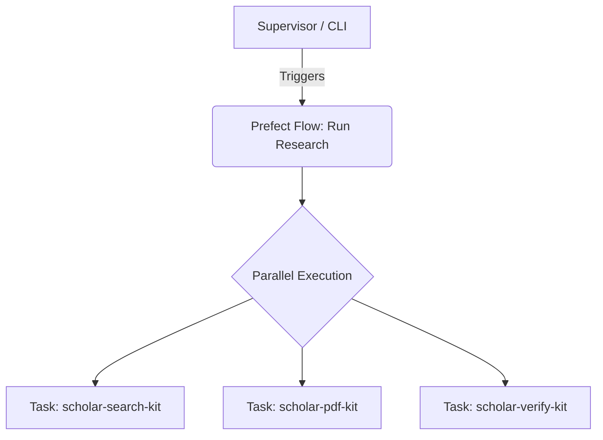

# V2 Orchestrator Option 1: Prefect

[Prefect](https://www.prefect.io/) is an industry-standard, Python-native workflow orchestration framework widely used in modern data engineering and MLOps.

## Overview
Prefect is designed around the concept of turning any Python function into a resilient, observable "Task" or "Flow" with just a single `@task` decorator. It excels at data-heavy pipelines.

## Architecture Fit for Nexus Scholar
In Nexus Scholar, Prefect would perfectly replace `orchestrator.py`. 

### Strengths
1. **100% Python Native:** You don't have to learn a new language. You just add `@task` to your existing kit CLI entry points or Python API functions.
2. **Massive Ecosystem:** It is deeply integrated into the Python ML ecosystem (Pandas, Dask, Ray).
3. **Built-in Dashboard:** Prefect comes with a beautiful open-source UI right out of the box to monitor your task queues and failures.

### Weaknesses
- **State Management for AI:** Prefect is built for "Data Pipelines" (ETL), not "Agentic Reasoning Loops". If an LLM needs to loop back and forth in a conversational state, Prefect feels slightly rigid compared to agent-native tools.
- **Latency:** It's built for batch processing, not sub-second API request serving.

## Conclusion
Choose Prefect if your priority is **Data Pipeline Reliability** and keeping everything strictly within the Python ecosystem with minimal architectural changes.
