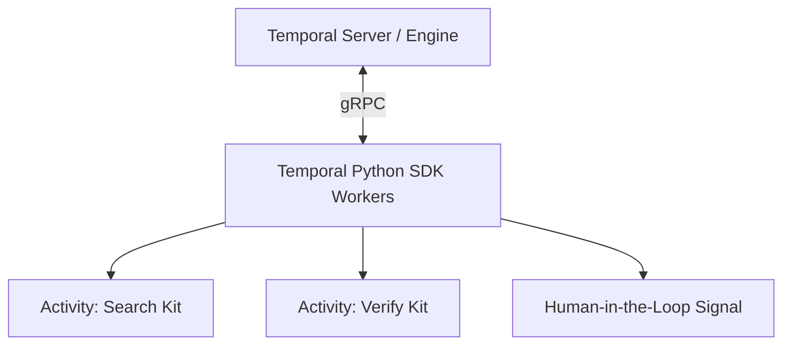

# V2 Orchestrator Option 2: Temporal

[Temporal](https://temporal.io/) is an open-source "Durable Execution" system. It is widely considered the gold standard for mission-critical, long-running processes.

## Overview
Temporal fundamentally changes how you write code. It acts as an invincible state machine. If your Python script crashes in the middle of a 3-hour operation, Temporal remembers exactly which line of code it was on and resumes execution instantly when the server restarts.

## Architecture Fit for Nexus Scholar
Temporal uses a Server (the engine) and Workers (your Python code).

### Strengths
1. **True Durability:** It is physically impossible to lose state. If your orchestrator is in the middle of extracting data from 10,000 PDFs and your AWS instance gets terminated, Temporal just picks up the next PDF on a new machine.
2. **Human-in-the-Loop:** Temporal natively supports "Signals". A workflow can pause itself for 30 days, waiting for a human researcher to click "Approve" in your web UI, without consuming any CPU resources.
3. **Polyglot (Cross-Language):** You can run the Temporal Server in Go, write your Web UI backend in TypeScript, and write your Research Kits in Python. They all communicate natively.

### Weaknesses
- **Steep Learning Curve:** You have to write your Python code according to strict deterministic rules (e.g., no random numbers or API calls inside the main workflow function, they must be isolated in "Activities").
- **Infrastructure Overhead:** You have to host the Temporal Server cluster (or pay for Temporal Cloud), which is a heavy infrastructure addition compared to a simple Python task queue.

## Conclusion
Choose Temporal if your priority is **Enterprise-Grade Reliability** and you want to build workflows that can survive massive system crashes or require complex human approval steps.
