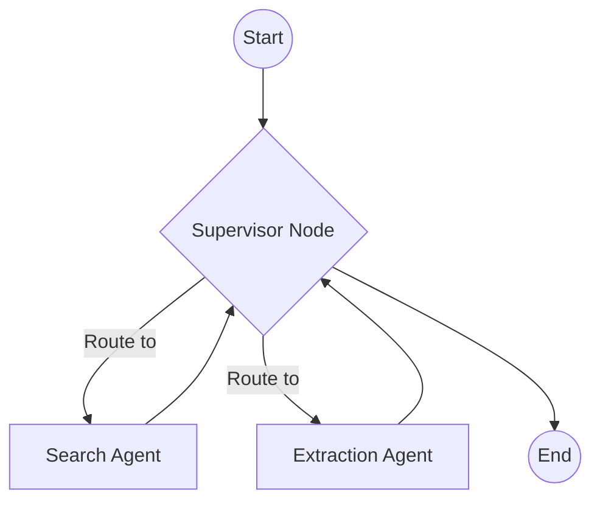

# V2 Orchestrator Option 3: LangGraph

[LangGraph](https://langchain-ai.github.io/langgraph/) is a framework built by the LangChain team specifically for creating stateful, multi-actor applications with LLMs.

## Overview
Unlike Prefect or Temporal (which are general-purpose software orchestrators), LangGraph is built strictly for **AI Agent Orchestration**. It models your application as a directed graph where nodes are agents or tools, and edges represent the flow of reasoning.

## Architecture Fit for Nexus Scholar
In Nexus Scholar, LangGraph would replace `orchestrator.py` with a Graph definition.

### Strengths
1. **Agent-Native Paradigm:** It is perfectly suited for building the "Chief Orchestrator Agent" we discussed in the V2 roadmap. It handles the non-deterministic routing (letting an LLM decide what to do next) beautifully.
2. **Cyclic Reasoning:** Traditional DAGs (Directed Acyclic Graphs) like Airflow cannot loop backward. LangGraph explicitly supports cyclic loops, meaning an agent can critique its own work, loop back, and fix it until it's right.
3. **Built-in Memory:** It natively manages conversation history and state across the entire graph.

### Weaknesses
- **Not a Distributed Engine:** LangGraph is an application-level framework, not an infrastructure-level task queue. If you want to run 10,000 PDFs in parallel, LangGraph alone won't scale across multiple servers; you still need a task queue (like Celery) underneath it.
- **Tightly Coupled to LangChain:** It leans heavily into the LangChain ecosystem, which can sometimes be overly abstracted and difficult to debug.

## Conclusion
Choose LangGraph if your primary focus for V2 is **Agent Autonomy**, meaning you want complex LLM reasoning loops and self-critiquing agents, rather than just running fixed python scripts in parallel.
