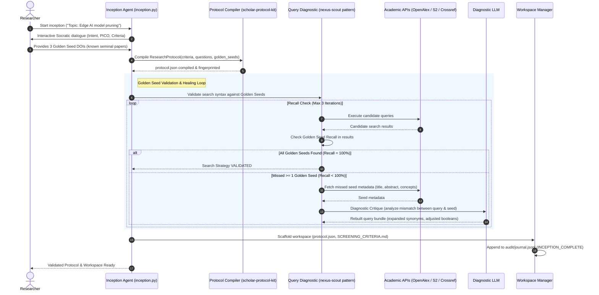
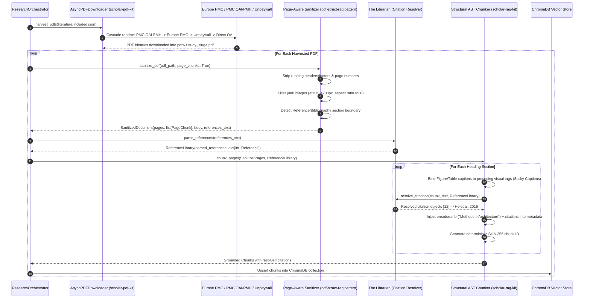
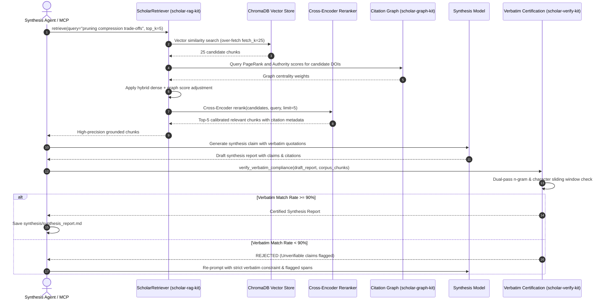
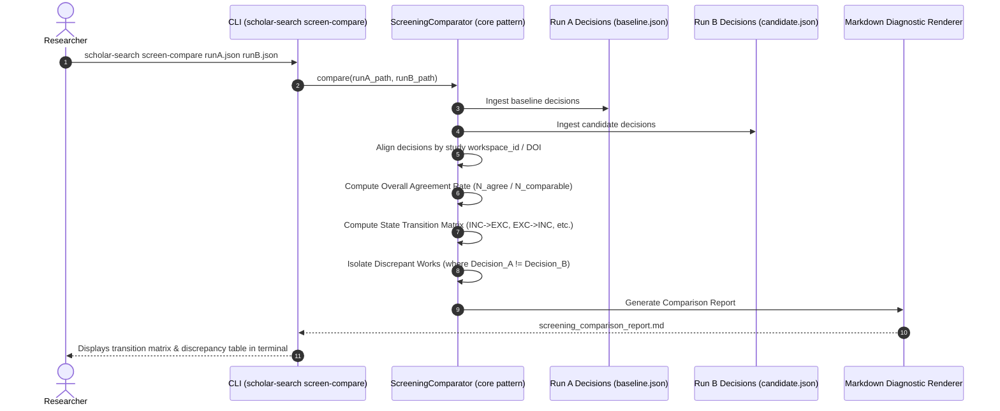
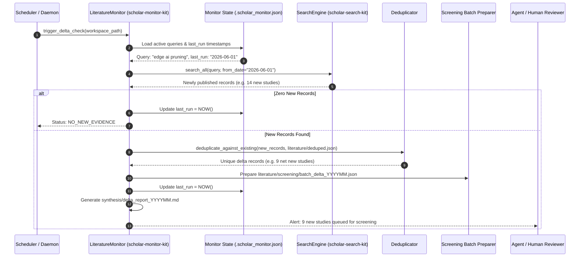
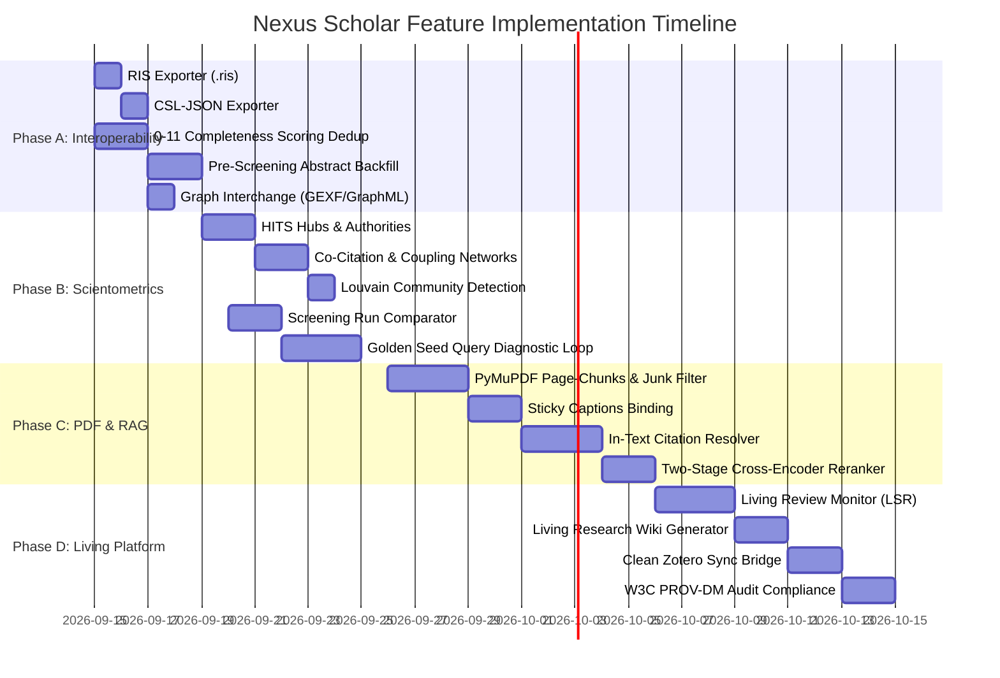

# Nexus Scholar: Master Technical Specification & Evolution Blueprint

> **Document Type:** Canonical Architecture Specification & Feature Integration Blueprint  
> **Status:** APPROVED ARCHITECTURAL SPECIFICATION  
> **Version:** 2.0.0-PROPOSAL  
> **Target System:** `nexus-scholar-harness` and the 8 domain toolkits (`tools/scholar-*-kit`)  
> **Derived From Synthesis Of:**
> - [`docs/NEXUS_PHP_ANALYSIS.md`](file:///c:/Users/mouadh/Documents/nexus-scholar-harness/docs/NEXUS_PHP_ANALYSIS.md) (Legacy PHP, `core`, and `graph-algorithms`)
> - [`docs/NEXUS_ECOSYSTEM_ANALYSIS.md`](file:///c:/Users/mouadh/Documents/nexus-scholar-harness/docs/NEXUS_ECOSYSTEM_ANALYSIS.md) (All 17 repositories across PHP, Python, .NET, and TypeScript)
> - [`docs/NEXUS_HARNESS_SYNTHESIS.md`](file:///c:/Users/mouadh/Documents/nexus-scholar-harness/docs/NEXUS_HARNESS_SYNTHESIS.md) (Codebase-grounded gap analysis and PRISMA value arguments)

---

## 1. Executive Summary & Architectural Vision

### 1.1 The Evolution Mandate
Nexus Scholar was originally conceived as an agent-native orchestrator for systematic literature reviews (SLRs). Across several generations of implementation in PHP, Python, .NET, and TypeScript, different repositories solved distinct, non-trivial problems:
- `pdf-struct-rag` solved high-fidelity PDF layout parsing, math extraction, and in-text citation linking.
- `refmanager` and `core` solved universal bibliographical format interoperability, 0–11 completeness deduplication, and screening sensitivity comparison.
- `graph-algorithms` and `scholar-graph` solved scientometric clustering, HITS authority modeling, and longitudinal citation dynamics.
- `scholar-monitor-kit` solved the maintenance bottleneck via Living Systematic Review (LSR) delta tracking.
- `core-csharp` formalized W3C PROV-DM scientific provenance and clinical critical appraisal instruments with human-in-the-loop safeguards.
- `nexus-scout` developed self-healing search queries anchored to Golden Seed papers.

This specification unifies these independent breakthroughs into a cohesive, production-grade technical specification for the active Python monorepo (`nexus-scholar-harness`).

### 1.2 The End-to-End System Architecture

The target architecture organizes the system into seven functional planes:

```mermaid
flowchart TB
    subgraph UI_CLI["Plane 1: Interaction & Interfaces"]
        CLI["CLI: scholar-harness / scholar-*"]
        MCP["FastMCP Server (19 Tools)"]
        WIKI["Living Research Wiki (docs/wiki/)"]
        ZOT["External Bridges (Zotero / Rayyan / Covidence)"]
    end

    subgraph ORCH["Plane 2: Master Orchestrator & State Machine"]
        ORCHESTRATOR["ResearchOrchestrator (orchestrator.py)"]
        STATE_MACHINE["Corpus & Screening Lifecycle Engine"]
        LSR_MONITOR["Living Review Monitor (scholar-monitor-kit)"]
        AUDIT_LEDGER["W3C PROV-DM Audit Ledger (audit/journal.jsonl)"]
    end

    subgraph DISCOVERY["Plane 3: Federated Discovery & Deduplication"]
        QUERY_COMP["Universal Boolean AST Query Compiler"]
        HEAL_LOOP["Golden Seed Self-Healing Loop"]
        SEARCH_ENG["Federated Search Engine (7 Providers)"]
        ABSTRACT_HYD["Batch Abstract Hydrator (S2 / OpenAlex)"]
        DEDUP_ENG["Deduplicator (3-Tier Matching + 0-11 Completeness)"]
        CORPUS_LOCK["Corpus Locking & Snapshot Seal"]
    end

    subgraph SCREENING["Plane 4: PRISMA Screening & Appraisal"]
        PRISMA_PREP["PRISMA Batch Partitioning (agent_screen.py)"]
        AGENT_SCREEN["Agent-in-the-Loop Screener"]
        HUMAN_ADJUD["Conflict Queue & Human Adjudication"]
        SCREEN_COMP["Run Comparator (Transition Matrices)"]
        APPRAISAL["Appraisal Instrument Engine (QUADAS/RoB)"]
    end

    subgraph PDF_RAG["Plane 5: PDF Harvesting, Extraction & RAG"]
        OA_HARVEST["OA PDF Harvester (Europe PMC / PMC OAI-PMH)"]
        PAGE_SANITIZER["PyMuPDF Page-Chunks & Junk Image Filter"]
        LIBRARIAN["In-Text Citation Resolver (The Librarian)"]
        STICKY_CHUNKER["Structural AST Chunker (Sticky Captions)"]
        TWO_STAGE_RAG["Two-Stage Retrieval (ChromaDB + Cross-Encoder)"]
        VERBATIM_SYNTH["Grounded Synthesis (>=90% Verbatim Cert.)"]
    end

    subgraph SCIENTOMETRICS["Plane 6: Scientometrics & Knowledge Networks"]
        CIT_GRAPH["Directed Citation Graph (NetworkX)"]
        SCIENTOMETRICS_ENG["Scientometric Engine (HITS / Co-Citation / Coupling)"]
        COMMUNITY_DET["Louvain & Leiden Community Detection"]
        INTERCHANGE["Graph Exporters (GEXF / GraphML / Cytoscape)"]
    end

    subgraph STORAGE["Plane 7: Workspace Storage & Persistence"]
        WS_FS["Workspace Filesystem (workspaces/<slug>/)"]
        SQLITE_DB["Workspace SQLite Database (workspace.sqlite)"]
        CHROMA_STORE["ChromaDB Vector Store (rag/chroma_db/)"]
    end

    UI_CLI --> ORCH
    ORCH --> DISCOVERY
    DISCOVERY --> SCREENING
    SCREENING --> PDF_RAG
    SCREENING --> SCIENTOMETRICS
    PDF_RAG --> STORAGE
    SCIENTOMETRICS --> STORAGE
    ORCH --> STORAGE
```



---

## 2. Exhaustive Sequence Flows

### 2.1 Sequence 1: Phase-0 Protocol Inception, Golden Seed Validation & Query Healing

When starting a review, research questions are compiled into search queries. If queries miss known landmark papers ("Golden Seeds"), the automated diagnostic loop heals the query syntax before committing to the full search run.



---

### 2.2 Sequence 2: Federated Discovery, Batch Abstract Hydration & 0–11 Completeness Deduplication

Discovery queries multiple academic providers in parallel. Because Crossref and other APIs frequently return empty abstracts, an asynchronous batch backfill is executed before deduplication and screening.

```mermaid
sequenceDiagram
    autonumber
    participant Orch as ResearchOrchestrator
    participant Engine as SearchEngine (scholar-search-kit)
    participant Providers as Search Providers (7 Sources)
    participant Hydrator as AbstractHydrator (lit-screen-first pattern)
    participant S2_OA as S2 & OpenAlex Batch APIs
    participant Dedup as Deduplicator (0-11 Completeness)
    participant Ledger as Audit Ledger

    Orch->>Engine: search_all(protocol.queries)
    par Concurrent Discovery
        Engine->>Providers: OpenAlex search
        Engine->>Providers: Semantic Scholar search
        Engine->>Providers: Crossref search
        Engine->>Providers: PubMed search
        Engine->>Providers: arXiv search
        Engine->>Providers: bioRxiv search
        Engine->>Providers: Europe PMC search
    end
    Providers-->>Engine: Raw discovered documents (e.g. 1,450 records)
    Engine->>Orch: raw_search.json saved

    rect rgb(255, 250, 240)
        note right of Orch: Batch Abstract Hydration Pass
        Orch->>Hydrator: Identify records where abstract is NULL but DOI exists
        Hydrator->>S2_OA: POST /graph/v1/paper/batch & GET /works?filter=doi:...
        S2_OA-->>Hydrator: Hydrated abstracts & inverted indices
        Hydrator-->>Orch: Backfilled documents (~85% recovery of blank abstracts)
    end

    rect rgb(240, 255, 240)
        note right of Orch: 0-11 Completeness Deduplication
        Orch->>Dedup: deduplicate(hydrated_docs)
        loop For Each Document
            Dedup->>Dedup: Check Tier 1 (DOI, PMID, arXiv, S2 ID match)
            Dedup->>Dedup: Check Tier 2 (Title >= 97% + Year +/- 1 + Author surname)
            alt Duplicate Cluster Found
                Dedup->>Dedup: Calculate Completeness Score (0-11) for candidate
                Dedup->>Dedup: Calculate Completeness Score (0-11) for current representative
                alt Candidate Score > Current Representative Score
                    Dedup->>Dedup: Elect candidate as NEW representative
                    Dedup->>Dedup: Demote old representative to duplicates array
                else Candidate Score <= Current Representative Score
                    Dedup->>Dedup: Retain representative; append candidate to duplicates
                end
                Dedup->>Dedup: Non-destructive metadata fusion (_merge_metadata)
            else Unique Document
                Dedup->>Dedup: Create new cluster with doc as representative
            end
        end
        Dedup-->>Orch: Deduplicated Clusters (literature/deduped.json)
    end

    Orch->>Orch: Generate cryptographic SHA-256 manifest of deduped corpus
    Orch->>Ledger: Log CORPUS_LOCKED event with immutable digest
    Orch->>Orch: Set corpus.lock (screening gate open)
```

---

### 2.3 Sequence 3: Full-Text PDF Harvesting, Deep Extraction & In-Text Citation Resolution

Harvesting leverages high-yield direct Open Access APIs (Europe PMC, PMC OAI-PMH). Extraction preserves page chunks, binds sticky captions, filters image junk, and links inline citations to the bibliography.



---

### 2.4 Sequence 4: Two-Stage Hybrid Retrieval & Verbatim Grounded Synthesis

Synthesis requires zero hallucinations. The retriever performs initial dense retrieval with PageRank boosting, followed by cross-encoder reranking, before synthesis and dual-pass verbatim verification.



---

### 2.5 Sequence 5: Screening Sensitivity & Run Comparison (`screen-compare`)

Comparing two screening runs (e.g. baseline vs. prompt revision, or Model A vs. Model B) provides an audit trail of criteria drift.



---

### 2.6 Sequence 6: Living Systematic Review (LSR) Delta Monitoring Loop

Living reviews monitor literature deltas on a scheduled basis, screening only newly published evidence without re-screening the past corpus.



---

## 3. Comprehensive Domain Specifications

### 3.1 Domain 1: Federated Discovery & Ingestion Hygiene (`scholar-search-kit`)

#### A. Universal Reference Exporter (`scholar_search.export`)
Extends `Exporter` to natively produce Tagged RIS and CSL-JSON for external review platforms (Rayyan, Covidence, EndNote, Zotero).

```python
# tools/scholar-search-kit/src/scholar_search/export.py
from pathlib import Path
from typing import Any
from .models import Document, DocumentCluster

class Exporter:
    def json(self, documents: list[Document], output_file: str | Path, indent: int = 2) -> Path: ...
    def jsonl(self, documents: list[Document], output_file: str | Path) -> Path: ...
    def csv(self, documents: list[Document], output_file: str | Path) -> Path: ...

    def ris(self, documents: list[Document], output_file: str | Path) -> Path:
        """Export documents to standardized Tagged RIS (.ris) format for Rayyan/Covidence."""
        path = Path(output_file)
        if not path.suffix == ".ris":
            path = path.with_suffix(".ris")
        path.parent.mkdir(parents=True, exist_ok=True)

        lines: list[str] = []
        for doc in documents:
            ty = "JOUR" if (doc.venue and any(x in doc.venue.lower() for x in ["journal", "trans"])) else "CONF" if "conf" in (doc.venue or "").lower() else "GEN"
            lines.append(f"TY  - {ty}")
            if doc.title:
                lines.append(f"TI  - {doc.title}")
            for author in doc.authors:
                if author.family_name and author.given_name:
                    lines.append(f"AU  - {author.family_name}, {author.given_name}")
                elif author.family_name:
                    lines.append(f"AU  - {author.family_name}")
            if doc.year:
                lines.append(f"PY  - {doc.year}")
            if doc.venue:
                lines.append(f"JO  - {doc.venue}" if ty == "JOUR" else f"T2  - {doc.venue}")
            if doc.abstract:
                lines.append(f"AB  - {doc.abstract}")
            if doc.external_ids.doi:
                lines.append(f"DO  - {doc.external_ids.doi}")
            if doc.url:
                lines.append(f"UR  - {doc.url}")
            if doc.external_ids.arxiv_id:
                lines.append(f"C1  - arXiv:{doc.external_ids.arxiv_id}")
            lines.append(f"DB  - {doc.sources[0] if doc.sources else 'nexus-scholar'}")
            lines.append("ER  - \n")

        path.write_text("\n".join(lines), encoding="utf-8")
        return path

    def csl_json(self, documents: list[Document], output_file: str | Path) -> Path:
        """Export documents to CSL-JSON format (application/vnd.citationstyles.csl+json)."""
        ...
```

#### B. 0–11 Completeness Scoring Election (`scholar_search.dedup`)
Replaces network-latency first-seen bias with deterministic election of the highest-fidelity metadata record.

```python
# tools/scholar-search-kit/src/scholar_search/dedup.py
def compute_completeness_score(doc: Document) -> int:
    """Computes an objective completeness score (0-11) for cluster representative election.
    
    Rules:
      - Has DOI: +2
      - Has Abstract: +2
      - Has Publication Venue: +1
      - Has Authors list (>0): +1
      - Has Publication Year: +1
      - Has Citation Count (>0): +1
      - Has ORCID: +1
      - Not Retracted: +1
      - Provider Weight: openalex (+5) > crossref (+4) > s2 (+3) > arxiv (+2) > pubmed (+2)
    """
    score = 0
    if doc.external_ids.doi:
        score += 2
    if doc.abstract and len(doc.abstract.strip()) > 20:
        score += 2
    if doc.venue:
        score += 1
    if doc.authors:
        score += 1
    if doc.year:
        score += 1
    if doc.citation_count and doc.citation_count > 0:
        score += 1
    if any(getattr(a, "orcid", None) for a in doc.authors):
        score += 1
    if not getattr(doc, "is_retracted", False):
        score += 1
    return score
```

#### C. Pre-Screening Batch Abstract Hydrator (`scholar_search.enrichment`)
```python
class AbstractHydrator:
    """Asynchronously hydrates missing abstracts across Semantic Scholar and OpenAlex."""
    def __init__(self, http_client: AcademicHttpClient):
        self.http_client = http_client

    async def hydrate_missing_abstracts(
        self, documents: list[Document]
    ) -> tuple[list[Document], dict[str, int]]:
        """Identifies papers with missing abstracts and queries S2/OpenAlex batch APIs."""
        ...
```

---

### 3.2 Domain 2: PDF Intelligence & In-Text Citation Resolution (`scholar-pdf-kit` & `scholar-rag-kit`)

#### A. The Librarian: In-Text Citation Resolution (`scholar_rag.citations`)
Binds inline citations (`[12]`, `(Smith et al., 2020)`) directly into retrieved chunk metadata to prevent synthesis hallucinations.

```python
# tools/scholar-rag-kit/src/scholar_rag/citations.py
from dataclasses import dataclass
import re

@dataclass
class ResolvedReference:
    number: int
    authors: str
    year: int | None
    title: str
    venue: str
    doi: str

class CitationResolver:
    """Parses bibliographies and resolves in-text references to structured metadata."""
    
    NUMERIC_PATTERN = re.compile(r'\[(\d+(?:[,\-–]\s*\d+)*)\]')
    AUTHOR_DATE_PATTERN = re.compile(r'\(([A-Za-z\s\.,]+?)\s*,?\s*((?:19|20)\d{2})\)')

    def parse_bibliography(self, raw_references_markdown: str) -> dict[int, ResolvedReference]:
        """Parses numbered or authored reference sections into structured entries."""
        ...

    def resolve_chunk_citations(
        self, chunk_text: str, library: dict[int, ResolvedReference]
    ) -> list[ResolvedReference]:
        """Extracts all citation markers in the chunk and returns matching references."""
        ...
```

#### B. Sticky Captions & Academic Image Filtering (`scholar_pdf.extract`)
- **Sticky Captions**: Ensures figure tags `` are never separated from their descriptive caption paragraphs (`Figure 1: Comparison of model latency...`).
- **Geometric Junk Filtering**:
  - File size $< 5\text{ KB}$ $\rightarrow$ Filtered (icons, bullets).
  - Width or Height $< 200\text{ px}$ $\rightarrow$ Filtered (publisher logos).
  - Aspect ratio $> 5.0$ $\rightarrow$ Filtered (header/footer separator lines).

---

### 3.3 Domain 3: Scientometrics & Knowledge Networks (`scholar-graph-kit`)

#### A. Advanced Scientometric Modes (`scholar_graph.scientometrics`)
```python
# tools/scholar-graph-kit/src/scholar_graph/scientometrics.py
import networkx as nx

class ScientometricEngine:
    @staticmethod
    def compute_hits(G: nx.DiGraph, max_iter: int = 100) -> tuple[dict[str, float], dict[str, float]]:
        """Calculates Kleinberg HITS Hubs and Authorities scores.
        
        Authorities: Seminal empirical landmark papers.
        Hubs: Comprehensive systematic reviews, meta-analyses, and surveys.
        """
        return nx.hits(G, max_iter=max_iter)

    @staticmethod
    def build_cocitation_network(citing_map: dict[str, set[str]], min_jaccard: float = 0.15) -> nx.Graph:
        """Constructs an undirected co-citation network weighted by Jaccard similarity.
        
        Sim(A, B) = |Citing(A) & Citing(B)| / |Citing(A) | Citing(B)|
        """
        ...

    @staticmethod
    def build_bibliographic_coupling(reference_map: dict[str, set[str]], min_overlap: int = 2) -> nx.Graph:
        """Constructs a bibliographic coupling network based on shared reference lists."""
        ...

    @staticmethod
    def detect_communities_louvain(G: nx.Graph) -> list[set[str]]:
        """Detects modular thematic sub-disciplines using Louvain modularity optimization."""
        return list(nx.community.louvain_communities(G.to_undirected(), seed=42))
```

#### B. Universal Graph Exporters (`scholar_graph.exporters`)
Supports immediate export into **Gephi, VOSviewer, yEd, and Cytoscape.js**:
- `export_gexf(G, path)`: Gephi with typed attributes.
- `export_graphml(G, path)`: yEd / standard XML.
- `export_cytoscape(G, path)`: JSON elements for web dashboards.

---

### 3.4 Domain 4: Screening Diagnostics & Run Comparison (`scholar-search-kit`)

#### A. Screening Run Comparator (`scholar_search.screening`)
```python
# tools/scholar-search-kit/src/scholar_search/screening.py
@dataclass
class ScreeningComparisonReport:
    total_compared: int
    agreement_count: int
    agreement_rate: float
    transition_matrix: dict[str, dict[str, int]]  # e.g. {"INCLUDE": {"EXCLUDE": 3, "INCLUDE": 42}}
    discrepancies: list[dict[str, Any]]

def compare_screening_runs(
    run_a_decisions: list[dict[str, Any]],
    run_b_decisions: list[dict[str, Any]],
) -> ScreeningComparisonReport:
    """Compares two screening runs (e.g. prompt revisions or dual screeners) and calculates transition matrices."""
    ...
```

---

### 3.5 Domain 5: Living Systematic Reviews & Monitoring (`scholar-monitor-kit`)

#### A. Delta State Tracker & Incremental Review Loop
- **State File**: `<workspace>/audit/.scholar_monitor.json`
  ```json
  {
    "workspace_slug": "edge-ai-pruning",
    "queries": [
      {
        "alias": "pruning_core",
        "query": "('edge ai' OR 'tinyml') AND 'structured pruning'",
        "last_run": "2026-06-01T00:00:00Z"
      }
    ]
  }
  ```
- **Execution**:
  `scholar-harness monitor <workspace> [--auto-screen]`
  Fetches only studies published after `last_run`, deduplicates against existing corpus, partitions delta screening batches, and emits a monthly delta synthesis diff report.

---

### 3.6 Domain 6: Living Research Wiki Scaffolding (`scholar-harness wiki init`)

#### A. Obsidian-Compatible Research Digital Garden
Scaffolds a persistent knowledge base inside `<workspace>/docs/wiki/`:
```
<workspace>/docs/wiki/
├── papers/
│   ├── SCI-000142_he2016deep.md      # Study card with frontmatter + [[wikilinks]]
│   └── SCI-000189_vaswani2017.md
├── concepts/
│   ├── Structured_Pruning.md         # Thematic synthesis with backlinked studies
│   └── Edge_Inference_Latency.md
├── synthesis/
│   ├── PRISMA_Flowchart.md
│   └── Synthesis_Matrix.md
├── SCHEMA.md
├── index.md
└── log.md
```

---

## 4. Prioritized Engineering Roadmap



### 4.1 Milestone Breakdown

| Milestone | Target Toolkits | Deliverables | Success Gate |
| :--- | :--- | :--- | :--- |
| **Phase A** *(Days 1–4)* | `scholar-search-kit`<br>`scholar-bib-kit`<br>`scholar-graph-kit` | • Tagged RIS exporter (`.ris`)<br>• CSL-JSON exporter<br>• 0–11 Completeness scoring in deduplication<br>• Pre-screening batch abstract backfill (`enrich_missing_abstracts`)<br>• GEXF and GraphML graph exporters | • Exported `.ris` validates in Rayyan/Covidence without error<br>• Dedup election verified deterministic across thread delays<br>• Blank abstract rate drops $\ge 75\%$ |
| **Phase B** *(Days 5–9)* | `scholar-graph-kit`<br>`scholar-search-kit`<br>`scholar-protocol-kit` | • HITS Hubs vs Authorities centrality<br>• Co-citation & Bibliographic coupling networks<br>• Louvain community detection<br>• `scholar-search screen-compare` CLI & transition matrix<br>• Golden Seed self-healing query diagnostic loop | • HITS scores correctly identify seminal reviews as Hubs and trials as Authorities<br>• `screen-compare` generates complete transition matrix<br>• Golden Seed recall achieves 100% on benchmark seeds |
| **Phase C** *(Days 10–15)*| `scholar-pdf-kit`<br>`scholar-rag-kit` | • Page-aware extraction with header/footer stripping<br>• Geometric junk image filtering<br>• Sticky caption binding (figures & tables)<br>• In-text citation resolution ("The Librarian")<br>• Two-stage RAG with cross-encoder reranking | • Image filter discards $\ge 75\%$ junk while retaining all data figures<br>• Chunks with `[12]` contain resolved metadata<br>• Grounded synthesis verbatim rate $\ge 90\%$ |
| **Phase D** *(Days 16–21)*| `scholar-harness`<br>`scholar-monitor-kit` | • Living Systematic Review delta tracking (`scholar-harness monitor`)<br>• Living Research Wiki scaffolding (`scholar-harness wiki init`)<br>• Clean Zotero Web API sync bridge (`pyzotero`)<br>• W3C PROV-DM alignment in `audit/journal.jsonl` | • Incremental monitor detects new papers without re-screening corpus<br>• `docs/wiki/` opens in Obsidian with functional bidirectional links<br>• Zotero collection created with clean author names |

---

## 5. Verification & Test Strategy

### 5.1 Automated Unit & Integration Test Plan
1. **Deduplication Completeness Test (`test_completeness_election.py`)**:
   - Ingest duplicate cluster with a Crossref stub (score 3) and an OpenAlex complete record (score 10).
   - Assert OpenAlex record is elected representative regardless of array insertion order.
2. **RIS Conformance Test (`test_ris_exporter.py`)**:
   - Export 50 documents to `.ris`.
   - Parse exported `.ris` with standard reference manager parser and assert all fields (`TI`, `AU`, `PY`, `JO`, `AB`, `DO`, `ER`) round-trip with zero loss.
3. **Citation Resolver Test (`test_citation_resolver.py`)**:
   - Pass markdown containing `"as demonstrated in [1] and [3-5]"`.
   - Assert `resolved_citations` contains exact metadata for references 1, 3, 4, and 5.
4. **Screening Run Comparator Test (`test_screen_compare.py`)**:
   - Compare Run A (50 INCLUDE, 50 EXCLUDE) vs Run B (45 INCLUDE, 55 EXCLUDE).
   - Assert transition matrix correctly tallies `45 (INC->INC)`, `5 (INC->EXC)`, `50 (EXC->EXC)`.
5. **Golden Seed Diagnostic Test (`test_golden_seed_diagnostic.py`)**:
   - Provide query that misses 1 Golden Seed.
   - Run healing critique and assert repaired query retrieves missing seed.

---

## 6. Architectural Conclusion

This specification provides the definitive blueprint for evolving the Nexus Scholar platform. By uniting the specialized capabilities scattered across earlier PHP, Python, and .NET implementations into our active Python monorepo, `nexus-scholar-harness` achieves:
1. **Unassailable Methodological Rigor**: PRISMA 2020 and Cochrane-grade audit trails, 0–11 completeness scoring, and criteria sensitivity comparison.
2. **Universal Interoperability**: Native bridges to Rayyan, Covidence, EndNote, Zotero, Gephi, and Obsidian.
3. **Deep Evidence Grounding**: In-text citation resolution and cross-encoder reranking that eliminate RAG hallucinations.
4. **Perpetual Relevance**: Living Systematic Review delta monitoring that prevents scientific obsolescence.
