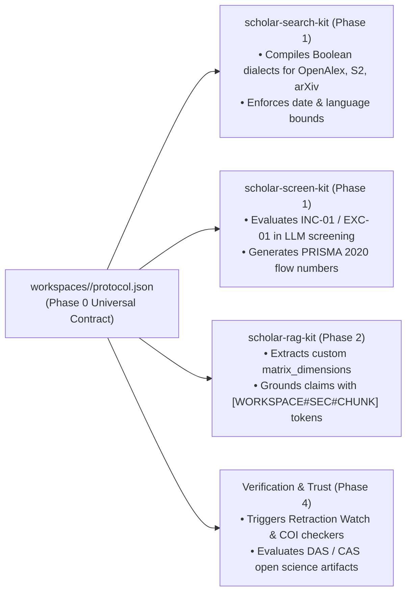

# Phase 0: Intent Router & Methodology Inception

> **Core Principle:** Transform raw, unstructured research curiosity into deterministic, auditable, and methodologically sound project blueprints before any searching begins.

---

## 1. Executive Summary & The Epistemological Bottleneck

Current academic research tools (Consensus, Elicit, Google Scholar, Scopus) assume the researcher arrives with a calibrated question, an explicit epistemological paradigm, and well-formulated screening boundaries.

In reality, **90% of students, early-career researchers, and practitioners start with fuzzy curiosity** (e.g. *"How does AI impact healthcare?"* or *"What are climate tech solutions?"*). If fed directly into search engines, this produces **Epistemological Soup**:
- Quantitative A/B benchmarks (Positivist: measuring speed and error rates).
- Qualitative interview studies (Interpretivist: exploring human agency and perceived meaning).
- Architectural proof-of-concept papers (Design Science: introducing prototype plugins).

When downstream retrieval-augmented generation (RAG) synthesizes these disparate papers, it compares fundamentally incompatible metrics, resulting in hallucinated claims and low-rigor conclusions.

```mermaid
flowchart TD
    subgraph BrokenPath["❌ The Traditional Broken Path"]
        A1["Fuzzy Curiosity / Raw Idea"] --> B1["Premature Keyword Search"]
        B1 --> C1["Thousands of Disjointed Papers (Epistemological Soup)"]
        C1 --> D1["Invalid Synthesis & False Equivalence"]
    end

    subgraph NexusPhase0["✅ Nexus Scholar Phase 0 Inception"]
        A2["Fuzzy Curiosity / Raw Idea"] --> B2["4-Stage Socratic Inception Engine"]
        B2 --> C2["Paradigm Refraction Grid (4 Stances)"]
        C2 --> D2["Socratic Boundary Grill & Rigor Probing"]
        D2 --> E2["Deterministic protocol.json & criteria.md"]
        E2 --> F2["Scaffolded Workspace + journal.jsonl Genesis Event"]
    end
```

---

## 2. Phase 0 Invariants

1. **Deterministic Idempotency**: Given identical Socratic interview inputs, the inception engine generates identical research questions, boolean concept clusters, and `criteria.md` screening rules.
2. **Contractual Lineage**: All downstream tools (`scholar-search-kit`, `scholar-screen-kit`, `scholar-pdf-kit`, `scholar-rag-kit`, Phase 4 Trust layers) read directly from `protocol.json`.
3. **Immutable Audit Trail**: The full interview transcript, selected paradigm, rejected refractions, and decision rationales are permanently recorded in `workspaces/<slug>/audit/journal.jsonl`.
4. **Pedagogical Empowerment**: The system actively educates the researcher on *why* specific methodological boundaries and proof standards exist.

---

## 3. Documentation Index

This directory contains the complete architectural specifications, schemas, templates, and interview protocols developed for Phase 0:

| Document | Description |
| :--- | :--- |
| **[`01_protocol_schema_specification.md`](./01_protocol_schema_specification.md)** | Full Pydantic v2 data models and JSON Schema specification for `protocol.json`. |
| **[`02_playbook_templates_guide.md`](./02_playbook_templates_guide.md)** | Complete configurations for the 5 Canonical Playbook Archetypes (PRISMA SLR, Scoping Review, REA, Design Science, Novice Starter). |
| **[`03_dynamic_matrix_dimensions.md`](./03_dynamic_matrix_dimensions.md)** | Comprehensive guide on customizable, domain-adaptive data extraction dimensions and RAG extraction prompts. |
| **[`04_socratic_inception_protocol.md`](./04_socratic_inception_protocol.md)** | The 4-stage conversational interview framework, semantic intent mining, and lexicon enforcement rules. |

---

## 4. Downstream Pipeline Integration

