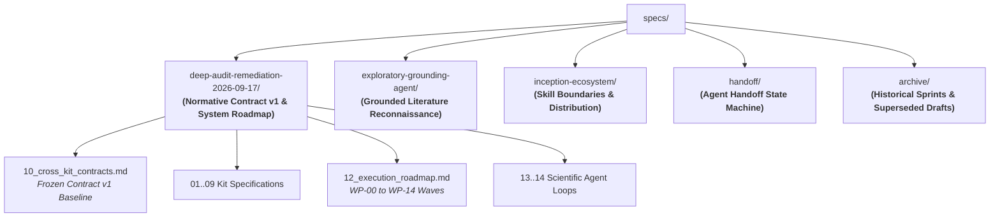

# Nexus Scholar Harness — System Specifications

Welcome to the central specification index for the Nexus Scholar ecosystem. This directory houses the formal engineering specifications, architectural contracts, and methodological frameworks governing the research harness and its eight specialized domain toolkits.

---

## 1. Specification Architecture & Hierarchy

Specifications within this repository are structured hierarchically based on normative authority and operational scope:

### Governing Authority

1. **Contract v1 (`specs/deep-audit-remediation-2026-09-17/10_cross_kit_contracts.md`)** is the highest architectural authority for shared data structures, canonical identity, error envelopes, and cross-kit protocols.
2. **Kit Specifications (`01_harness_spec.md` through `09_verify_kit_spec.md`)** govern subsystem boundaries and requirements for the harness and individual toolkits.
3. **Execution Roadmap (`12_execution_roadmap.md`)** governs work-package scheduling, gate criteria, and rollout ordering.
4. **Domain Series (`exploratory-grounding-agent/`, `inception-ecosystem/`, `handoff/`)** govern specialized workflows, cognitive agent loops, and phase transitions.

---

## 2. Active Specification Series

### 2.1 Normative System Remediation & Contract v1
**Directory:** [`specs/deep-audit-remediation-2026-09-17/`](./deep-audit-remediation-2026-09-17/README.md)  
**Status:** Normative Architecture Baseline (Frozen WP-00 / Active Waves)

Translates the comprehensive 2026-09-17 system audit findings into strict, testable requirements organized into 15 work packages (WP-00 through WP-14) across four delivery waves:

| Specification Document | Boundary / Role | Core Requirements |
| :--- | :--- | :--- |
| [`00_system_scope_and_findings.md`](./deep-audit-remediation-2026-09-17/00_system_scope_and_findings.md) | Whole System | Severity model, audit findings (SYS-001..022), system invariants |
| [`01_harness_spec.md`](./deep-audit-remediation-2026-09-17/01_harness_spec.md) | `scholar_harness` | Orchestration, agent-in-the-loop screening, DAG executor, audit journal |
| [`02_search_kit_spec.md`](./deep-audit-remediation-2026-09-17/02_search_kit_spec.md) | `scholar-search-kit` | Multi-source discovery outcomes, lossless records, transitive deduplication |
| [`03_pdf_kit_spec.md`](./deep-audit-remediation-2026-09-17/03_pdf_kit_spec.md) | `scholar-pdf-kit` | Download validation, layout extraction, frontmatter metadata |
| [`04_bib_kit_spec.md`](./deep-audit-remediation-2026-09-17/04_bib_kit_spec.md) | `scholar-bib-kit` | Conservative BibTeX resolution, deduplication, atomic writes |
| [`05_rag_kit_spec.md`](./deep-audit-remediation-2026-09-17/05_rag_kit_spec.md) | `scholar-rag-kit` | Study-bound AST chunking, honest retrieval, negative claim verification |
| [`06_graph_kit_spec.md`](./deep-audit-remediation-2026-09-17/06_graph_kit_spec.md) | `scholar-graph-kit` | Scientometrics, bibliographic coupling, co-citation, PageRank, PyVis |
| [`07_protocol_kit_spec.md`](./deep-audit-remediation-2026-09-17/07_protocol_kit_spec.md) | `scholar-protocol-kit` | Protocol compilation, schema validation, golden seed query preservation |
| [`08_agent_kit_spec.md`](./deep-audit-remediation-2026-09-17/08_agent_kit_spec.md) | `scholar-agent-kit` | Model Context Protocol (MCP) server truthfulness, CLI-MCP parity, cache roots |
| [`09_verify_kit_spec.md`](./deep-audit-remediation-2026-09-17/09_verify_kit_spec.md) | `scholar-verify-kit` | Retraction blocking, open-science artifact scans, COI audits, RoB scoring |
| [**`10_cross_kit_contracts.md`**](./deep-audit-remediation-2026-09-17/10_cross_kit_contracts.md) | Cross-Kit Architecture | **Contract v1 Baseline**: Identity registry, envelopes, outcomes, fingerprints |
| [`11_validation_and_test_plan.md`](./deep-audit-remediation-2026-09-17/11_validation_and_test_plan.md) | Quality Assurance | Negative regressions, concurrency isolation, golden 2-study end-to-end chain |
| [**`12_execution_roadmap.md`**](./deep-audit-remediation-2026-09-17/12_execution_roadmap.md) | Delivery Program | Delivery gates G0..G3, dependency order, work packages WP-00..WP-14 |
| [`13_scientific_agent_loop_framework.md`](./deep-audit-remediation-2026-09-17/13_scientific_agent_loop_framework.md) | Orchestration Engine | Reusable multi-role loop schema, doer-critic contract, state persistence |
| [`14_scientific_agent_loop_catalog.md`](./deep-audit-remediation-2026-09-17/14_scientific_agent_loop_catalog.md) | Agent Catalog | Concrete scientific agent workflows (dual-screening, deep extraction, audit) |
| [`15_deep_audit_report.md`](./deep-audit-remediation-2026-09-17/15_deep_audit_report.md) | Audit Evidence | Consolidated codebase audit findings, severity metrics, and architectural risk |
| [`16_publication_strategy.md`](./deep-audit-remediation-2026-09-17/16_publication_strategy.md) | Academic Strategy | Empirical benchmark plan, research contribution framing, venue target analysis |

---

### 2.2 Grounded Exploratory Inception Agent
**Directory:** [`specs/exploratory-grounding-agent/`](./exploratory-grounding-agent/README.md)  
**Status:** Implemented & Verified (M0.1 – M0.7)

Specifies the pre-protocol literature reconnaissance subsystem (`src/scholar_harness/recon/`). Enables AI agents to probe the scholarly literature, calculate empirical grounding metrics, and establish saturated research directions before freezing a protocol:

- **Mathematical Grounding:** Defines the Question Echo Index (QEI ≤ 0.30 target) to detect query regurgitation and the Anchor-Provenance Ratio (APR ≥ 0.70) for empirical concept density.
- **Corpus Saturation Seam:** Quantifies whether candidate search frontiers are dense, moderate, or thin, informing honest downstream screening budgets.
- **Canonical Cache Architecture:** Guarantees deterministic, CWD-independent cache sharing (`canonical_recon_root()`) across interactive CLI wizards and background MCP servers.
- **Tool Contracts:** Complete interface specifications for `recon_probe`, `recon_distill`, `recon_directions`, and `recon_delta`.

---

### 2.3 Inception Skill Ecosystem
**Directory:** [`specs/inception-ecosystem/`](./inception-ecosystem/README.md)  
**Status:** Implemented & Active

Specifies the boundaries, state transitions, and synchronization mechanics for agent skills supporting inception and protocol formulation:

- **[`01_skill_boundaries.md`](./inception-ecosystem/01_skill_boundaries.md):** Strict division of responsibilities among `inception-agent`, `methodology-copilot`, `workspace-manager`, and domain kit skills.
- **[`02_handoffs.md`](./inception-ecosystem/02_handoffs.md):** The `GENESIS` provenance contract and `audit/recon_context.json` sidecar schema bridging exploratory recon to protocol compilation.
- **[`03_skill_tree_and_plugin_distribution.md`](./inception-ecosystem/03_skill_tree_and_plugin_distribution.md):** Source-of-truth rules and deterministic mirroring between `.agents/skills/` and `.agents/plugins/nexus-scholar/skills/`.

---

### 2.4 Agent Handoff Protocol
**Directory:** [`specs/handoff/`](./handoff/README.md)  
**Status:** Active Pipeline State Machine

Defines the file-based state machine that automatically advances research workspaces through the systematic review lifecycle:

$$\text{INCEPTION} \longrightarrow \text{SCREENING} \longrightarrow \text{EXTRACTION} \longrightarrow \text{GRAPH} \longrightarrow \text{SYNTHESIS} \longrightarrow \text{CRITIQUE} \longrightarrow \text{COMPLETE}$$

- **File-First Triggers:** Advancement is governed by deterministic workspace artifacts (`protocol.json`, `literature/included.json`, `literature/knowledge_graph.json`, `synthesis/consensus.json`).
- **Runtime Supervisor:** Managed by `src/scholar_harness/handoff.py` with state tracked in `handoff_state.json` and full event logging to `audit/journal.jsonl`.

---

## 3. Core Architectural Contracts (Contract v1)

All active specifications and runtime components adhere to the Contract v1 standards established in [`deep-audit-remediation-2026-09-17/10_cross_kit_contracts.md`](./deep-audit-remediation-2026-09-17/10_cross_kit_contracts.md):

1. **Disambiguated Entity Identity:**
   - `workspace_id`: Identifies a local research workspace namespace.
   - `study_id`: Uniquely identifies a conceptual scholarly work.
   - `document_id`: Identifies an acquired, full-text representation of a study.
   - `chunk_id`: Identifies an indexed evidence chunk derived from a document.
2. **Standardized Envelopes:**
   - All inter-kit artifacts are serialized using `ArtifactEnvelope` v1, capturing producer metadata, protocol fingerprints, and typed payloads.
   - Operations report status via `OperationOutcome` v1, ensuring partial failures and provider errors remain explicitly structured rather than silently swallowed.
3. **Audit Ledger Immutability:**
   - Every state-altering action appends a cryptographically traceable event to `audit/journal.jsonl` within the workspace.

---

## 4. Historical Archive

Historical sprint checklists, early draft data contracts, and implementation notes from earlier development cycles are preserved in [`specs/archive/`](./archive/README.md):

- **[`INTER_PHASE_DATA_CONTRACT.md`](./archive/INTER_PHASE_DATA_CONTRACT.md):** Superseded early contract draft (September 2026).
- **[`phase_0_refactoring/`](./archive/phase_0_refactoring/):** Historical refactoring plan for inception and test directories.
- **[`phase_a_interoperability/`](./archive/phase_a_interoperability/) through [`phase_f_specialized_agents/`](./archive/phase_f_specialized_agents/):** Implementation sprint checklists for Phases A through F (merged in PR #34 and integrated into toolkits).
