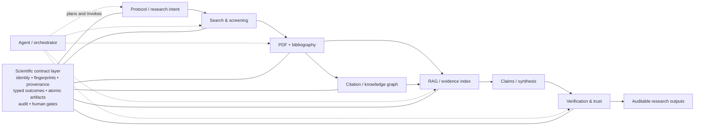

# 16 — Publication Strategy and Scientific-Contribution Framing

**Status:** Advisory (non-normative). This document imposes no delivery
obligation and does not weaken any requirement in `00`–`15`. It is a
research-positioning companion to the remediation program.

**Source:** `deep-research-report (9).md` (external deep-research report,
2026-09-17), normalized for repository use and fact-checked.

**Provenance note:** The source report was produced by a research tool that
emitted inline citation tokens (`cite`/`filecite` followed by `turn*`
identifiers) and `filecite` references to the remediation set. Those tokens are
private-use characters that do not resolve in this repository and have been
stripped. Claims that could be verified are recorded in the "Fact-check
appendix" at the end; any claim not listed there should be treated as
**unverified** until independently confirmed.

---

# Can a Scientific-Research Software Harness Be a Scientific Contribution?

## Executive assessment and assumptions

**Verdict: yes, but conditionally.** A software harness that composes scientific toolkits can itself constitute a scientific contribution when the contribution is not merely “we connected existing tools,” but rather a **generalizable research method, architecture, control model, or set of scientific guarantees whose effects are empirically demonstrated**. Research-software venues explicitly recognize software that enables research, supports experiments, or extracts knowledge as a legitimate research output; systems and eScience venues likewise solicit workflow, infrastructure, provenance, reproducibility, and research-automation contributions.

A useful formulation is:

> **Scientific software contribution = research artifact + generalizable claims about the artifact + credible evidence supporting those claims.**

Under that formulation, an ordinary integration project can merit a software paper if it is mature, reusable, documented, maintainable, and demonstrably useful. A stronger scientific paper requires something more: the integration itself must embody an idea that can be tested, falsified, compared, and generalized. JOSS explicitly asks for a clear statement of need, research application, quality software, documentation, and maintainability, while ACM artifact criteria separately emphasize functionality, completeness, documentation, reusability, and independent reproducibility.

For **Nexus Scholar**, based on the supplied design material, the most defensible scientific thesis is **not** “eight research tools under one interface.” The architecture already describes a more interesting object: cross-tool contracts for canonical scientific identity, provenance, fingerprints, explicit failure states, atomic artifacts, auditability, bounded agent adaptation, critic separation, and human authority. Your validation plan also goes beyond conventional unit testing by specifying scientific negative controls, stale-artifact tests, same-workspace multi-paper identity tests, partial-provider failures, retraction-only evidence, fault injection, metamorphic tests, and cross-surface equivalence. That combination can support a much stronger claim:

> **A contract-based harness can make heterogeneous scientific automation safer and more reproducible by preserving evidence identity, provenance, explicit uncertainty, and human decision state across independently developed components.**

That proposition is scientifically testable.

There is, however, an important qualification before publication. Your documentation contains evidence of two states of the system: capability material describes a broad, production-oriented eight-kit platform, while the architecture audit records serious scientific-integrity defects in an audited revision, including paper-identity collapse, invented methodology defaults, stale screening state, ignored control parameters, invalid pipeline interfaces, and misleading failure states. Your later remediation specifications explicitly address many of these defects. Therefore a paper should be tied to **one immutable tagged release and one conformance result set** rather than making claims about the repository in the abstract.

This report assumes that the eventual target discipline is not yet fixed, the harness may operate from laptops through servers/HPC rather than one known scale, Python is important but not necessarily the only integration language, and literature/evidence synthesis is the first major use case rather than the permanent scope. Those assumptions matter because the evidentiary bar differs between software publication, computer-systems research, computational science, and experimentally oriented science.

The likely scientific contribution is the **contract/control layer in the lower box**, together with evidence that it improves scientific reliability—not merely the arrows joining existing tools. This interpretation is consistent with the architecture you have already specified: canonical `workspace_id`/`study_id`/`document_id`/`chunk_id`/claim distinctions, schema-versioned artifacts, outcome envelopes, audit provenance, atomic publication, and fail-closed fingerprint gates.

## What makes a harness a scientific contribution

The term “scientific contribution” has different practical meanings across communities. The following distinction is useful because it prevents both underclaiming and overclaiming.

| Criterion | Research-software / software-paper bar | Strong scientific or systems-paper bar |
|---|---|---|
| **Need** | Solves a recognizable research-software problem and has a clear research application. JOSS explicitly asks for a statement of need and research application. | Demonstrates that an important scientific or systems limitation exists and quantifies it against prior approaches. |
| **Intellectual contribution** | Useful, reusable implementation may suffice even without a fundamentally new algorithm. JORS explicitly accommodates reusable research software and software-focused scholarship. | New generalizable architecture, algorithm, protocol, contract model, verification mechanism, theory, or experimentally justified synthesis of techniques. |
| **Correctness** | Tests, documentation, examples, maintainability and functioning software. | Defined invariants, adversarial/negative testing, comparisons to reference methods, quantitative error bounds where appropriate. |
| **Evaluation** | Demonstrations and realistic examples can establish usefulness. | Serious baselines, multiple datasets, ablations, statistical uncertainty, fault injection and external replication. |
| **Generalizability** | Software can be reused by researchers outside the authors’ immediate project. | Findings transfer across domains, workloads, components or scales; limitations and scope conditions are explicitly tested. |
| **Reproducibility** | Installable release, documentation, license and preserved source. | Independent replay of the main claims from pinned artifacts and data, ideally qualifying for reproducibility/artifact badges. ACM distinguishes artifact availability, functionality, reusability and results reproduction. |
| **Scientific integrity** | Accurate description and sensible limitations. | The architecture demonstrably prevents or exposes classes of scientific error such as stale evidence, identity conflation, silent partial failure or unsupported claims. |
| **Impact** | Clear prospective research use can be enough for a software venue. | Measurable improvement in scientific validity, researcher workload, discovery capability, reproducibility, scale or a new class of experiment. |

**In computer science and software/systems research**, architecture itself can be the research object. A harness is scientifically interesting when it proposes reusable abstractions or mechanisms—such as a new provenance model, failure semantics, workflow formalism, composition protocol or agent-control architecture—and measures them against alternatives. ACM TOMS, for example, emphasizes originality, accuracy, robustness, completeness, portability and lasting value for algorithmic software, while eScience explicitly welcomes advances in scientific workflows, FAIR software, reproducibility, infrastructure and research automation.

**In computational science**, integration can be even more central. Platforms such as Nextflow, Snakemake, Galaxy and AiiDA became publishable research software because workflow composition, portability, provenance, scaling and reproducibility are themselves barriers to scientific work. Nextflow’s published contribution concerned a computational workflow model for portable and reproducible pipelines; Snakemake was presented as sustainable workflow management for reproducible and scalable analyses; AiiDA makes automatic data provenance and workflow execution first-class concepts. The lesson is important for Nexus: **novelty does not have to reside in every leaf algorithm if the composition semantics solve a genuine, general problem.**

**In experimental sciences**, the bar moves toward measurement validity. Software is clearly scientific when it controls instruments, realizes experimental protocols, enables measurements that could not otherwise be made, or materially changes throughput or precision. But its contribution must be validated against calibration standards, reference procedures, known specimens, blinded experiments or other forms of ground truth. JOSS’s definition of research software explicitly includes software that supports research instruments and experiments, while Nature Methods has stressed that useful research software requires sufficient method/version detail and provenance rather than merely releasing code. A Nexus extension into laboratory or instrument workflows would therefore need more than workflow correctness: it would need to show that the experimental outputs are not degraded.

For Nexus, I would define five increasingly strong levels of contribution:

| Level | Claim that can safely be made |
|---|---|
| **Engineering integration** | “The system makes multiple tools easier to run together.” Valuable, but normally insufficient as the central claim of a strong scientific paper. |
| **Research-software contribution** | “The system is a reusable, open and maintained implementation that enables a class of scientific workflows.” A plausible JOSS/JORS contribution when mature. |
| **Methodological contribution** | “The harness introduces explicit scientific contracts for identity, provenance, failure and human decisions.” This is the most promising current Nexus level. |
| **Empirical scientific contribution** | “Controlled evaluation shows those contracts materially reduce scientific-integrity failures or researcher burden relative to the same components without them.” This needs the A/B/C evaluation proposed below. |
| **General scientific finding** | “Across domains and implementations, certain orchestration mechanisms systematically improve reproducibility/reliability.” This would require multiple systems or external replications, but would be a genuinely general contribution about research software itself. |

The central distinction is therefore **artifact novelty versus knowledge novelty**. A JOSS-style paper can be valuable because the artifact is useful. A stronger scientific paper should leave the reader knowing something general that was not known before—for example, that fingerprint-bound human decisions prevent a measurable class of stale-corpus errors, or that canonical evidence identity reduces erroneous cross-paper attribution under realistic modular workflows.

Your own scientific-loop design is particularly valuable here. It explicitly requires one scientific objective, frozen inputs, artifact-mediated state, critic separation, bounded adaptation, method provenance, retention of negative results and human authority for consequential decisions. Those are not just implementation choices. They can be formalized into a **scientific control model** and evaluated as such.

## Competitive landscape and positioning

The relevant competitive landscape is broader than “systematic-review software.” Nexus sits at the intersection of at least four established classes: scientific workflow engines, evidence-synthesis platforms, scientific RAG/agents, and laboratory/research-information systems. No adoption number below should be treated as directly comparable: GitHub stars, registered users, customer counts, publications and institutional licenses measure very different things, and several commercial figures are vendor-reported.

| System | Primary scope and salient features | License / business model | Public adoption signal | Representative source |
|---|---|---|---|---|
| **Nextflow** | Data-driven scientific workflow DSL; containers; HPC/cloud portability; reproducible pipelines. | Apache-2.0. | Repository showed roughly 3.5k stars when reviewed. | Di Tommaso et al., *Nature Biotechnology* 2017; official repository. |
| **Snakemake** | Python-oriented declarative workflows, dependency resolution, scalable/reproducible analyses. | MIT. | Official repository showed roughly 2.8k stars and v9.21.0 in May 2026. | Mölder et al., *F1000Research*; official repository. |
| **Galaxy** | Web-accessible scientific analyses, tool registry, histories, reusable workflows and provenance. | MIT. | Galaxy reported thousands of integrated tools; a 2024 project account reported more than 500,000 registered users across instances and approaching 20,000 citations. | Official Galaxy project/materials. |
| **AiiDA** | Automated workflow execution plus provenance graph, particularly established in computational materials science. | MIT. | Official site reports 100+ plugins, 1,000+ publications, 100+ contributors and tens of thousands of monthly downloads. | Official AiiDA site. |
| **Common Workflow Language** | Vendor-neutral workflow specification connecting command-line tools across local, HPC and cloud runtimes. | Apache-2.0 specification. | Supported by multiple open and commercial implementations, including platforms listed by the CWL project. | Official CWL specification/implementation registry. |
| **ASReview** | Active-learning-assisted title/abstract screening with simulation and benchmark modes; unusually useful as both a product and an evaluation framework. | Apache-2.0. | Official GitHub organization showed about 900 stars for the main project in 2026. | van de Schoot et al., *Nature Machine Intelligence*; official repository. |
| **PaperQA2** | Agentic scientific literature search/RAG, evidence collection, cited answers and contradiction-oriented workflows. | Open-source release; verify the license of the exact tagged version used for comparison. | FutureHouse reported more than 7k GitHub stars in 2025; the project remains actively developed. | PaperQA2 paper and official project materials. |
| **Biomni** | General biomedical agent integrating databases, tools, code execution and reasoning across heterogeneous biomedical tasks. | Apache-2.0 for the main repository; integrated assets can have separate restrictions. | Official repository showed roughly 3.9k stars and hundreds of forks when reviewed. | Biomni preprint and official repository. |
| **AI Scientist** | Autonomous idea generation, coding, experiment execution, visualization, paper generation and automated review. | Custom Responsible-AI-derived source-code license rather than a standard OSI license. | Official repository showed about 14.6k stars when reviewed. | *Nature* 2026 publication and official repository/license. |
| **Elicit** | Commercial literature discovery, screening, extraction and synthesis; API and research-agent functionality. | Commercial/closed service. | Vendor reports more than 5 million researchers; its API description in 2026 cited a corpus above 138 million papers. | Official Elicit pages; adoption/performance figures are vendor-reported. |
| **DistillerSR** | Enterprise systematic-review/evidence-synthesis workflows, auditability, configurable forms and AI-assisted work, especially in regulated settings. | Commercial. | Vendor reports more than 300 customers and substantial penetration among large pharmaceutical/device organizations. | Official DistillerSR materials; figures are vendor-reported. |
| **Covidence** | End-to-end systematic-review collaboration: screening, full text, risk-of-bias workflows, extraction and exports. | Commercial/subscription. | Institution-wide licenses are publicly documented at major universities and research organizations. | Official Covidence and institutional licensing materials. |
| **EPPI-Reviewer** | Evidence synthesis, references/PDFs, meta-analysis, thematic synthesis and text mining; increasingly integrates modern automated methods. | Not-for-profit subscription service. | Current service/version and pricing are publicly maintained; experimental LLM functionality comes with explicit cautions about validation. | Official EPPI-Centre materials. |
| **Labguru** | Adjacent rather than direct: ELN/LIMS, inventory and laboratory/research operations, useful as a comparator if Nexus expands into experimental workflows. | Commercial. | Vendor reports well over 100,000 scientists using its platform. | Official Labguru materials; adoption is vendor-reported. |

This landscape suggests that Nexus should **not** primarily claim to replace Nextflow or Snakemake as a general compute scheduler, Galaxy as a mature end-user analysis portal, Covidence/DistillerSR as polished evidence-review products, or AI Scientist/Biomni as fully autonomous research agents. Those are different optimization targets. The more defensible position is:

> **Nexus is an evidence-centric scientific orchestration harness whose primary abstraction is not a DAG but a set of cross-tool scientific contracts: paper/evidence identity, provenance, protocol/corpus fingerprints, explicit partial/failure semantics, auditable state transitions, bounded agent loops and human decision gates.**

That positioning is grounded in your own cross-kit specification and scientific-agent framework. It also occupies a plausible gap between workflow engines that excel at computational dependency execution, evidence platforms that excel at review UX, and autonomous agents that excel at adaptive tool use. This is an **inference from the surveyed systems, not a proven claim of uniqueness**; a publication should avoid “first” or “only” language unless a systematic prior-art study establishes it.

The most consequential baseline is therefore not a single competitor. It is the **same toolkit set without the harness’s scientific control mechanisms**. That creates the cleanest causal question:

> Given identical search, PDF, bibliography, RAG, graph and verification implementations, does the harness layer reduce scientific errors or improve reproducibility, recovery and researcher efficiency?

If it does, you have evidence that **integration architecture itself** is the contribution.

The components you have documented make this comparison feasible. Nexus currently defines eight specialized capability areas—search, PDF acquisition/extraction, bibliography, RAG, graph analysis, protocol handling, agent orchestration and verification—while the proposed cross-kit contract standardizes identity and state across them.

## Evaluation framework and metrics

A credible evaluation should operate at **three levels simultaneously**: component correctness, cross-component contract correctness, and end-to-end scientific utility. Benchmarking only answer quality would miss the harness’s purported contribution; benchmarking only software quality would fail to show scientific benefit.

| Evaluation level | Primary metrics | What the metric detects | Recommended interpretation |
|---|---|---|---|
| **Search / discovery** | Recall/sensitivity, precision, average precision, PR-AUC, golden-seed recall, workload-versus-recall curve, WSS@95 and ATD | Missed relevant studies and workload trade-offs | Make recall a primary endpoint. WSS@95 is useful but sensitive to prevalence/cutoffs; report it with the full workload curve and a complementary metric such as ATD. |
| **Identity / deduplication** | Pairwise or cluster precision/recall/F1, B-cubed F1, false-merge rate, false-split rate, ID stability across input permutation | Catastrophic evidence conflation and duplicate leakage | Give false merges especially high weight: merging distinct studies can contaminate multiple downstream stages. Your audit identified transitive-identity problems as a critical boundary issue. |
| **PDF acquisition/extraction** | Legal-full-text resolution coverage, validity rate, extraction character/token accuracy, section/table retention, layout mAP where appropriate, malformed/encrypted-document classification, throughput | Whether “a PDF exists” actually produces usable and correctly classified evidence | A failed parse or HTML masquerading as a PDF must never count as success; this principle is already in your remediation/validation design. |
| **Bibliographic resolution** | DOI-resolution precision/recall, false-match rate, field-preservation rate, ambiguous-candidate rate, conflict-detection recall | Whether metadata enrichment silently changes study identity | Precision should dominate recall for remote resolution because an incorrect DOI can poison downstream graph/search linkage. |
| **Retrieval / RAG** | Recall@k, nDCG@k, MRR, evidence precision/recall/F1, citation precision, unsupported-claim rate, latency/cost | Evidence accessibility and grounding | BEIR-style retrieval metrics should be separated from claim-verification metrics; semantic similarity must not be labelled entailment. This distinction is also explicit in your RAG remediation design. |
| **Graph** | Node/edge preservation, isolate preservation, ranking correlation/error against reference implementation, deterministic community assignment where applicable, runtime/memory scaling | Whether transformations lose scientific entities or miscompute network signals | Centrality describes graph structure, not study quality. Evaluate structural correctness before interpretive utility. |
| **Protocol** | Invalid-protocol detection sensitivity/specificity, false acceptance/rejection, cross-field error detection, fingerprint invariance under formatting, fingerprint change under semantic mutation, expert agreement | Whether the protocol really serves as a control plane | Your design correctly separates schema validity from cross-field/methodological readiness; evaluation should preserve those layers. |
| **Verification** | Retraction precision/recall, support/refute F1, false reassurance rate, unresolved rate, evidence-locator accuracy, calibration/ECE or Brier score if probabilities are emitted | Whether the system distinguishes “not found” from “clear” and support from similarity | Retraction-only and explicit-negation cases should be safety-critical negative controls. |
| **Agent/orchestration** | Task completion, valid tool-call rate, retry count, fallback transparency, human intervention rate, recovery time, cancellation correctness, cost/tokens | Whether adaptive control improves work without concealing method changes | Hidden LLM→heuristic fallback should count as a failure of provenance even when final accuracy happens to be high. |
| **Cross-kit contracts** | Traceability coverage, provenance completeness, stale-input rejection, schema-parity rate, identity-preservation rate, partial-failure classification, atomic-commit success | The distinctive “harness” contribution | These should be headline endpoints for the methods paper. |
| **Whole system** | End-to-end scientific accuracy, researcher active time, wall time, reproducibility rate, failure-containment rate, independent replay agreement, clean-install portability, total compute/API cost | Whether the integrated artifact provides net scientific value | Treat efficiency as secondary unless integrity/correctness reaches the preregistered non-inferiority or safety threshold. |

Static code quality also matters, but it should be supporting rather than central evidence. SoftWipe, for example, evaluates scientific software through compiler/static-analysis warnings, sanitizers, assertions, complexity, formatting, duplication and test characteristics, illustrating that research software can be assessed systematically as software. Such measures are valuable engineering evidence, but passing them does not establish that an evidence-synthesis result is scientifically correct.

The strongest end-to-end design is a **paired three-condition experiment**:

| Condition | Purpose |
|---|---|
| **A — established baseline** | Best practical alternative for the task: manual workflow, ASReview/Covidence-style evidence workflow, conventional scripts, or another serious domain baseline depending on the experiment. |
| **B — Nexus toolkits without the scientific harness** | Use the same underlying component implementations and model/provider configuration, but connect them using ordinary files/scripts without canonical cross-kit identity, fingerprint gates, standardized outcomes and orchestration constraints. This isolates the integration effect. |
| **C — full Nexus harness** | Run the identical underlying toolkits with the contract, audit, fingerprint, human-gate and bounded-agent mechanisms enabled. |

Condition B is the crucial experimental control. A comparison of Nexus against an unrelated product cannot distinguish whether an improvement comes from your search engine, model choice, user interface or the harness architecture. **B versus C can.**

Use paired tasks and exactly the same snapshots wherever possible; repeat stochastic components under multiple seeds; preregister primary outcomes and exclusions; report per-dataset values rather than only macro-averages; and use confidence intervals. For paired outcome differences, bootstrap intervals and paired permutation/nonparametric tests are reasonable general choices; for a sufficiently large multi-task study, a mixed-effects model can account for task/domain effects. These are recommended experimental-design choices rather than venue-specific requirements.

**Recommended safety gates—not universal literature standards—** for a release intended to support strong scientific claims are deliberately strict:

- **100% claim traceability** in the evaluation corpus: every final scientific claim/citation must resolve through `claim → evidence → document → study → corpus/protocol`.
- **Zero silent P0 failures** in the fault suite: an injected identity collision, stale screening generation, unsupported evidence, malformed full text, retraction flag or interrupted multi-file commit must never end in an unqualified `SUCCESS`.
- **Zero catastrophic canonical false merges** on the high-confidence identity fixture set.
- **100% rejection of known stale fingerprints** and mismatched decision generations.
- **100% correct blocking of retraction-only benchmark cases** under the chosen trust policy.
- For deduplication, a useful stretch target is **≥0.98 precision and ≥0.98 recall** on a curated benchmark, while separately requiring zero false merges in deterministic identifier-bridge cases.
- For generated evidence-backed claims, a sensible stretch target is **≥0.95 expert-audited citation/evidence precision** and no “high-confidence” unsupported claims.
- For screening, a primary recall target of **≥95%** is defensible in systematic-review evaluation, but it should be accompanied by workload curves rather than interpreted as universal adequacy. WSS@95 exists precisely to summarize work saved at that recall level.
- For utility, target something materially consequential—such as **≥30% reduction in median researcher active time** versus condition B—while establishing non-inferiority on scientific-integrity endpoints.

One point deserves emphasis: **do not build the paper around aggregate “task success.”** A system that completes 98% of runs while silently attributing evidence to the wrong paper is scientifically worse than one that completes 90% and explicitly marks the remaining 10% unresolved. Your own cross-kit specification correctly treats partial, unresolved and failed states as scientific information rather than inconvenient exceptions.

## Datasets, benchmarks, and experimental program

No single existing dataset covers the full harness. The strongest evaluation will therefore combine **public component benchmarks with a new cross-kit fault/contract benchmark**.

| Dataset / benchmark | Suitable Nexus components | Scale / content | Principal metrics / use |
|---|---|---|---|
| **SYNERGY** | Search, screening, dedup, active-learning integration | Official dataset repository describes 169,288 works from 26 systematic reviews, including 2,834 included records, with scholarly metadata/identifiers. | Recall, precision, workload/recall, WSS@95, dedup identity, cross-review robustness. |
| **CLEF Technology-Assisted Review** | Search/ranking/screening | The 2019 TAR collection uses Cochrane review topics and tasks covering retrieval and screening/ranking. | Recall, AP/ranking metrics, workload saved, comparison with published systems. |
| **BEIR** | RAG retrieval layer | 18 heterogeneous public retrieval datasets in the original benchmark, designed for zero-shot information retrieval across diverse tasks/domains. | nDCG@10, Recall@k and cross-domain retrieval robustness. |
| **SciFact / SciFact-Open** | Claim evidence, support/refute verification | SciFact contains expert-authored scientific claims, evidence rationales and SUPPORT/REFUTE labels; SciFact-Open extends the setting toward open-domain retrieval over hundreds of thousands of abstracts. | Evidence retrieval, support/refute F1, false-verification rate, robustness to open-domain retrieval. |
| **QASPER** | Full-text scientific QA/RAG | 5,049 questions over 1,585 NLP papers in the original release, with answers and supporting evidence from full papers. | Answer F1, evidence F1, citation/evidence selection. |
| **PubMedQA** | Biomedical QA/reasoning | Includes 1,000 expert-labelled instances plus larger unlabeled/artificial sets with yes/no/maybe answers. | Answer classification, evidence-conditioned reasoning, domain-transfer study. |
| **DocLayNet** | PDF/layout extraction | 80,863 manually annotated pages from diverse document classes with 11 layout categories. | Layout mAP, structural retention, extraction robustness. |
| **PubLayNet** | PDF layout at larger scale | More than 360,000 document images derived from over one million PMC articles in the original IBM release. | Layout detection and extraction scalability. |
| **S2ORC** | Search metadata, citation/RAG experimentation | Original release contains metadata for tens of millions of scientific papers and structured full text for millions of open papers. | Large-scale indexing/retrieval/citation experiments; use a fixed snapshot because the resource is historical. |
| **OpenAlex snapshot** | Search, metadata fusion, bibliography, graph | OpenAlex provides a CC0 public scholarly graph and downloadable snapshots; its June 2026 materials describe hundreds of millions of scholarly entities. | Search coverage, DOI/metadata reconciliation, citation graph correctness/scaling. Pin an exact snapshot. |
| **OGB `ogbn-arxiv`** | Graph layer | Citation graph benchmark with established train/validation/test conventions and time-aware split. | Graph integrity, algorithm scaling and deterministic/reference comparisons; do not equate node classification with Nexus scientific quality. |
| **Crossref Retraction Watch data** | Verification/trust | Crossref exposes the Retraction Watch dataset publicly and updates the service regularly; records cover retractions and other publication-event types. | Retraction/event classification, unresolved-vs-clear semantics, trust-policy tests. |
| **LitQA2** | Whole scientific literature agent/RAG | Introduced with PaperQA2 to evaluate expert-level scientific literature questions. | Scientific QA accuracy, evidence quality and comparison to an established agentic scientific-RAG system. |
| **AIRS-Bench** | Broader agentic-science loops | Recent benchmark covering 20 tasks reconstructed from state-of-the-art ML papers across several scientific/ML domains and stages of the research lifecycle. | Useful if Nexus extends beyond evidence synthesis into experiment/code loops; not necessary for the first paper. |

I would additionally publish a **Nexus ContractBench**—the name is only a suggestion—as an independent contribution. Existing benchmarks generally measure retrieval, screening, QA or layouts; they do not test whether a heterogeneous scientific workflow preserves semantic contracts across package boundaries.

Your own validation plan already contains most of the seeds for such a benchmark. It explicitly calls for a two-paper same-workspace case, stale human decisions, partial provider outages, inability to resolve legal OA full text, malformed extraction, retraction-only evidence, legacy migration, cancellation, identity metamorphisms and fault injection. A public benchmark could turn these into small deterministic fixtures with exact expected outputs:

| ContractBench family | Example synthetic mutations | Scientific failure being tested |
|---|---|---|
| **Identity adversaries** | DOI-only record + arXiv-only record + bridge record; title collision; casing/prefix variants; two papers deliberately placed in one workspace | False merge, false split, workspace/study confusion |
| **Staleness** | Change corpus after screening decisions; change protocol after extraction; regenerate a batch but retain old `included.json` | Reuse of scientifically invalid prior state |
| **Evidence contradiction** | Positive statement, negation, reversed comparison, unsupported number, semantically similar non-entailing sentence | Confusing semantic similarity with support/entailment |
| **Trust events** | Retracted paper with no other Phase-4 metadata; correction versus retraction; provider unavailable | “No flag found” incorrectly becoming “clear” |
| **Document corruption** | Truncated PDF, HTML renamed `.pdf`, encrypted PDF, zero-text scan, malformed metadata, oversized response | False full-text success and unsafe resource behavior |
| **Provider faults** | 429 with/without `Retry-After`, 503, timeout, DNS failure, malformed JSON, one-of-many provider failure | Empty-results versus outage ambiguity |
| **Persistence faults** | Crash during staged write, after promotion/before audit, stale temporary file, disk-full simulation | Partial canonical state, duplicate events and non-idempotent replay |
| **Agent/tool faults** | Unsupported argument, hidden fallback, skipped stage that actually executes, tool timeout | Semantic mismatch between requested and performed method |
| **Adversarial content** | Prompt-injection text embedded in a “paper,” hostile filename/path, misleading citation strings | Agent/security boundary and evidence-channel integrity |

Because the expected truth is controlled, ContractBench would let you measure exactly what an integration harness should be good at: **contract violation detection and failure containment**. It can also be entirely synthetic where redistribution of publisher text would be problematic.

The component and whole-system experiments should then follow this progression.

**Component characterization.** Establish that each kit reaches credible baseline quality on its natural benchmarks. Search/screening should be evaluated on SYNERGY/CLEF; retrieval on BEIR; evidence QA on QASPER/SciFact; PDF parsing/layout on DocLayNet; graph functions against deterministic synthetic/reference graphs; retraction handling on Crossref/Retraction Watch.

**Contract validation.** Run ContractBench against isolated kits, loose composition and the full harness. The central metric is not simply accuracy but the fraction of faults that become correct explicit terminal states rather than silent scientific corruption.

**Harness A/B/C experiment.** Run the same research tasks under established baseline, loose identical toolkits and full harness. Keep models, provider snapshots, search queries, seeds and component versions fixed. This experiment should supply the central causal evidence for the methods paper.

**Ablations.** At minimum, independently disable canonical study identity, fingerprint gates, structured partial/failure outcomes, evidence verification, graph boosting, multi-provider discovery, critic separation, human gates and provenance/audit recording. For adaptive features, disable only one mechanism at a time. Several of these ablations deliberately produce scientifically unsafe behavior, so they should be run on benchmarks/simulations rather than consequential live research.

The particularly important ablations are:

- **No identity contract:** measure false attribution and duplicate/collapse effects.
- **No fingerprint gate:** quantify stale-decision reuse.
- **No explicit partial status:** show how often provider/model failures become indistinguishable from legitimate zero evidence.
- **No evidence-verification stage:** measure unsupported-claim/citation error.
- **No critic separation:** compare claim errors and human corrections in bounded agent tasks.
- **No human decision gate:** benchmark automation accuracy in simulation; do not use this condition to justify real high-consequence autonomous decisions.
- **No audit/provenance layer:** measure reproducibility, debugging/recovery time and ability of a blinded evaluator to trace claims.

**Human study.** Once benchmark performance is stable, conduct a randomized crossover or counterbalanced expert study in which researchers complete representative evidence tasks with the loose-toolkit condition and full Nexus. Measure active minutes, number/type of scientific mistakes, interventions, confidence calibration, ability to diagnose deliberately injected failures and usability. A pilot should determine variance and therefore the sample size rather than choosing an arbitrary `n`.

**External replay.** Give a second group a clean machine, frozen artifact, protocol and benchmark package. ACM-style artifact evaluation provides an appropriate mental model: independently reproduce the principal results within preregistered tolerances rather than merely showing that the software starts.

## Publication strategy and paper framing

A single paper does not need to carry every possible Nexus contribution. In fact, separating software, methodology and validation will likely produce cleaner claims.

| Venue / route | Best Nexus contribution to emphasize | What reviewers will expect |
|---|---|---|
| **Journal of Open Source Software** | Mature reusable implementation of an auditable modular scientific-research harness | OSI-approved open-source software, clear research application/need, feature-complete useful functionality, documentation, tests, maintainability and an accurate short paper. JOSS explicitly does not want the software paper to become primarily a report of scientific results produced by the package. |
| **Journal of Open Research Software** | Reusable research software plus sustainability/reuse story | Professionally archived/citable software with research relevance and reuse potential; JORS also accommodates longer scholarship on creating, maintaining and evaluating research software. |
| **IEEE eScience, future cycle** | Cross-kit scientific contracts, trustworthy orchestration, reproducibility/fault-containment evaluation | A real research contribution in application and/or infrastructure plus rigorous evaluation. Its current themes explicitly encompass FAIR software, workflows, reproducibility, automation and agents. The 2026 submission date has already passed as of September 17, 2026, so this means a later edition. |
| **WORKS, future cycle** | Workflow semantics, provenance, fault handling, end-to-end scientific workflow composition | Novel workflow-management/reproducibility contribution, technically serious experiments, ideally against existing workflow approaches. The 2026 deadline has passed. |
| **Agentic-science workshop such as AGENT4SC** | Bounded scientific agent loops, observability, critic/human control, failure recovery | Agent architecture plus convincing scientific-safety/operational evaluation; provenance, auditability and human-in-the-loop concerns are directly in scope. |
| **ACM TOMS** | Only if Nexus contains a substantial algorithmic/numerical contribution | Originality, accuracy, robustness, completeness, portability and lasting algorithmic value. A general orchestration story alone is unlikely to be the strongest fit. |
| **Nature Methods or comparable high-impact methods venue** | Stretch target after strong cross-domain scientific validation | A method that materially changes scientific practice, not just a polished software layer; detailed version/provenance/reporting is essential. |

The **recommended publication sequence** is:

**Software paper.** *Nexus Scholar: an auditable modular harness for evidence-centric scientific workflows.* Submit only when a stable open release, documentation, licensing, package smoke tests and a reproducible example exist. JOSS or JORS is the natural target.

**Methods/systems paper.** *Cross-tool scientific contracts for fail-closed research automation.* The novel object is the identity/fingerprint/outcome/provenance control layer. The decisive experiment is full Nexus versus the identical toolkits loosely composed. eScience or WORKS is an appropriate class of venue.

**Evaluation paper.** Focus on evidence-synthesis accuracy and human workload across public systematic-review and scientific-QA benchmarks, ideally including expert users and an external replication.

**Benchmark paper or reusable benchmark release.** ContractBench could itself be significant if it exposes failure classes that current research-agent/workflow benchmarks systematically omit.

The strongest methods-paper framing would be something close to:

> “Composable scientific software creates failure modes at interfaces that component-level tests cannot detect. We introduce a contract-based research harness in which study identity, protocol/corpus state, evidence lineage, execution outcomes and human decisions are versioned end-to-end. We evaluate whether these contracts reduce silent scientific corruption relative to the same tools composed without the harness.”

That framing has three advantages. It defines a general problem, makes Nexus an instance of a broader solution rather than the entirety of the claim, and yields falsifiable evaluation endpoints.

By contrast, weak framings would be “a unified interface to eight tools,” “an AI-powered all-in-one research platform,” or “a fully reproducible scientific system.” The first is primarily engineering; the second competes on breadth with large commercial/agent platforms without identifying the methodological novelty; the third is an absolute that live databases, nondeterministic models and human judgment make difficult to defend.

Your own project material already supplies the conceptual basis for a more disciplined paper. The loop framework states that completion, inconclusive and failure must remain distinct outcomes; adaptation is bounded; negative results persist; human authority remains at consequential gates; and method provenance records whether a result came from a human, deterministic rule, heuristic, LLM or external provider. The cross-kit specification adds typed outcome envelopes, identity separation, canonical hashing, fingerprint gates, audit ordering and explicit support/entailment/trust vocabularies. These are much closer to a research thesis than the component count.

## Reproducibility, licensing, sustainability, and ethics

**Reproducibility should be treated as part of the architecture, not a release-time packaging exercise.** FAIR4RS exists because software differs from static data: it is executable, composite, evolving and version-dependent. The principles adapt FAIR ideas to software’s lifecycle and reuse requirements. For each paper-facing experiment, freeze the tagged commit, cross-kit schema versions, dependency lock, prompts, model/provider identifiers, random seeds, dataset snapshot hashes, environment/container definition, command configuration and expected machine-readable outputs.

A good artifact bundle should contain the source release; immutable dependency/environment specification; benchmark version identifiers and hashes; statistical analysis scripts; exact prompts and generation configuration; model/API version and observation date; hardware/OS information where relevant; golden expected outputs; and either reproducible provider fixtures or legally redistributable cached responses. Your own validation plan’s rule that required CI should use no live network is particularly strong: provider-contract tests can exist as opt-in jobs, while publication-critical regression evidence remains hermetic.

**Archive and citation infrastructure should be first-class.** Software Heritage is designed to preserve source-code history and exposes persistent identifiers for archived software; `CITATION.cff` provides human- and machine-readable citation metadata. A release should therefore have, at minimum, a repository tag, archived source, persistent identifier, `CITATION.cff`, changelog, contributor/authorship policy and release notes linking software and paper versions.

**Licensing must be evaluated at the composition boundary.** If the JOSS route is pursued, the submitted software must meet its open-source licensing requirements. Use SPDX/REUSE-style machine-readable license metadata and maintain a dependency/data/service license inventory rather than assuming that an Apache- or MIT-licensed harness makes all connected data and models redistributable. REUSE formalizes a practical approach based on clear license files and SPDX identifiers. Biomni provides a pertinent precedent: its own code can have one license while integrated databases/tools may impose additional conditions.

For Nexus that means maintaining separate inventories for the harness, each toolkit, Python/system dependencies, models/embedding providers, datasets, full-text corpora and remote APIs. A reproducibility artifact may sometimes need to distribute identifiers, hashes and scripts rather than copyrighted full text.

**Sustainability is also evidentiary.** JOSS and JORS care about maintainability/reuse rather than code dumps. The strongest operational practices for this project are a public compatibility matrix; semantically versioned cross-kit schemas; explicit deprecation periods; generated capability/interface registries; migration tools that never fabricate missing provenance; contributor and governance documentation; clean-package installation tests; and a release gate that verifies canonical kit repositories, vendored copies and pinned revisions are synchronized. Your proposed execution roadmap already treats these as contract-level release gates rather than documentation chores.

The major **scientific and ethical risks** are not incidental.

| Risk | Why it matters | Required mitigation |
|---|---|---|
| **Automation bias** | Researchers may treat “verified,” “included” or “clear” as stronger than the underlying procedure warrants. | Use axis-specific labels—retrieval, lexical support, entailment and trust—rather than an unqualified `VERIFIED`; expose evidence and unresolved states. Your cross-kit vocabulary already adopts this separation. |
| **Incomplete search interpreted as absence** | Provider outage or indexing gaps can produce false “no literature” conclusions. | Preserve per-provider success/partial/failure outcomes and prohibit absence claims from incomplete coverage. |
| **Evidence identity corruption** | A paper/study ID conflation can make a true quotation support the wrong study. | Canonical study/document/chunk identity plus alias lineage and high-risk identity benchmarks. The audited RAG identity issue shows why this is publication-critical. |
| **LLM hallucination / hidden fallback** | A seemingly good answer can be generated using a method different from the requested one. | Record exact method/model, prohibit silent fallback, require claim/evidence linking and retain partial states. |
| **Benchmark leakage** | Public QA and agent benchmarks may appear in model training corpora. | Include new synthetic adversarial cases, newly collected post-training examples and, where practical, a blinded held-out set; clearly separate public-benchmark performance from evidence of generalization. |
| **Prompt injection / malicious documents** | Scientific papers, webpages or PDFs become untrusted inputs to agentic tools. | Treat retrieved text strictly as data; sandbox execution; use least privilege, tool allowlists and restricted egress. This concern is concrete in autonomous-science systems: AI Scientist explicitly warns about executing model-written code and recommends container/network isolation; Biomni also warns about file/network/system access. |
| **Copyright and access restrictions** | Full-text research papers are not uniformly redistributable. | Respect publisher/API terms and legal-access policies; publish identifiers/checksums or derived benchmark artifacts where redistribution is unavailable. |
| **Privacy/confidential research data** | An eventual general research harness may process unpublished manuscripts, participant data or proprietary datasets. | Local/offline modes, explicit retention policy, access control and redaction; obtain appropriate ethics/IRB review before human/sensitive-data studies. |
| **Overclaiming autonomy** | Human judgment remains necessary in protocol changes, consequential screening, risk assessment and causal interpretation. | Preserve the explicit human authority model already specified in the agent-loop framework. |
| **Model/API drift** | Re-running an experiment through a cloud API months later may not invoke the same underlying system. | Record provider/model/date; cache legally permitted inputs/outputs; maintain at least one reproducible local/open-model evaluation lane. |
| **Cost/environmental burden** | Agentic workflows can consume substantial API calls and compute while producing only small accuracy gains. | Report tokens/API cost, wall time, CPU/GPU hours and model calls beside scientific metrics; prefer accuracy-per-cost rather than raw throughput. |

An especially important ethical principle is that **failure visibility is part of scientific integrity**. A tool that says “unresolved” after a provider outage is not performing worse than one that says “clear”; it may be scientifically superior. The evaluation protocol should therefore penalize false reassurance more heavily than explicit unresolved states.

## Recommended execution plan and timeline

The project is already unusually well positioned for this evaluation because the supplied remediation program is organized around explicit global invariants, cross-kit contracts and validation gates. The next step should be to convert those engineering requirements into **paper-facing hypotheses and experiments**.

A practical sequence from the present date, September 17, 2026, is:

| Period | Work | Exit criterion |
|---|---|---|
| **September 21 – October 9, 2026** | Freeze the candidate scientific thesis; select the exact tagged baseline; reconcile capability documentation against implementation; write a preregistered evaluation specification with primary/secondary outcomes and falsification conditions. | One-sentence contribution claim; immutable baseline; every headline claim maps to a benchmark/metric. |
| **October 12 – November 6** | Close science-integrity P0/P1 issues required by the experiment: canonical identity, stale screening gates, protocol validation, structured failure semantics, RAG non-fabrication, graph correctness, verification trust logic and surface parity. | Full hermetic conformance suite passes; no known critical defect can invalidate the scientific experiment. Your existing dependency-ordered roadmap gives an appropriate implementation order. |
| **November 9 – November 27** | Package ContractBench; build adapters for SYNERGY, CLEF, BEIR, SciFact/QASPER, DocLayNet, OpenAlex/graph fixtures and retraction data; lock all snapshots. | One command can recreate benchmark manifests without live-network dependence for required CI. |
| **November 30, 2026 – January 8, 2027** | Run component characterization, contract fault injection, performance/scaling and reliability experiments; rerun after any benchmark-discovered fix. | Component weaknesses are quantified; no post-hoc hidden benchmark changes; benchmark results frozen. |
| **January 11 – January 29** | Run the decisive A/B/C whole-system experiment and the preregistered ablations over repeated seeds. | Full harness shows a meaningful advantage over the loose identical-toolkit chain on at least one primary reliability/efficiency endpoint while satisfying scientific-integrity non-inferiority/safety gates. |
| **February 1 – February 19** | Expert crossover study and independent replay, subject to institutional ethics requirements; otherwise run the independent replay first and defer the human study. | Independent team reproduces primary machine results within tolerance; expert results quantify active-time and error effects. |
| **February 22 – March 5** | Freeze final artifact; archive software/benchmark; produce artifact appendix; write software paper and methods paper as distinct manuscripts/preprints. | Tagged release, persistent archive/citation metadata and reproducibility bundle correspond exactly to reported results. |

The most important **decision gates** are:

**By October 9:** be able to state the contribution without naming individual kits:

> “We introduce a contract-based orchestration architecture for modular scientific software that preserves evidence identity, provenance, failure semantics and human decision state across tool boundaries.”

If the sentence collapses to “we integrate search, RAG, graphs and agents,” the contribution is not yet sharp enough.

**By November 6:** every invariant on which the paper depends must have a machine-checkable conformance test. Your validation specification is already close to this standard: it requires requirement traceability, negative controls, producer/consumer contract fixtures, property tests, failure injection, package isolation and end-to-end scientific cases.

**By January 29:** answer the decisive question: *does the harness itself add measurable scientific value beyond its components?* A statistically or operationally meaningful reduction in silent contract failures, better independent replay, faster fault diagnosis or lower expert workload—without sacrificing scientific accuracy—would be compelling evidence.

**By March 5:** release only claims that correspond to frozen artifact evidence. If the end-to-end superiority hypothesis fails, the project can still be a strong research-software contribution through JOSS/JORS; the negative result should simply prevent a stronger claim that the architecture improves scientific validity.

The highest-value experiment to prioritize above all others is therefore:

> **Run the same research tasks with the same underlying tools twice—once as a loosely connected pipeline and once through Nexus’s identity, fingerprint, provenance, typed-outcome, audit and human-gate contracts—and deliberately inject realistic scientific failures. Measure how often each condition silently produces a scientifically misleading artifact.**

That experiment directly addresses whether **the harness, rather than the collection of toolkits, is the contribution**. Your present architecture and test plan provide unusually strong foundations for answering it rigorously.

---

## Fact-check appendix

External claims were spot-checked against primary sources on 2026-09-17. This
is not an exhaustive verification of every numeric claim; unlisted claims remain
unverified. Transient figures (GitHub stars, download counts) are inherently
volatile and are treated as directional only.

### Confirmed

| Claim in report | Verdict | Primary source |
|---|---|---|
| SYNERGY: 169,288 works from 26 reviews, 2,834 included | **Confirmed** exactly | Dataverse NL `doi:10.34894/HE6NAQ`; `asreview/synergy-dataset` |
| QASPER: 5,049 questions over 1,585 NLP papers | **Confirmed** exactly | arXiv:2105.03011 (NAACL 2021) |
| DocLayNet: 80,863 annotated pages, 11 layout classes | **Confirmed** exactly | arXiv:2206.01062 (KDD '22) |
| PubLayNet: >360,000 document images from >1M PMC articles | **Confirmed** | arXiv:1908.07836 |
| BEIR: 18 heterogeneous retrieval datasets | **Confirmed** (v4/NeurIPS) | arXiv:2104.08663 |
| SciFact: expert scientific claims with SUPPORT/REFUTE labels | **Confirmed** | `allenai/scifact` (EMNLP 2020) |
| LitQA2 introduced with PaperQA2 | **Confirmed** | arXiv:2409.13740 |
| PaperQA2 >7,000 GitHub stars (2025) | **Confirmed** (9,096 at check) | FutureHouse announcement, Mar 2025; `Future-House/paper-qa` |
| Galaxy >500,000 registered users (2024), ~20,000 citations | **Confirmed** (2026 update: 650k users / 22k citations) | NAR Galaxy 2024/2026 updates |
| AI Scientist published in *Nature* 2026 | **Confirmed** | *Nature* 651:914–919 (25 Mar 2026), `doi:10.1038/s41586-026-10265-5` |
| IEEE eScience 2026 paper deadline already passed by 2026-09-17 | **Confirmed** | Paper deadline 9 Jun 2026; conference 28 Sep–2 Oct 2026 |
| WORKS26 is a real SC26 workshop and its 2026 cycle is closed | **Confirmed** (workshop exists; exact deadline not pinned) | SC26 workshop list (21st WORKS, Nov 2026) |

### Unverified / vendor-reported (treat as directional)

- AiiDA "100+ plugins, 1,000+ publications, 100+ contributors, tens of
  thousands of monthly downloads" — site-reported, not independently confirmed.
- GitHub star counts for Nextflow (~3.5k), Snakemake (~2.8k), ASReview (~900),
  Biomni (~3.9k), AI Scientist (~14.6k) — transient; not re-verified.
- Commercial adoption figures: Elicit ">5M researchers / >138M papers",
  DistillerSR ">300 customers", Labguru ">100,000 scientists" — vendor-reported.
- SciFact-Open specifics, S2ORC release counts, OpenAlex "hundreds of millions
  of entities", OGB `ogbn-arxiv`, Crossref Retraction Watch coverage, and
  AIRS-Bench "20 tasks" — plausible but not re-verified in this pass.

### Internal-consistency observations

- The report correctly aligns with the remediation program's contract layer
  (identity, fingerprints, typed outcomes, audit, human gates) and its
  validation plan's negative controls; no contradiction with `10`–`12` was
  found.
- The proposed "ContractBench" overlaps heavily with the fault families already
  specified in `11_validation_and_test_plan.md`; adopting it should extend,
  not duplicate, that plan.
- Timeline dates (Sept 2026–Mar 2027) assume the WP-00 decisions and Wave 1
  P0 closure complete on schedule; they are unverified planning estimates.