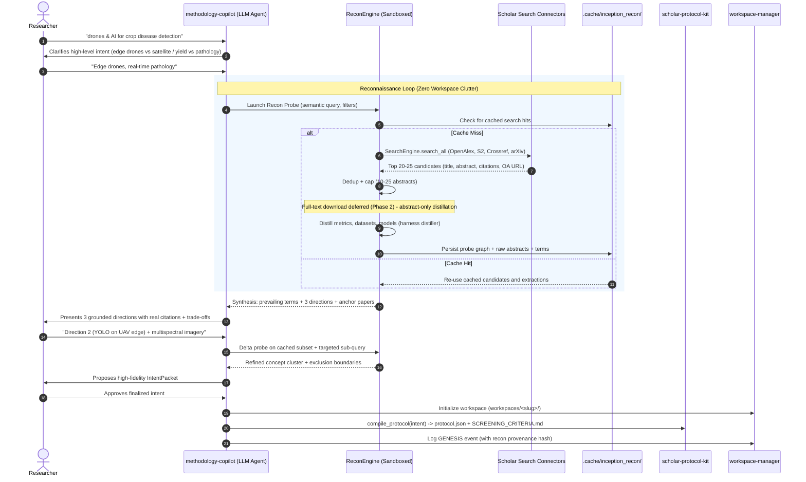

# 02 — System Architecture

## 1. Component inventory

| Component | Kind | Role | Real implementation (verified) |
| :--- | :--- | :--- | :--- |
| `methodology-copilot` | LLM agent (skill) | Clarifies intent, presents directions, drives the conversation | `.agents/skills/methodology-copilot/` |
| `ReconEngine` | harness sandbox | Fires micro-queries, dedups, caps pool | **New**: `src/scholar_harness/recon/engine.py` wrapping `scholar_search.engine.SearchEngine` |
| `distiller` | harness sandbox | Extracts prevailing terms (metrics, datasets, models) | **New**: `src/scholar_harness/recon/distiller.py` (pure-Python term-frequency first) |
| Search connectors | external APIs | OpenAlex, Semantic Scholar, Crossref, arXiv, PubMed, bioRxiv | `scholar-search-kit` providers |
| `.cache/inception_recon/` | persistent memory | Scratch corpus, cache keys, session state | Gitignored (`.gitignore:19` `.cache/`) |
| `scholar-protocol-kit` | deterministic compiler | `IntentPacket` → `protocol.json` + `SCREENING_CRITERIA.md` | `scholar_protocol.compiler.compile_protocol` |
| `workspace-manager` | scaffolder + audit | Creates `workspaces/<slug>/` only on protocol emission; writes `audit/journal.jsonl` | `init_project.py`, `log_event.py` |

## 2. Sequence diagram (proposed flow)

> **Full-text status (honest):** early sequences sketched downloading 2-3 OA PDFs via
> `scholar-pdf-kit download_batch` to feed the distiller. The implemented recon fills
> `payload["fulltexts"]` with `{}` (a reserved seam) and the distiller runs **exclusively on
> title + abstract** — deliberate demotion, not drift. PDF/Markdown extraction belongs to
> **Phase 2** (post-GENESIS, inside the workspace where `pdfs/` and `extracted/` already exist).

## 3. Interaction contract between agents

| Boundary | Caller | Callee | Payload |
| :--- | :--- | :--- | :--- |
| Recon Probe | Copilot | `ReconEngine.probe(intent_hint)` | topic text, optional year window, optional providers |
| Recon Result | `ReconEngine` | Copilot | `ReconReport` (directions, terms, anchor docs, session id) |
| Delta Probe | Copilot | `ReconEngine.delta(session_id, refinement)` | session id + delta text |
| Emit Intent | Copilot | `scholar-protocol-kit` | `IntentPacket` (validated) |
| Workspace Genesis | Copilot | `workspace-manager` | title, slug, paradigm, RQs |

## 4. Rate-limit & resilience contract (from real kit config)

| Provider | Rate limit (requests/s) | Source |
| :--- | :--- | :--- |
| OpenAlex | 10.0 | `scholar-search-kit/config.py:35` |
| Crossref | 5.0 | `config.py:38` |
| Semantic Scholar | 1.0 | `config.py:41` |
| PubMed | 3.0 | `config.py:44` |

- `AcademicHttpClient` (`scholar-search-kit/http_client.py:50-93`) already applies the per-provider `RateLimiter`, retries on **429/503**, enforces a default timeout, and caches responses. The ReconEngine inherits all of these by reusing `SearchEngine` — **no new rate-limit code in the harness.**
- The 1.0 rps Semantic Scholar limiter makes the recon probe configurable: prefer OpenAlex-first ordering and cap total providers per probe to bound wall-time on the 1 rps providers.

## 5. Failure modes handled

| Failure | Handling |
| :--- | :--- |
| Provider down / 429 / 503 | Kit retries; recon degrades partial providers gracefully (that provider contributes 0 docs). |
| Zero hits on a term | Recon marks the term as unverified; excluded direction; Copilot surfaces to user. |
| No OA full text available | Skip full-text distillation; proceed on abstracts only (flag confidence drop). |
| Cache corruption | Cache files are JSON; corrupt entries are treated as misses and re-fetched (best-effort try/except). |
| Session not found for delta probe | Delta against a fresh probe with same initial hint (session id missing). |