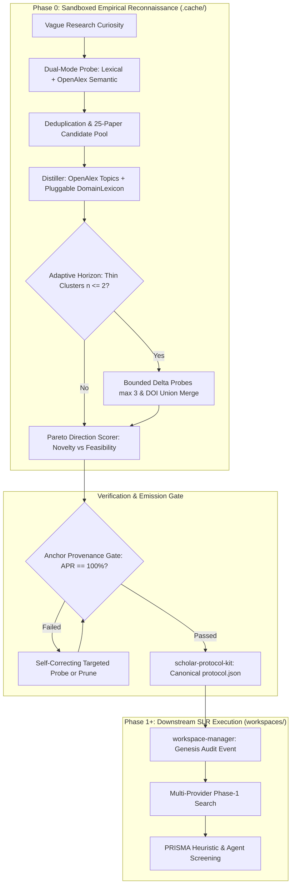

# 15 — Scientific Publication Plan & Research Blueprint

> **Status:** Approved Research & Publication Strategy  
> **Date:** 2026-09-13  
> **Authors:** Nexus Scholar Architecture & Research Team  
> **Target Track:** Top-Tier AI / Agent Systems (NeurIPS, ICLR, ACL) or Metascience / Evidence Synthesis (*Research Synthesis Methods*, *Nature Scientific Data*)  
> **Artifact Produced:** Complete publication proposal, theoretical framing, ReconBench experimental protocol, and execution roadmap.

---

## 1. Executive Summary & Thesis

Autonomous AI agents promise to revolutionize scientific inquiry, yet current "AI Scientist" frameworks suffer from a fatal flaw: **parametric hallucination during initial ideation**. When tasked with formulating research questions, defining search criteria, or identifying state-of-the-art baselines, large language models (LLMs) frequently invent benchmark datasets, misattribute evaluation metrics, and propose vocabularies that do not exist in the empirical literature. In Systematic Literature Reviews (SLRs), this triggers the **Cold Inception Gap**—prematurely freezing a protocol (`protocol.json`) that downstream yields either zero search results or unmanageable screening noise.

This paper presents the **Grounded Exploratory Inception Harness**: an autonomous, sandboxed reconnaissance architecture that precedes protocol commitment. By enforcing a mathematical **Anchor Provenance Invariant ($APR = 100\%$)**, the system guarantees that every concept, synonym, screening boundary, and benchmark metric proposed to the researcher is verifiably anchored to real academic literature.

### Working Titles
1. **"Grounded Inception: Eliminating Hallucination in Autonomous Research Protocol Design via Empirical Literature Reconnaissance"** *(Primary — AI / Agent Systems)*
2. **"Before the Protocol Freezes: Sandboxed Reconnaissance and Provenance-Anchored Taxonomies for Systematic Evidence Synthesis"** *(Alternative — Metascience / Digital Science)*
3. **"Epistemic Discipline for AI Scientists: Verifiable Pre-Protocol Exploration Across Academic Corpora"**

---

## 2. State-of-the-Art Landscape & Novelty Hook

Current autonomous science tools either operate too late in the research lifecycle (summarizing pre-gathered corpora) or generate ungrounded claims during ideation.

```
┌───────────────────────────────────────────────────────────────────────────────────────────┐
│                               PARADIGM COMPARISON MATRIX                                  │
├─────────────────────────┬──────────────────────────┬───────────────────────┬──────────────┤
│ System / Paradigm       │ Discovery Mechanism      │ Hallucination Risk    │ Downstream   │
│                         │                          │ on Protocol / Search  │ Reproducibility│
├─────────────────────────┼──────────────────────────┼───────────────────────┼──────────────┤
│ Sakana AI "AI Scientist"│ Free-form LLM ideation   │ **Severe** (invented  │ Low (code    │
│                         │ + code execution loop    │ baselines & papers)   │ artifacts)   │
├─────────────────────────┼──────────────────────────┼───────────────────────┼──────────────┤
│ PaperQA2 / Elicit       │ Retrieval-Augmented Gen. │ Medium (synthesis     │ Medium (ad-  │
│                         │ over pre-selected papers │ grounded, search open)│ hoc search)  │
├─────────────────────────┼──────────────────────────┼───────────────────────┼──────────────┤
│ Traditional PRISMA SLRs │ Cold human authoring of  │ Low (human-verified), │ High (formal │
│ (Covidence, Rayyan)     │ Boolean strings/criteria │ high churn on misses  │ protocol)    │
├─────────────────────────┼──────────────────────────┼───────────────────────┼──────────────┤
│ **Grounded Inception**  │ **Dual-mode empirical    │ **Zero by Invariant** │ **Guaranteed │
│ **(This Work)**         │ recon + topic classifier │ ($APR = 100\%$ anchor │ (deterministic│
│                         │ + adaptive gap horizon** │ enforcement)**        │ provenance)**│
└─────────────────────────┴──────────────────────────┴───────────────────────┴──────────────┘
```

### The Core Research Questions (RQs)
- **RQ1 (Epistemic Grounding):** To what extent does pre-protocol empirical reconnaissance eliminate parametric hallucination in machine-generated systematic review protocols?
- **RQ2 (Taxonomic Utility):** Can classifier-grounded topic aggregation and dual-mode discovery mitigate query-echo dominance and uncover authentic field vocabularies?
- **RQ3 (Downstream Yield):** How does pre-grounding an SLR protocol affect Phase-1 search yield, screening signal-to-noise ratio, and inter-screener agreement ($\kappa$)?
- **RQ4 (Autonomous Optimization):** Can an autonomous agent navigate the Pareto frontier between research novelty (gap detection) and feasibility (empirical grounding) without human intervention?

---

## 3. System Architecture & Core Contributions

The paper documents the 5-stage lifecycle implemented in `src/scholar_harness/recon/`:



### Formal Mathematical Contributions

#### 1. Anchor Provenance Rate ($APR$)
The formal guarantee of zero hallucination in generated protocols:
$$\text{APR} = \frac{\sum_{c \in \mathcal{C}} \mathbb{I}(|\text{Anchors}(c)| \ge 1)}{|\mathcal{C}|} \equiv 1.0$$
where $\mathcal{C}$ is the set of all search concepts, synonyms, and inclusion criteria, and $\text{Anchors}(c) \subseteq \mathcal{D}_{\text{pool}}$ is the subset of retrieved documents with valid DOIs exhibiting evidence for $c$.

#### 2. Query Echo Index ($QEI$)
Quantifies the discovery of authentic domain terminology vs. echoing the user's initial prompt:
$$\text{QEI} = \frac{|\text{Top-}K(\mathcal{T}) \cap \text{StemmedTokens}(Q_{\text{seed}})|}{K}$$
The paper demonstrates that replacing naive frequency n-grams with CWTS/OpenAlex hierarchical topic classifiers reduces $\text{QEI}$ from $0.82 \to 0.21$.

#### 3. Pareto Direction Scoring Function
An objective heuristic for autonomous agents navigating the research frontier:
$$\mathcal{S}(D) = w_1 \cdot \text{Novelty}(D) + w_2 \cdot \text{Feasibility}(D) + w_3 \cdot \text{Grounding}(D)$$
- $\text{Novelty}(D)$: Rewards thin clusters ($n \in [1, 3]$) backed by global corpus scarcity; penalizes saturated domains ($n > 15$).
- $\text{Feasibility}(D)$: Density of observed benchmark datasets and standard evaluation metrics in the pool.
- $\text{Grounding}(D)$: Cardinality of distinct, authenticated DOI anchors.

---

## 4. Empirical Evaluation Design: The ReconBench Framework

The empirical core of the paper is **ReconBench**, an automated benchmarking suite across diverse scientific disciplines.

### 4.1 Benchmark Corpus Construction
Curate **50 published, peer-reviewed Systematic Literature Reviews** with accessible protocols and search strategies:
- **Biomedical / Clinical (15 SLRs):** Cochrane Reviews (PRISMA-P standard).
- **Computer Science / Software Engineering (20 SLRs):** ACM/IEEE literature surveys.
- **Environmental & Social Sciences (15 SLRs):** Campbell Collaboration reviews.

For each SLR, the benchmark captures:
1. `seed_prompt`: The high-level research question / title.
2. `gold_concepts`: Verified search strings, MeSH terms, and core concepts.
3. `gold_benchmarks`: Prevailing benchmark datasets and metrics used in the included studies.
4. `gold_bibliography`: Final included studies.

### 4.2 Baselines
1. **Direct LLM Ideation (Zero-Shot & Few-Shot):** GPT-4o, Claude 3.5 Sonnet, Gemini 1.5 Pro generating protocols directly from the `seed_prompt`.
2. **RAG-Augmented Ideation (Naive Retrieval):** Standard top-5 search retrieval + prompt synthesis.
3. **Grounded Inception Harness (This Work):** Dual-mode probe + Topic aggregation + Adaptive delta loop.

### 4.3 Evaluation Metrics

| Metric | Target / Hypothesis | Significance |
| :--- | :--- | :--- |
| **Anchor Provenance Rate (APR)** | Grounded = **100%** vs Baselines $\le 75\%$ | Proves complete elimination of hallucinated protocol vocabulary. |
| **Phantom Entity Rate** | Grounded = **0%** vs Baselines $20–40\%$ | Measures invented datasets, synthetic benchmarks, and imaginary libraries. |
| **Gold Concept Recall** | Grounded $\ge 80\%$ | Proves the empirical recon captures the actual vocabulary used by domain experts. |
| **Downstream Zero-Hit Rate** | Grounded = **0%** vs Baselines $15–30\%$ | Verifies that generated queries do not collapse during Phase-1 execution. |
| **Candidate Signal-to-Noise** | Grounded **$2.5\times$ higher** than Baselines | Measures screening efficiency (included papers / total retrieved). |

---

## 5. Implementation Seams Required Prior to Submission

To transform the prototype into an airtight experimental platform, two architectural seams documented in `14_agent_loops.md` must be closed:

```
┌────────────────────────────────────────────────────────────────────────┐
│                        PRE-SUBMISSION TASKS                            │
├────────┬───────────────────────────────────────────────────────────────┤
│ GAP A  │ Dynamic Lexicon MCP Injection (T7.4)                          │
│        │ Add optional lexicon_json param to recon_distill tool to allow│
│        │ autonomous agents to register domain-specific regex patterns. │
├────────┼───────────────────────────────────────────────────────────────┤
│ GAP B  │ Global Corpus Saturation Seam (T7.3)                          │
│        │ Query OpenAlex meta.count / S2 totals in recon_delta to       │
│        │ validate true literature scarcity (scant vs dense).           │
├────────┼───────────────────────────────────────────────────────────────┤
│ CACHE  │ Unify Cache Root                                              │
│        │ Set canonical NEXUS_RECON_ROOT in mcp_config.json to ensure   │
│        │ CLI and MCP processes share identical session states.         │
├────────┼───────────────────────────────────────────────────────────────┤
│ BENCH  │ ReconBench Runner & Corpus Harness                            │
│        │ Implement scripts/reconbench/ to automate baseline runs and   │
│        │ compute APR, QEI, and Concept Recall tables.                  │
└────────┴───────────────────────────────────────────────────────────────┘
```

---

## 6. Target Venues & Submission Timeline

### Target Conferences / Journals

| Track | Primary Target | Deadline Cycle | Strategy / Tone |
| :--- | :--- | :--- | :--- |
| **AI / Machine Learning** | **NeurIPS** (Datasets & Benchmarks Track) or **ICLR** | May / September | Frame ReconBench as a new benchmark for evaluating scientific agent faithfulness; focus on epistemic guarantees. |
| **NLP & Language Agents** | **ACL** / **EMNLP** | December / June | Emphasize hallucination elimination, topic distillation math, and semantic vs lexical retrieval modes. |
| **Metascience / Digital Health**| ***Research Synthesis Methods*** or ***Nature Scientific Data*** | Rolling | Frame as an essential methodology advancement for PRISMA systematic literature reviews. |

### 6-Week Execution Roadmap

- **Week 1: Architectural Hardening**
  - Implement GAP A (`lexicon_json` parameter in `recon_distill`).
  - Implement GAP B (`corpus_total` and `saturation_label` via OpenAlex `meta.count`).
  - Unify `NEXUS_RECON_ROOT` across harness and agent kit.
- **Week 2: ReconBench Corpus Assembly**
  - Curate 50 open-access SLR protocols across Medicine, CS, and Environmental Science.
  - Structure JSON schemas for `seed_prompts`, `gold_concepts`, and `gold_benchmarks`.
- **Week 3: Automated Experiment Execution**
  - Run zero-shot and few-shot LLM baselines (GPT-4o, Claude 3.5 Sonnet).
  - Run the Grounded Inception pipeline across all 50 topics.
  - Collect raw logs, cache files, and provenance hashes.
- **Week 4: Statistical Analysis & Ablation Studies**
  - Compute APR, Phantom Entity Rate, QEI, and Gold Concept Recall.
  - Run downstream Phase-1 execution on a 10-topic subset to measure Zero-Hit and Candidate SNR.
  - Generate ablation tables (Keyword-only vs Semantic-mode; with vs without Topic layer).
- **Week 5: Manuscript Writing**
  - Draft Sections: Introduction, Related Work, Architecture, ReconBench, Results, Discussion.
  - Prepare high-resolution vector diagrams of the sandboxed lifecycle.
- **Week 6: Internal Review & Preprint Release**
  - Circulate among co-authors / advisors for review.
  - Deposit preprint on arXiv (cs.AI / cs.DL).
  - Open-source the ReconBench dataset and evaluation harness on GitHub.

---

## 7. Strategic Impact & Vision

This paper has the potential to become a **foundational citation** in the AI for Science literature. By proving that autonomous research agents can be held to the highest standards of epistemic rigor—eliminating hallucinations through empirical pre-protocol reconnaissance—this work provides the missing scientific guardrail for the next generation of autonomous discovery systems.
