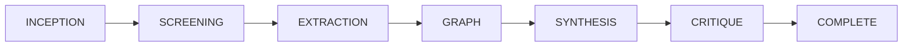

# Agent Handoff Protocol

**Specification:** `specs/handoff/handoff_spec.md`  
**Runtime Implementation:** `src/scholar_harness/handoff.py`  
**Test Suite:** `tests/test_handoff.py`

## Overview

The Agent Handoff Protocol defines the autonomous phase state machine and filesystem trigger contracts that guide research workspaces through the systematic literature review lifecycle:

## Key Invariants

1. **File-First Triggers**: Advancement between phases is driven by the deterministic presence and validity of canonical workspace artifacts (e.g., `intent.json`, `literature/included.json`, `synthesis/consensus.json`), requiring zero external sync engines.
2. **Deterministic State Machine**: Pipeline state is recorded in `handoff_state.json` inside the workspace directory, capturing `current_phase`, `completed_phases`, and timestamps.
3. **Supervisor Autonomous Advance**: The runtime supervisor loop (`scholar_harness.handoff.supervise()`) scans trigger files, detects prerequisites, advances to the next eligible phase, and logs append-only audit events to `audit/journal.jsonl`.
