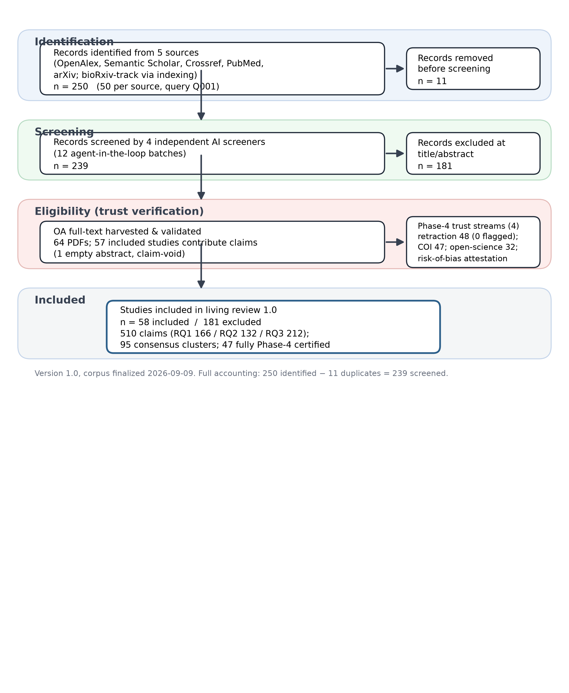
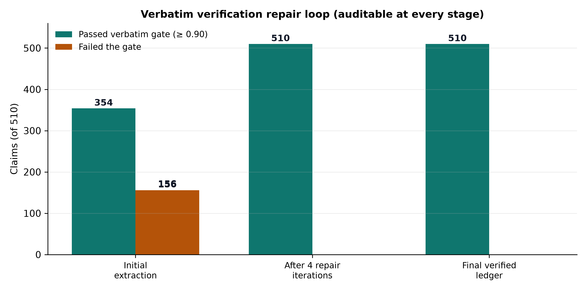
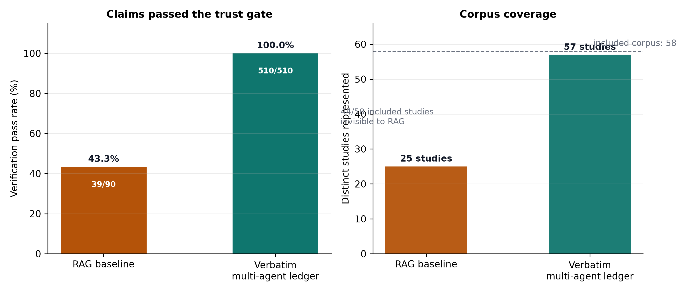
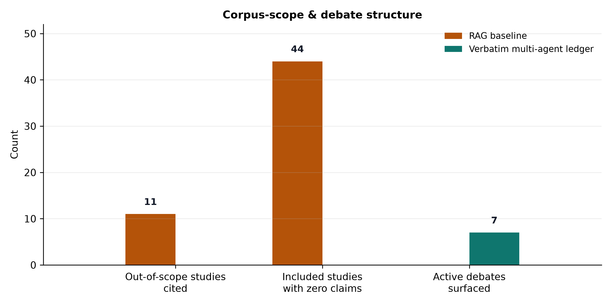
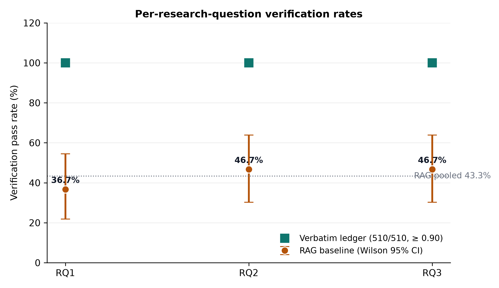

# AI-Assisted Research Harnesses: Traceability, Evidence Trust, and Reproducibility in Agentic Systematic Review Systems
## A Grounded, Verbatim-Verified Early-Evidence Living Scoping Review of the 2023–2026 Corpus (Version 1.0)

---

**Protocol ID**: PROTO-20260908-AI-RESEARCH-HARNESSES-TRUST
**Type**: Early-evidence living scoping review (protocol-based), reported in line with PRISMA-ScR
**Manuscript status**: Draft v3 for author review (post-adversarial audit)
**Review version**: 1.0 (corpus finalized 2026-09-09; aggregates reported as-of this date)
**Prepared by**: The Nexus Scholar Research Pipeline (multi-agent orchestration; agent prompts versioned with the pipeline; all claims machine-verified verbatim against full text — see §3.5 and §7)
**Corpus window**: January 2023 – September 2026

---

**Authors**

Mouadh Bekhouche*¹ and Soumia Zertal*²

¹² University of Oum El Bouaghi, Algeria

*Contributed equally to this work.
² Corresponding author. Email: zertal.soumia@univ-oeb.dz

---

## Abstract

**Background.** Large language model (LLM) and agentic systems are being pressed into service across the systematic-review lifecycle — search, screening, extraction, and synthesis — yet the trustworthiness of their outputs (citation verifiability, provenance, reproducibility) is not established.

**Methods.** We conducted a protocol-driven early-evidence living scoping review across five scholarly sources (OpenAlex, Semantic Scholar, Crossref, PubMed, arXiv; January 2023–September 2026; bioRxiv-track content captured through these providers' indexing). The field is preprint-dominated and publication-lagging — 32/58 included records (55%) are preprint-track and 2026 alone accounts for 30/58 (52%) of the corpus — so the review is explicitly framed as a living review (Version 1.0, corpus finalized 2026-09-09; re-run protocol in §3.8). 239 deduplicated records were screened by four independent AI screeners (Fleiss' κ = 0.408) with majority voting and adjudicated deadlock resolution, yielding 58 included studies. The 58 included studies (47 fully Phase-4 certified) were subjected to a four-stream trust audit (retraction status, open-science artifact scan, conflict-of-interest audit, risk-of-bias attestation). Evidence was synthesized by two competing pipelines: a deterministic top-k retrieval-augmented generation (RAG) baseline (90 claims, 43.3% entailment-verified) and an authoritative **multi-agent full-text claim-extraction pipeline** (8 full-text agents + 1 abstract agent) whose 510 claims each passed **≥90% glyph-normalized coverage on char-window or token 6-gram verification** (100% pass). Claims were clustered into a semantic consensus map.

**Results.** Architectures converge on auditable, provenance-bearing workflows: multi-agent role specialization, end-to-end orchestrated pipelines, retrieval- (RAG) and knowledge-graph-grounded designs, and prompt-compilation systems. Execution provenance is increasingly structured and append-only (deterministic IDs, immutable content-hashed run records, temperature-0 decoding, open-weights selection). Citation verifiability is the binding trust constraint: across 17,443 generated citations no model exceeded a 0.475 existence rate, while retrieval grounding reduced hallucinated papers to zero in OpenScholar-8B versus 78–98% for non-retrieval LLMs. Pooled LLM screening sensitivity/specificity reached 0.92/0.94 (I² = 95.8%), but temporal drift (−1.9%/day), run-to-run item-level discordance, and prompt fragility (up to 76-point accuracy swings) are not captured by standard reporting. The deterministic RAG pipeline cited 11 screened-out studies (corpus contamination) and verified only 43.3% of its claims; the multi-agent ledger reached 100% pass at the ≥0.90 coverage threshold across 57 included studies and surfaced a consensus structure (95 clusters: 16 high-consensus, 7 active debates, 37 unresolved, 35 provisional) invisible to RAG.

**Conclusions.** Full-text, verbatim-verifiable claim extraction is a tractable and superior synthesis primitive for trustworthy research infrastructure. We identify the field's open gap: no study provides an end-to-end, externally validated, multi-domain benchmark jointly evaluating screening, extraction, synthesis quality, citation verifiability, and cost.

**Keywords**: AI-assisted systematic review; agentic systems; retrieval-augmented generation; citation fact-checking; provenance; reproducibility; hallucination mitigation; evidence synthesis.

---

## 1. Introduction

Conventional systematic reviews and scoping reviews are time-consuming, labor intensive, and susceptible to human bias [1]; conventional keyword search tools "lack the semantic understanding to answer nuanced questions" [2]. The rapid commoditization of LLMs has produced a wave of research harnesses claiming to automate review workflows end to end — from federated discovery and deduplication to TITLE/ABSTRACT screening, full-text extraction, risk-of-bias assessment, and statistical synthesis. Yet the same commoditization introduces new failure modes: fabricated citations, unreproducible runs, opaque closed-weight models, and retrieval pipelines that silently draw on evidence outside the approved corpus.

This review asks three questions. **RQ1** — What is the state of the art in academic research and literature-review harnesses integrating LLMs and agentic AI (2023–2026), particularly their design mechanisms for execution provenance, audit trails, and process reproducibility? **RQ2** — What evidence-trust and academic-integrity mechanisms (citation fact-checking, hallucination mitigation, retraction checks, risk-of-bias, open-science artifact verification) do they incorporate? **RQ3** — How are they empirically evaluated, and what architectural gaps remain for the construction of novel, trustworthy research infrastructure?

Our contribution is methodological as much as substantive: the synthesis itself is generated and audited by the same class of systems under study. Every claim in this manuscript is backed by a machine-verified, glyph-normalized verbatim quote from the included full text (≥90% coverage on char-window or token 6-gram matching — see §3.5), and every pipeline step is recorded in an append-only audit journal.

Because the field is preprint-dominated and publication-lagging (55% of included records are preprint-track, and 2026 accounts for 52% of the corpus), we frame this as an **early-evidence living scoping review**: Version 1.0 reports the aggregate state of evidence as of corpus finalization (2026-09-09), and §3.8 specifies a re-run protocol for subsequent versions.

## 2. Related Work

Prior evaluations have been narrow and siloed. Screening-performance meta-analyses report strong pooled sensitivity but extreme heterogeneity [3]. Citation-fabrication studies establish low existence ceilings but stop at measurement [4]. System papers demonstrate retrieval-grounded claim generation but evaluate on narrow benchmarks [5] (preprint version: [6]). Reviews of agentic scientific tools remain taxonomical [7], and reproducibility audits document run-to-run instability without remediating it [8]. Missing is a protocol-driven, corpus-scoped, verbatim-verified synthesis that simultaneously characterizes design, trust mechanisms, and evaluation maturity — the gap this review addresses. Our retrieval-augmented baseline further contributes a direct, quantitative comparison of deterministic RAG synthesis versus full-text multi-agent extraction over an identical corpus.

## 3. Methods

The review follows a hash-pinned protocol compiled with a protocol compiler (`protocol.json`, `SCREENING_CRITERIA.md`, `intent.json`) under the Design Science paradigm, and is reported in line with PRISMA-ScR and living-(systematic-)review guidance adapted to a scoping design. All stages were executed through a shared virtual Python environment; every step is recorded in an append-only audit journal (`audit/journal.jsonl`, 60 events). The corpus window (January 2023 – September 2026) is frozen for Version 1.0 at corpus finalization; §3.8 defines how the trailing publication-date boundary and subsequent evidence are absorbed in later versions.

### 3.1 Search and record verification
Five sources were federated in a single pass (OpenAlex, Semantic Scholar, Crossref, PubMed, arXiv; bioRxiv-track preprints are captured via PubMed indexing) with concept-and-synonym search strings (Boolean OR within and across the concepts "literature-review automation" and "large language model"; see `search_strategy` in `protocol.json` and supplementary search-log) targeting LLM/agentic review automation, 2023–2026. 250 raw hits were deduplicated and hydrated (DOI and normalized-title resolution, abstract and DOI completion), yielding **239 unique verified records**.

### 3.2 Screening
Two hundred thirty-nine records were screened against explicit PICO-style inclusion/exclusion criteria by four independent AI screeners in twelve agent-in-the-loop batches (Fleiss' κ = **0.408**, fair agreement by Landis–Koch bands). Two hundred thirteen records were resolved by majority rule (≥3 of 4); the **26 two-vs-two deadlocks** were adjudicated by a senior adjudicator. Final: **58 included / 181 excluded**. Table 1 summarizes the full flow of information; screening reliability is decomposed in Table 2; the flow is rendered in Figure 1.

**Table 1. Identification, screening, and inclusion flow (PRISMA-ScR item 17).**

| Stage | Count | Source artifact |
| :--- | ---: | :--- |
| Records identified from 5 sources | 250 | `raw_search.json` (50 per source, query Q001) |
| Duplicates removed (DOI + normalized-title) | 11 | `deduped.json` |
| Records screened (title + abstract, 4 AI screeners) | 239 | 12 agent-in-the-loop batches |
| Excluded at title/abstract (systematic rule) | 181 | `excluded.json` |
| Included studies (review corpus) | 58 | `included.json` |
| OA full-text PDFs harvested and validated | 64 | `pdfs/` (OA harvest) |
| Included studies contributing claims | 57 | `claims.json` (493 full-text + 17 abstract-only) |
| Fully Phase-4 certified studies | 47 | `phase4/*.json` |

**Table 2. Title/abstract screening reliability.**

| Metric | Value |
| :--- | :--- |
| Screeners | 4 independent AI screeners |
| Batches | 12 (agent-in-the-loop) |
| Fleiss' κ | 0.408 (fair, Landis–Koch) |
| Majority-rule resolutions | 213 (≥ 3 of 4) |
| Two-vs-two deadlocks escalated | 26 (senior adjudicator) |
| Final split | 58 included / 181 excluded |

*Figure 1. PRISMA-ScR flow of information for the living scoping review (Version 1.0).*

### 3.3 Full-text acquisition, extraction, and scoping
Open-Access PDFs were retrieved and extracted to YAML-frontmatter Markdown (64 documents; 3,814 structural AST chunks; `all-MiniLM-L6-v2` embeddings). Because extraction preceded final scoping, 18 extractions belong to screened-out studies; **all synthesis in this manuscript is scoped strictly to the 58 included studies**, and the screened-out extractions are removed from the evidence index for authoritative synthesis.

### 3.4 Trust verification (Phase 4)
Each included study was certified with four `scholar-verify` streams: retraction/status (OpenAlex `is_retracted`, Crossref `update-to`), open-science DA/S/CA artifact scanning, conflict-of-interest audit, and risk-of-bias attestation. **47 of 58 included studies were fully checked** (retraction stream covered 48; the remaining 11 lacked verifiable metadata/DOI records — see §5.3).

### 3.5 Claim extraction with verbatim verification
**Approach B (authoritative).** Eight parallel agents read the complete text of the 46 full-text included papers (7 size-balanced batches ≤ ~456 KB) plus one agent over the 12 abstract-only papers, producing claims in a canonical 10-field schema (principal fields: `rq_id`, `claim_text`, `citation_tokens`, `evidence_quote`, `section`, `stance`, `evidence_level`, `location_hint`, plus content-hash and provenance fields). Every quote was then **machine-verified against the source file** to a defined threshold: glyph-normalized (bullet remapping, zero-width-space and Unicode-dash handling, NFKC, hyphen-wrap rejoin) matching via character windows (8 chars, step 4) and token 6-grams (6 tokens, step 3); a claim passes at ≥ 0.90 coverage on either metric — i.e., the verified quote matches the source at ≥90% on char-window or token 6-gram alignment, not byte-for-byte. Initial verification failed 156/510 quotes; after four repair iterations including re-casting 11 light-paraphrase/math-glyph artifacts to exact substrings, **510/510 (100%) claims pass the ≥0.90 threshold**, comprising 166 (RQ1), 132 (RQ2), 212 (RQ3) — 493 full-text and 17 abstract-only, spanning 57 studies (one included study has an empty abstract and contributes none).

**Approach A (baseline).** Deterministic RAG synthesis retrieved the top-30 chunks per research question from the full 64-document index and applied heuristic entailment verification of claims against their own snippets (90 claims, 30 per RQ). Table 3 summarizes the verbatim ledger; the verification repair loop is rendered in Figure 2.

**Table 3. Multi-agent verbatim claim-extraction ledger (Approach B).**

| Dimension | Value |
| :--- | :--- |
| Architecture | 8 full-text agents (46 full-text papers, 7 size-balanced batches) + 1 abstract agent (12 abstract-only papers) |
| Total claims | 510 (100% pass at the ≥ 0.90 glyph-normalized coverage threshold) |
| Per research question | RQ1 166 / RQ2 132 / RQ3 212 |
| Full-text vs. abstract-only | 493 / 17 |
| Studies contributing claims | 57 of 58 (SCI-000147 empty abstract, claim-void) |
| Initial verification failures | 156 / 510 |
| Repair iterations / re-cast | 4 iterations; 11 light-paraphrase/math-glyph quotes re-cast to exact substrings |

*Figure 2. Verbatim verification repair loop (auditable at every stage).*

### 3.6 Semantic consensus
The 510-claim ledger was clustered with cached-embedding cosine similarity (`all-MiniLM-L6-v2`, threshold 0.40) into a consensus map (16 high-consensus, 7 active debates, 37 unresolved, 35 provisional clusters).

### 3.7 Analysis and integrity of the synthesis
Results are reported per research question from the verification-gated ledger, with cluster references; direct quotes are drawn from `claims.json` (each gated at the ≥0.90 coverage threshold, §3.5). Aggregates (e.g., citation existence, pooled sensitivity) are reported as stated by the source studies and cross-checked between claims.

### 3.8 Living-review protocol (Version 1.0)
This Version 1.0 report is the initial snapshot of a living scoping review. The underlying pipeline (federated discovery → dedup/hydration → screening → verbatim-verified extraction → trust verification → synthesis) is re-runnable from committed inputs through the documented stage CLIs (see §7). Planned update policy:
- **Cadence**: quarterly re-run of the five-source federation (OpenAlex, Semantic Scholar, Crossref, PubMed, arXiv; bioRxiv-track via PubMed) with the same concept-and-synonym strings; each run advances the trailing publication-date boundary to the run date (the Version 1.0 window ends 2026-09), so "same strings" yields new evidence rather than the identical set. Evidence already in the included set is retained across versions (supersession handled under Preprint policy below).
- **Versioning**: each update stamps a new version and corpus-finalization date in the front matter; aggregate figures in each version carry that version's corpus stamp. A search-log supplement accompanying each version records that run's query set, window, and dedup threshold (committed as `literature/search_log_<version>.json`).
- **Preprint policy**: preprint-track records (arXiv/bioRxiv/institutional repositories) are eligible and explicitly retained as the field's leading edge; each preprint is tracked against a published version where one appears (Crossref `update-to` / OpenAlex status), and the version table ships in the per-version supplement.
- **Diff discipline**: the authoritative verbatim claim ledger is versioned under git and regenerated deterministically from committed extraction inputs; revisions re-verify affected quotes against attached full text rather than restating aggregates, so every claim statistic remains machine-checkable in any version.

## 4. Results

### 4.1 Corpus characteristics
The 58 included studies (2023: 2; 2024: 8; 2025: 18; 2026: 30) reflect rapid growth in agentic research tooling, with 2026 accounting for over half the corpus (30/58, 52%). Of the 46 full-text-characterized systems, keyword-classified architecture patterns are: single-agent/single-system 19 (41.3%); multi-agent/agentic orchestration 16 (34.8%); RAG/retrieval-grounded 5 (10.9%); end-to-end pipeline/meta-analysis 4 (8.7%); knowledge-graph/ontology 2 (4.3%). Phase-4 audit: **0 retractions**, 16 live repository links (34.0%), 7 dual data+code releases, 5 industry COI ties (10.6%), 4 declared no-conflict, 1 academic-or-public affiliation, 37 with no formal COI statement. Table 4 summarizes corpus composition.

**Table 4. Corpus composition (Version 1.0).**

| Dimension | Value |
| :--- | :--- |
| Included studies | 58 (239 screened; 181 excluded) |
| Publication years | 2023: 2 · 2024: 8 · 2025: 18 · 2026: 30 |
| Preprint-track | 32/58 (55%) — 30 arXiv, 1 bioRxiv, 1 institutional repository |
| Architecture patterns (n = 46 full-text-characterized) | single-agent 19 (41.3%) · multi-agent 16 (34.8%) · RAG 5 (10.9%) · end-to-end 4 (8.7%) · graph/ontology 2 (4.3%) |
| Freshness | 2026 alone = 30/58 (52%); living-review rationale |

### 4.2 RQ1 — State of the art and design mechanisms
**Architectural convergence.** Systems press general-purpose LLMs into review pipelines without task-specific fine-tuning, treating **prompt engineering as the primary optimization strategy** [3][9]. Motivating framing recurs: conventional SLR practice is "time-consuming, labor-intensive, and susceptible to human bias" [1], and general-purpose agents "fall short on the auditable, scenario-specific workflows" biomedical evidence demands [7]. Five patterns recur: (i) **prompt-compilation systems** that package compiled prompts as "verifiable digital artefacts" to neutralize prompt fragility [9]; (ii) **multi-agent teams with role specialization** — Orchestrator/BioExpert/Evaluator decomposition [10], three-layer worker–manager–director networks [11], and 11-agent coordination with deliberate model routing (cheap models for throughput phases, strong models for judgment and verification) [12]; (iii) **end-to-end orchestrated pipelines** automating complete meta-analysis workflows [13][14][15]; (iv) **RAG/retrieval-grounded designs** coupling dynamic retrieval with answer generation [16][17][6]; and (v) **graph/knowledge-grounded designs** that productionize both a knowledge graph and vector collections as "structural infrastructure for verifiable information synthesis" [18][19].

**Execution provenance.** Provenance is increasingly structured, deterministic, and immutable: per-module token/runtime/inference logging [10], structured JSON API logs with model identity, latency, and retry counts [12], corpus-wide interaction logging [20], validated requests with unique identifiers guaranteeing **idempotent behavior** [21], stable record identifiers preserved end to end [8], and content-hashed "commitment cards" with run-bundles (event traces, checksums, retries) hosted in an immutable provenance record [22]. Reproducibility levers are dominated by **fixed decoding** (temperature 0 with frequency/penalty/presence penalties pinned [23]; temperature 0 with regex-constrained parsing and retries [24]; 2,880 runs producing 17,443 citations under deterministic settings [4]) and **model openness** — open-weights selection "explicitly to enhance the reproducibility of the results" [24], fully-local zero-API pipelines [25], and open-source positioning as an explicit fidelity alternative [26].

**Debates.** Open-source versus proprietary control: closed hosted models "cannot be guaranteed to reproduce original outputs because the underlying models and web interfaces are externally controlled and may change over time" [8][27]. Human-in-the-loop tension: dominant platforms position **researcher orchestration with retained control** and five mandatory human decision points [28][15], while deterministic workflows gain reproducibility but "restrict adaptive decision-making" [10].

### 4.3 RQ2 — Evidence-trust and academic-integrity mechanisms
**Citation verifiability ceiling.** Across **17,443 generated citations**, no model exceeded an existence rate of **0.475**; time-bound and combined conditions produced the steepest drops while outputs stayed format-compliant — "compliance without substance" [4]. A three-way Existing/Unresolved/Fabricated labeling pipeline audited against human labels achieved Cohen's κ = **0.63**; manual validation (n = 100) gave 0.75 overall agreement, precision 0.97 (Existing) and 0.88 (Fabricated) but only **0.43 (Unresolved)** — whose dominant error was Unresolved-to-Fabricated, making reported fabrication rates underestimates. Post-hoc multi-database verification was recommended [4].

**Grounded mitigation works.** OpenScholar, a retrieval-augmented scientific LM, returns passage-traceable answers [5]; OpenScholar-8B produced **zero hallucinated cited papers** versus baseline LLMs hallucinating **92.1% (CS) / 97.6% (Bio)** of cited papers; non-retrieval LLMs fabricated 78–98% of citations, worse in biomedicine [6]. Knowledge-graph integration into public biological graphs reduced hallucinations [29]. Deterministic countermeasures include Crossref/Semantic-Scholar verification [4], conservative schema-constrained missingness ("NR") to avoid fabrication [25], agent-level anti-hallucination instructions with full traceability [10], and multi-agent validation loops (generator + auditing QA agent) [18][11].

**Methodological integrity mechanisms.** Risk-of-bias assessment is institutionalized: PROBAST+AI and QUADAS-2 application to LLM screening studies [3], ROBINS-I-based automated risk-of-bias with PRISMA 2020 flow diagrams and funnel-plot checks [13]. Reproducibility is advanced by open code, cost, and prompt releases [12] and open-weights selection [24].

**Residual gaps.** Field-level citation accuracy remains imperfect (DOI matching 74.4%, in-text citations 73.9%) [18]. Two nominally identical runs agreed on 91.7% of records but **disagreed on 94 individual records, including 29 verified-eligible records retained by only one run** — aggregate similarity conceals item-level instability [8]. Verification proxies fail as reliability guarantees: BERTScore returned near-identical F1 across workflows and rated false conclusions as semantically equivalent to correct ones [17]. LLM precision for post-exposure controls (0.15–0.30) is far below the best human reviewer (0.89) [30]. Data contamination is unquantified across benchmarks [24].

### 4.4 RQ3 — Empirical evaluation, reliability, and gaps
**Screening performance.** A meta-analysis of 18 studies reports pooled sensitivity **0.92** (95% CI 0.81–0.96), specificity **0.94** (0.90–0.97), SROC AUC **0.98**, with substantial heterogeneity (I² = 95.8%); chain-of-thought improved sensitivity 0.86→0.95 (p < 0.01); full-text screening pooled sensitivity/specificity 0.99/0.99 [3]. Benchmark AUCs range 0.77–0.95 across heterogenous domains with inclusion rates from <1% to 12.4% [16]. **Extraction performance.** Structured field extraction strongly outperforms naive chunking: HySemRAG +35.1% semantic similarity (p < 0.000001, 643 observations) [18]; schema-constrained ketamine extraction achieved **100% recall / 97.9% precision / 98.9% F1** [25]. Extraction is domain-sensitive (clinical 82% accuracy best) with author-attribution errors (40% partial/failed) [23][31].

**Cost and efficiency.** Screeners run ~25× faster than human raters at $3.26 versus an estimated $492.18 for two human raters [32]; GPT-4o ≈ $3.16/100 articles, GPT-3.5 ≈ $0.22 [26]; a RAG pipeline synthesized 30 articles in 1m24s versus an estimated 50+ human hours [33]; full end-to-end pipeline costs are $19.51–$29.04 per review (median $22.65) [12].

**Reliability failure modes.** Temporal drift of **−1.9%/day** in HySemRAG's evaluation window [18]; identical questions answered identically only 69% of the time (8% substantively different) [23]; domain-transfer limits (LGAR reliably tested only in medicine due to sparse SYNERGY domains [24]); model ranking domain-dependence (e.g., one model 98% screening but 40% extraction in the same study) [34]; prompt fragility with up to **76 accuracy-point** swings from format variations [9]; contamination acknowledgment and cross-model divergence [35][9]. Multi-agent orchestration is **phase-dependent**: it hurts screening but is essential for extraction, yielding 5.7× more poolable analyses [12].

**The evaluation gap.** No included study provides an end-to-end, externally validated, multi-domain benchmark jointly evaluating screening, extraction, synthesis quality, citation verifiability, and cost. Validations are proof-of-concept against published reviews without blinded dual review [25], formally labeled "essential" to reproduce [15], single-model without cross-model replication [24], and rely on LLM-as-judge protocols correlating only moderately with experts (r = 0.65–0.81) [23][36].

### 4.5 Consensus cartography
The 95-cluster consensus map (Table 5) surfaces structure the RAG baseline cannot see. High-consensus themes (≥ 3 independent sources): citation-verifiability failure at scale (0.475 existence ceiling), open-weights selection for reproducibility (17 studies), human-machine collaboration with retained researcher control, structured-field extraction superiority, and local-vs-API cost anatomy. **Seven active debates** include deterministic versus adaptive configuration, best-performing benchmark model, and LLM-versus-human screening reliability. Full cluster contents: see supplementary consensus file.

**Table 5. Consensus cartography (`synthesis/consensus.json`, threshold 0.40).**

| Bucket | Clusters | Meaning |
| :--- | ---: | :--- |
| High-consensus | 16 | ≥ 3 independent sources converge |
| Active debates | 7 | Contradictory claim sets |
| Unresolved | 37 | Mostly neutral-direction findings |
| Provisional | 35 | Single-source findings |
| **Total** | **95** | 510 claims clustered (all-MiniLM-L6-v2 cosine) |

### 4.6 Approach comparison (RAG baseline vs. multi-agent ledger)
The deterministic RAG baseline produced 90 claims across 25 studies (14 in-scope of 58), of which **only 43.3% were entailment-verified** (RQ1 36.7%, RQ2/RQ3 46.7%; Figure 5); it cited **11 studies absent from the included set** (its index contained the 18 screened-out extractions; a single non-included paper, SCI-000184, supplied 22/90 claims), covered 44 included studies not at all (Figure 4), and yielded 20 clusters with zero debates. The multi-agent ledger achieved **100% pass at the ≥0.90 verification threshold** across 57 included studies and 95 clusters including 7 active debates. Table 6 gives the head-to-head summary; Figures 3–4 visualize verification coverage and corpus-scope discipline.

**Table 6. Approach A (deterministic RAG baseline) vs. Approach B (multi-agent verbatim ledger).**

| Metric | Approach A (RAG) | Approach B (verbatim) |
| :--- | ---: | ---: |
| Claims generated | 90 (30 per RQ) | 510 |
| Verification gate | Entailment vs. own snippets | ≥ 0.90 glyph-normalized coverage (char-window / token 6-gram) |
| Pass rate | 43.3% (39/90) | 100% (510/510) |
| Studies represented | 25 | 57 |
| In-scope studies covered | 14/58 | 57/58 |
| Studies cited outside included set | 11 | 0 |
| Included studies invisible | 44 | 0 |
| Consensus clusters | 20 | 95 |
| Active debates surfaced | 0 | 7 |

*Figure 3. Claim verification pass rate and corpus coverage, Approach A vs. B.*

*Figure 4. Corpus-scope and debate structure (lower is better for the first two panels; higher for debates).*

*Figure 5. Per-research-question verification rates with 95% CIs.*

### 4.7 Phase-4 trust audit
Retraction: 0/48 flagged. Open science: 16 repository links, 7 dual data+code, 32 explicit DA/S/CA statements, 5 proprietary. COI: 5 industry ties (two Meta-affiliated, Google, Anthropic, OpenAI), 4 declared no-conflict, 1 academic-or-public, 37 with no formal COI statement (of 47 scanned) — a structural feature of computer-science preprints and evocative of governance gaps the corpus itself describes. Table 7 summarizes the four-stream audit.

**Table 7. Phase-4 trust-verification streams (Version 1.0).**

| Stream | Coverage | Finding |
| :--- | :--- | :--- |
| Retraction status (OpenAlex/Crossref) | 48 studies checked | 0 flagged; `crossref_update_events` empty (no supersession yet) |
| Open-science artifact scan (DA/S/CA) | 47 studies scanned | 16 repo links · 7 dual data+code · 32 explicit statements · 5 proprietary |
| Conflict-of-interest audit | 47 studies scanned | 5 industry-equipment ties · 4 declared no-conflict · 1 academic-or-public · 37 no formal statement |
| Risk-of-bias attestation | 47 studies assessed | PROBAST/QUADAS-2-adapted deterministic scoring |

## 5. Discussion

### 5.1 Interpretation
Three findings carry design consequences. **First**, provenance engineering has matured into a concrete, implementable pattern language — structured logging, deterministic IDs, idempotency, content-hashed commitments, open-weights selection, temperature-0 decoding — that converts "traceability" from a desideratum into a verifiable mechanism, but adoption is uneven across the corpus. **Second**, citation verifiability is the binding trust constraint: over the corpus observed, the 0.475 existence ceiling across 17,443 citations and the discrepancy between retrieval-grounded (zero hallucinated papers) and ungrounded (78–98%) systems jointly imply that **non-grounded claim generation is not defensible on current evidence** in this corpus, and is a poor basis for scholarly infrastructure by our reading of the included records. **Third**, evaluation practice lags the systems it purports to assess: aggregate metrics (I² > 95%, domain-dependent AUC 0.77–0.95, item-level run instability, semantic-similarity-proxy failures, −1.9%/day drift) make single-number validation claims unusable for trust certification.

### 5.2 Implications for trustworthy research infrastructure
1. **Append-only, file-based audit journals are the correct provenance primitive**, directly countering ephemeral logs and statistics that conceal item-level instability [8][22].
2. **Threshold-verified evidence is tractable and should be standard.** A full-text agent pipeline achieved 100% pass at the stated ≥0.90 glyph-normalized coverage threshold on 510/510 claims; deterministic RAG reached 43.3% on the same corpus.
3. **Corpus-scope discipline is mandatory.** Pre-screening extractions silently leak screened-out evidence into retrieval (11 contaminated studies in the RAG baseline); synthesis must be confined to the reconciled included set.
4. **Trust verification precedes synthesis** — retractions, COI ties, and open-science claims are knowable only through explicit Phase-4 streams.
5. **The field lacks its own benchmark.** Systems auditing review automation are themselves unaudited end-to-end; cross-domain, externally validated, jointly-evaluating infrastructure is the prerequisite for generalizable trust.

### 5.3 Limitations
Written tools were excluded from the review matrix to avoid self-selection bias. Eleven included studies lack full text and contribute the 17 abstract-only claims (12th included study has an empty abstract and contributes none). **11 of 58 included studies could not be Phase-4 certified** (absence of verifiable Crossref/OpenAlex records at corpus finalization for the retraction stream and partial metadata coverage for the other three streams; retraction stream covered 48) — the attestation statistics in §4.7 use the study-scanned denominators. The consensus clusterer uses a single embedding model and a hand-set threshold (0.40). Verification at ≥0.90 coverage guarantees that a quote matches its source at that threshold, not that the quote is byte-identical or that the source is representative of its own corpus. The corpus is preprint-track-heavy by design (55% preprint, 52% from 2026): this front-loads the newest evidence but makes aggregates provisional and version-bound — the living protocol (§3.8) absorbs published-version supersession and subsequent runs rather than restating finality. Screening agreement (κ = 0.408) is fair; screening decisions were consensus-aggregated and adjudicated.

## 6. Conclusion

The 2023–2026 literature documents a rapid, convergent movement toward auditable, provenance-bearing, retrieval- and agent-grounded research harnesses — and an equally rapid emergence of trust gaps (citation fabrication ≤ 0.475 existence, item-level run instability, semantic-proxy failures, absent benchmarks) that any credible infrastructure must address. Our method — protocol-driven scoping, four-stream trust verification, threshold-verified full-text claim extraction, and semantic consensus — demonstrates, within this corpus, that trustworthy agentic synthesis is achievable with currently available tooling. The open research gap is a joint, externally validated, multi-domain evaluation benchmark for the field.

## 7. Declarations and Data Availability

- **Data availability**: full workspace `workspaces/ai-research-harnesses-trust/` (protocol, screening, extractions, claims ledger, consensus, audit journal, phase-4 outputs) is preserved and git-tracked (text/metadata) as versioned, hash-pinned artifacts. Supplementary: search-log per version (`literature/search_log_v1.0.json`), standalone flow of information (`synthesis/prisma_scr_flow.md` + vector figure `synthesis/figures/fig_prisma_scr_flow.svg` and raster `fig_prisma_scr_flow.png`), and reference-provenance map with preprint→published supersession tracking (`reports/supplementary_references.md`).
- **Code availability**: pipeline orchestration via Nexus Scholar kits; stage CLIs (`scholar-verify` retraction/open-science/coi/risk-of-bias + `verbatim-claims`, `scholar-rag` index/consensus, discovery/screening entry points) are invocable in the project venv. Re-run instructions for the living-review protocol (§3.8): federated discovery and screening from `literature/`, extraction from `extracted/`, claim verification via the `scholar-verify verbatim-claims` gate (regeneration of the higher-level claim ledger uses the committed agent/prompt inputs recorded per run). Author-metadata resolution scripts for reference updates are committed under `scripts/`.
- **Protocol availability**: hash-pinned protocol `protocol.json` (compiled-protocol fingerprint `sha256:9646d5ec6902c8f7687dfcb6568e473e1e01b78f666b20b74ec901f9703bf55c`, recorded at last protocol recompile in the audit journal), `SCREENING_CRITERIA.md`, and `intent.json`. Not externally registered at Version 1.0; registration is planned for a recognized registry (OSF) before journal submission.
- **#Preprints and updates**: this review explicitly includes preprint-track records (32/58). Preprint→published supersession is tracked where Crossref `update-to`/OpenAlex status is available; at Version 1.0 finalization these fields were empty for the corpus (see §5.3), so the living protocol (§3.8) is the mechanism by which supersession will be absorbed.
- **Conflicts of interest**: none declared by the authors; the Nexus Scholar toolkit was excluded from the review matrix.
- **Authors' contributions**: MB and SZ conceived and designed the review protocol, co-authored the manuscript, and jointly verified the evidence pipeline outputs; SZ provided supervision and methodological oversight; MB implemented the analyses.
- **Funding**: this research received no specific grant from any funding agency in the public, commercial, or not-for-profit sectors.
- **Traceability declaration**: every claim statistic in this manuscript is machine-verifiable against `synthesis/claims.json` (510 claims, each with verified evidence quotes) and `synthesis/consensus.json`; every pipeline step is recorded in `audit/journal.jsonl` (60 events). Version stamp: Review 1.0, corpus finalized 2026-09-09.

---

## References

[1] Islam MA. Designing a Human-AI Collaborative Modular Approach to Automating Systematic Literature Reviews: From Objectives to Reporting. Tampere University Institutional Repository. (2025).

[2] Paulraj NJ. Building an LLM Agent for Life Sciences Literature QA and Summarization. World Journal of Advanced Research and Reviews. (2025). doi: 10.30574/wjarr.2025.26.2.1665.

[3] Xie C, Kong W, Pi L, Qi D, Yang Y, Wang B, et al. Performance of Large Language Models in Automated Medical Literature Screening: A Systematic Review and Meta‐Analysis. Journal of Evidence-Based Medicine. (2026). doi: 10.1111/jebm.70166.

[4] Zhao C, Tang Y, Qian Y. Do Deployment Constraints Make LLMs Hallucinate Citations? An Empirical Study across Four Models and Five Prompting Regimes. arXiv. (2026). arXiv:2603.07287.

[5] Asai A, He J, Shao R, Shi W, Singh A, Chang JC, et al. Synthesizing scientific literature with retrieval-augmented language models. Nature. (2026). doi: 10.1038/s41586-025-10072-4.

[6] Asai A, He J, Shao R, Shi W, Singh A, Chang JC, et al. OpenScholar: Synthesizing Scientific Literature with Retrieval-augmented LMs. arXiv. (2024). doi: 10.48550/arxiv.2411.14199. (preprint version of ref [5]. doi: 10.1038/s41586-025-10072-4)

[7] Kinas R, Krawczyk J, Powalski R, Pietrzak P, Kowalewska A, Kolmus K, et al. BioResearcher: Scenario-Guided Multi-Agent for Translational Medicine. arXiv. (2026). arXiv:2605.05985.

[8] Figalová N, Huestegge L, Böckler-Raettig A. Evaluating human and LLM screening workflows in a conceptually complex scoping review: Recall--workload trade-offs and run-to-run consistency. arXiv. (2026). arXiv:2608.26885.

[9] Susnjak T. Compiling Prompts, Not Crafting Them: A Reproducible Workflow for AI-Assisted Evidence Synthesis. arXiv. (2025). arXiv:2509.00038.

[10] Wysocki O, Wysocka M, Jacobo M, Unsworth H, Freitas A. Biomedical reasoning in action: Multi-agent System for Auditable Biomedical Evidence Synthesis. arXiv. (2025). doi: 10.48550/arxiv.2510.05335.

[11] Wang Z, Wei CH, Chan J, Leaman R, Day CP, Wu C, et al. DeepER-Med: Advancing Deep Evidence-Based Research in Medicine Through Agentic AI. arXiv. (2026). arXiv:2604.15456.

[12] Huang YH, Lin YS. LUMEN: Cost-Transparent Multi-Agent Pipeline for Automated Systematic Review and Meta-Analysis. arXiv. (2026). arXiv:2606.28362.

[13] Taherinezhad M, Maier S, Vitagliano G, Pierri F, Feuerriegel S. AutoSynthesis: An agentic system for automated meta-analysis. arXiv. (2026). arXiv:2607.15247.

[14] Wang Z, Cao L, Danek B, Jin Q, Lu Z, Sun J. Accelerating clinical evidence synthesis with large language models. npj Digital Medicine. (2025). doi: 10.1038/s41746-025-01840-7.

[15] Lin HT, Yeh JT. meta-pipe: An LLM-agent pipeline for end-to-end automated systematic review and meta-analysis. arXiv. (2026). arXiv:2606.28363.

[16] Rouzrokh P, Khosravi B, Rouzrokh P, Shariatnia M. LatteReview: A Multi-Agent Framework for Systematic Review Automation Using Large Language Models. arXiv. (2025). doi: 10.48550/arxiv.2501.05468.

[17] Ha HH, Favre B, Portet F. MedMeta: A Benchmark for LLMs in Synthesizing Meta-Analysis Conclusion from Medical Studies. arXiv. (2026).

[18] Godinez A. HySemRAG: A Hybrid Semantic Retrieval-Augmented Generation Framework for Automated Literature Synthesis and Methodological Gap Analysis. arXiv. (2025). doi: 10.48550/arxiv.2508.05666.

[19] Rahgozar A, Mortezaagha P. AI Co-Scientist for Knowledge Synthesis in Medical Contexts: A Proof of Concept. arXiv. (2026). arXiv:2601.11825.

[20] Rahgozar A, Mortezaagha P, Edwards JD, Manuel DG, McGowen J, Zwarenstein M, et al. An AI-Driven Live Systematic Reviews in the Brain-Heart Interconnectome: Minimizing Research Waste and Advancing Evidence Synthesis. arXiv. (2025). doi: 10.48550/arxiv.2501.17181.

[21] Tongnamtiang S, Wongsim M, Satchawatee N. An AI-Assisted Research Automation System for Scholarly Paper Retrieval and Review With Workflow Orchestration. Journal of Computer Science. (2026). doi: 10.3844/jcssp.2026.2082.2091.

[22] Chen Z, Lu N, Li X, Ricard JA, Ju C, Wang HH, et al. Bringing analytic rigor to agentic AI for science: The Brain Researcher platform for neuroimaging data analysis. arXiv. (2026). arXiv:2608.19902.

[23] Schmidt L, Hair K, Graziosi S, Campbell F, Kapp C, Khanteymoori A, et al. Exploring the use of a Large Language Model for data extraction in systematic reviews: a rapid feasibility study. arXiv. (2024). arXiv:2405.14445.

[24] Jaumann C, Wiedholz A, Friedrich A. LGAR: Zero-Shot LLM-Guided Neural Ranking for Abstract Screening in Systematic Literature Reviews. Findings of the Association for Computational Linguistics: ACL 2025. (2025). doi: 10.18653/v1/2025.findings-acl.412.

[25] Serretti A. Benchmarking a Local Schema-Constrained Large Language Model Pipeline for Abstract Screening and Evidence Mapping. Cureus. (2026). doi: 10.7759/cureus.111193.

[26] Haryanto CY. LLAssist: Simple Tools for Automating Literature Review Using Large Language Models. arXiv. (2024). doi: 10.48550/arxiv.2407.13993.

[27] Robinson A, Thorne W, Wu BP, Pandor A, Essat M, Stevenson M, et al. Bio-SIEVE: Exploring Instruction Tuning Large Language Models for Systematic Review Automation. arXiv. (2023). doi: 10.48550/arxiv.2308.06610.

[28] Auer S, Oelen A, Jaradeh MY, Khalid M, Keya F, Gaddipati SK, et al. Towards AI-Supported Research: a Vision of the TIB AIssistant. arXiv. (2025). arXiv:2512.16447.

[29] Matsumoto N, Choi H, Freda PJ, Hernandez ME, Wang ZP, Moore JH. EcoXAI: Autonomous Agentic Ecosystem for Explainable Artificial Intelligence and Biomedical Discovery. bioRxiv. (2026). doi: 10.64898/2026.07.08.737358.

[30] Zhang W, Nguyen T, Stuart EA, Chen YT. Large language models for full-text methods assessment: a case study on mediation analysis. Journal of the American Medical Informatics Association. (2026). doi: 10.1093/jamia/ocag108.

[31] Shafqat W, Patterson M, Liss SN. Knowledge Synthesis Review Framework: Task-Level Benchmarking of LLM-Based Systems for Multi-Source Evidence Synthesis. arXiv. (2026). arXiv:2608.12741.

[32] Zrubka M, Alexy M, György KT, Zrubka Z. Large Language Models for Title/Abstract Screening in Systematic Literature Reviews: A Case Study in Precision Livestock Farming. 2025 IEEE 25th International Symposium on Computational Intelligence and Informatics (CINTI). (2025). doi: 10.1109/cinti67731.2025.11311831.

[33] Moţăţăianu A, Păvăloiu IB. Advanced Semantic Analysis of Research Papers Using a Retrieval-Augmented Architecture. Proceedings of the International Conference on Business Excellence. (2026). doi: 10.2478/picbe-2026-0107.

[34] Ferreira Barros C, Kalinowski M, Kassab M, Neto VVG. On the Use of a Large Language Model to Support the Conduction of a Systematic Mapping Study: A Brief Report from a Practitioner’s View. Proceedings of the 2026 IEEE/ACM International Workshop on Methodological Issues with Empirical Studies in Software Engineering. (2026). doi: 10.1145/3786149.3788298.

[35] Tang X, Duan X, Cai Z. Large Language Models for Automated Literature Review: An Evaluation of Reference Generation, Abstract Writing, and Review Composition. Proceedings of the 2025 Conference on Empirical Methods in Natural Language Processing. (2025). doi: 10.18653/v1/2025.emnlp-main.83.

[36] Wang X, Zhang Y, Xu B, Hou L, Li J. DeepWeaver: Bridging the Evidence Synthesis Gap in Open-Ended Question Answering. arXiv. (2026). doi: 10.48550/arxiv.2608.18988.
