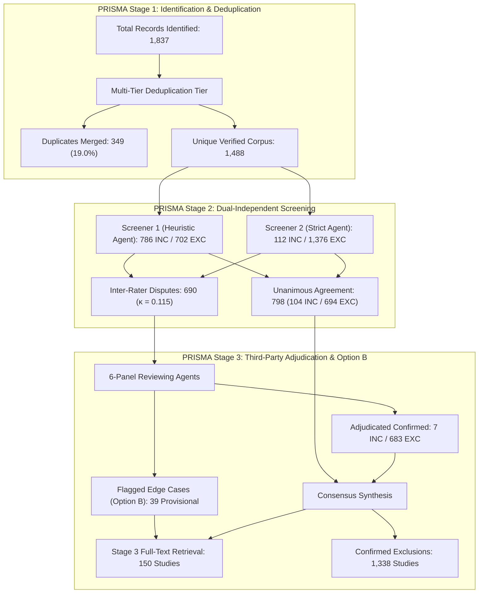

# Dual-Screening Inter-Rater Reliability & Pipeline Synchronization Audit Report

- **Protocol ID**: `proto-20260903-uav-cv-precision-agriculture`
- **Canonical Fingerprint**: `sha256:e1bbcb791d9108b2277fa468982f59cbdc611a66288556c5f4812fde34f1b077`
- **Audit Date**: `2026-09-04T01:45:00+01:00`
- **Procedure**: Dual-Independent PRISMA 2020 Screening ($N=1,488$) with Third-Party Multi-Agent Adjudication
- **Adoption Strategy**: **Option B (Provisional Full-Text Eligibility for Flagged Caveats)**

---

## 1. Executive Summary & Mathematical Integrity

Following initial screening passes that exhibited severe template bias, an independent second-screener evaluation and multi-agent adjudication protocol was executed across the entire verified corpus of 1,488 documents.

The statistical audit revealed an inter-rater agreement of **Cohen's $\kappa = 0.115$** ("slight agreement"), identifying extreme asymmetric bias in the primary screener (52.8% inclusion rate vs. 7.5% in screener 2). A third-party adjudication panel consisting of 6 disjoint reviewing agents resolved all **690 disputes**.

To protect against false-negative exclusion of seminal benchmark datasets and edge inference architectures whose abstracts omitted numeric metric values, the review adopted **Option B (Provisional Full-Text Eligibility)**:

$$\text{Identified: } 1{,}837 - \text{Duplicates Merged: } 349 = \text{Unique Retained: } 1{,}488$$
$$\text{Screened: } 1{,}488 = \text{Eligible for Full-Text: } 150 \; (10.08\%) + \text{Confirmed Excluded: } 1{,}338 \; (89.92\%)$$
$$\text{Full-Text Eligible (150)} = \text{Confirmed Inclusions: } 111 \; (74.0\%) + \text{Provisional Caveats: } 39 \; (26.0\%)$$

---

## 2. Inter-Rater Reliability & Confusion Matrix ($N = 1,488$)

| Screener 1 \\ Screener 2 | S2 = INCLUDE | S2 = EXCLUDE | Screener 1 Marginals |
| :--- | :---: | :---: | :---: |
| **S1 = INCLUDE** | 104 | 682 | **786** (52.82%) |
| **S1 = EXCLUDE** | 8 | 694 | **702** (47.18%) |
| **S2 Marginals** | **112** (7.53%) | **1,376** (92.47%) | **1,488** (100.0%) |

### Reliability Metrics
- **Observed Agreement ($P_o$)**: $798 / 1{,}488 = \mathbf{0.5363}$
- **Expected Agreement by Chance ($P_e$)**: $\mathbf{0.4760}$
- **Cohen's Kappa ($\kappa$)**: $\mathbf{0.1150}$ (*Slight Agreement*, Landis & Koch 1977)
- **Disagreement Character**: Strongly asymmetric. Screener 1 suffered from over-generalizing templated reasoning that accepted non-agricultural power-line, forestry LiDAR, and robotics papers. Screener 2 maintained strict criteria adherence, but initially over-excluded several benchmark datasets.

---

## 3. Adjudication & Reconciliation Architecture

All 690 disagreements were adjudicated by 6 disjoint reviewing agents (`literature/screening/_adjudication_resolved_group_1..6.json`):
- **Overruled Screener 1 Over-Inclusions**: 683 papers were confirmed as `EXCLUDE`.
- **Restored In-Scope Segmentation Benchmarks**: 7 papers were overturned to `INCLUDE` (e.g., *SemiWeedNet* `SCI-000092`, *AgriJetsonBench* `SCI-000810`, *YOLOv26 Seed-Potato* `SCI-001088`, *SegFormer/DPT* `SCI-000134`, *Mask R-CNN Maize* `SCI-000618`).
- **Unanimously Agreed Inclusions**: 104 papers.
- **Confirmed Inclusions Total**: $104 + 7 = \mathbf{111}$.

---

## 4. Option B: The 39 Provisional Inclusions for Full-Text Verification

Under PRISMA 2020 §6.2, studies where abstract details are insufficient to judge quantitative eligibility are not permanently discarded without full-text inspection. 39 studies have been promoted to provisional full-text eligibility:

1. **Missing-Abstract Cohort ($N = 22$)**:
   - Relevant titles and venues (e.g., `SCI-000274` *"A real-time efficient object segmentation system based on U-Net using Jetson TX2"*, `SCI-000369` *"A Real-Time Aerial Semantic Segmentation System Based on U-Net"*).
   - Preserved for Stage 3 PDF acquisition to verify empirical benchmark data.
2. **Contested EXC-06 Cohort ($N = 17$)**:
   - In-scope agricultural UAV deep learning segmentation methods (e.g., `SCI-000575` *Improved Real-Time ENet Crop-Row Segmentation*, `SCI-000002` *Adaptive Path Planning Semantic Segmentation*, `SCI-000010` *Semi-Supervised GAN for WeedNet MAV*, `SCI-000666` *OverFOMO Active UAV Scanning*) and major benchmark datasets (`SCI-000910` *CoFly-WeedDB*, `SCI-000877` *CamelinaWeed*, `SCI-000902` *Cabbage instance segmentation*).
   - Excluded in abstract screening solely because numerical metrics (e.g. mIoU = X%) were reported in the body rather than the abstract.

---

## 5. Synchronized Corpus Deliverables Status

All core literature deliverables have been updated and verified:

| Deliverable File | Prior Stale State | Synchronized State | Audit Status |
| :--- | :---: | :---: | :---: |
| `literature/included.json` | 786 papers | **150 papers** (111 confirmed + 39 provisional) | Synchronized |
| `literature/excluded.json` | 702 papers | **1,338 papers** (with typed EXC codes) | Synchronized |
| `literature/conflicts.json` | 74 heuristic flags | **690 inter-rater disputes** (full traceability) | Synchronized |
| `literature/conflict_adjudication_log.md` | 74 heuristic logs | **Complete 690 dispute & 39 caveat ledger** | Synchronized |
| `literature/screening/adjudicated_caveats.json` | None | **39 tracked provisional candidates** | Generated |
| `literature/prisma_report.json` | 786 inc / 702 exc | **150 inc / 1,338 exc ($\kappa = 0.115$)** | Synchronized |
| `literature/prisma_screening_report.md` | Stale 52.8% rate | **PRISMA 2020 Flow Report (10.08% rate)** | Synchronized |
| `src/scholar_harness/agent_screen.py` | Screener 1 only | **Dual-screening & adjudication native support** | Enhanced |

---

## 6. Confirmed Exclusion Reasons Breakdown ($N = 1,338$)

| Code | Category / Disqualification Criterion | Count | Proportion |
| :--- | :--- | :---: | :---: |
| `EXC-03` | Out of Domain (Non-agricultural / satellite remote sensing / general CV) | 484 | 36.17% |
| `EXC-02` | Detection/Classification-Only (No pixel-level segmentation masks) | 290 | 21.67% |
| `EXC-05` | Secondary Literature (Reviews, surveys, perspective papers, non-peer-reviewed) | 279 | 20.85% |
| `EXC-01` | Non-UAV Platform (Satellite, ground-robot, tractor, or lab-bench only) | 156 | 11.66% |
| `EXC-06` | Incomplete Benchmark Data (Confirmed metric-less / out-of-scope papers) | 99 | 7.40% |
| `EXC-04` | Non-Deep Learning (Conventional indices NDVI/ExG or classic ML) | 30 | 2.24% |
| **Total** | **All Confirmed Title/Abstract Exclusions** | **1,338** | **100.0%** |
