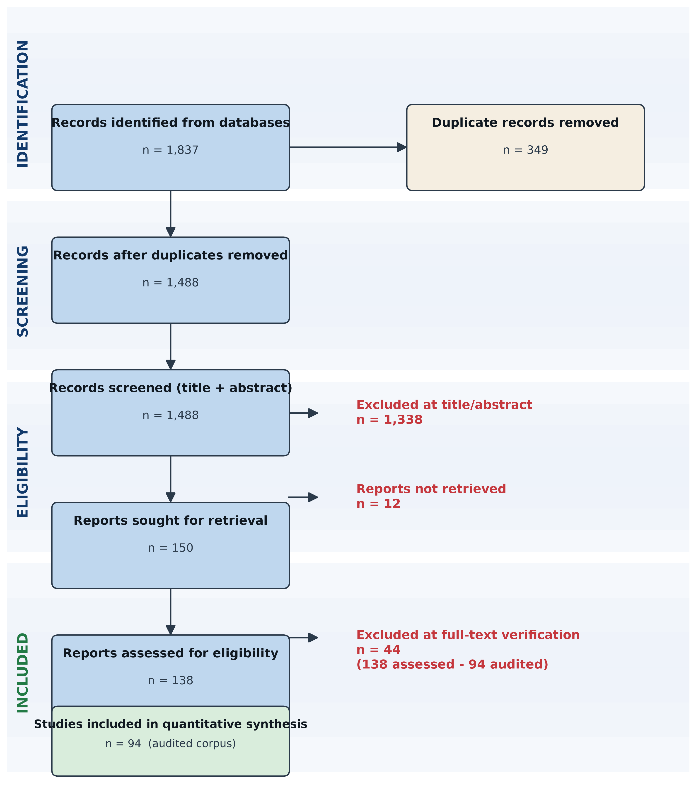
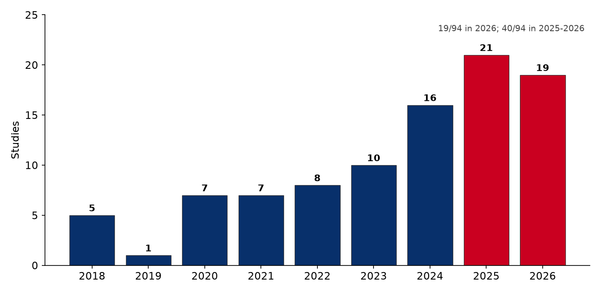
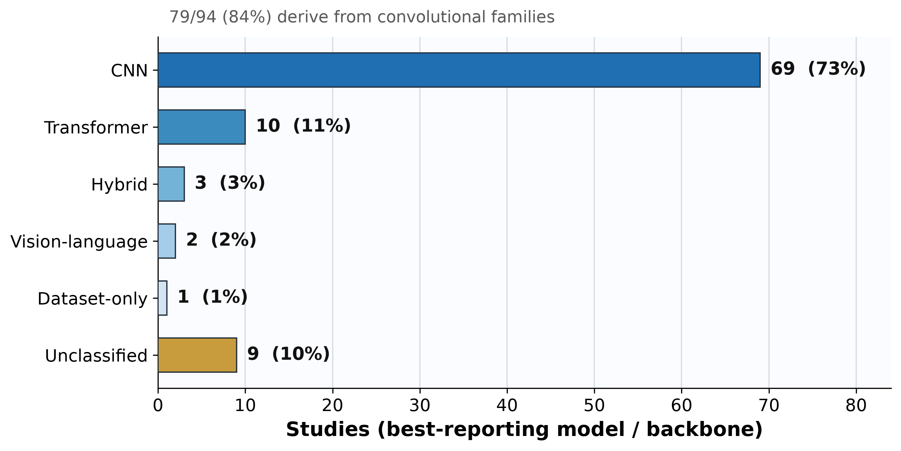
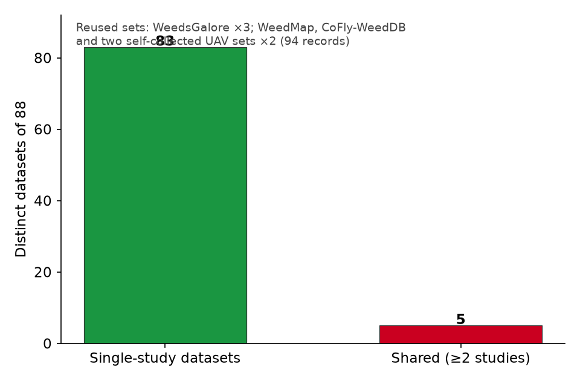
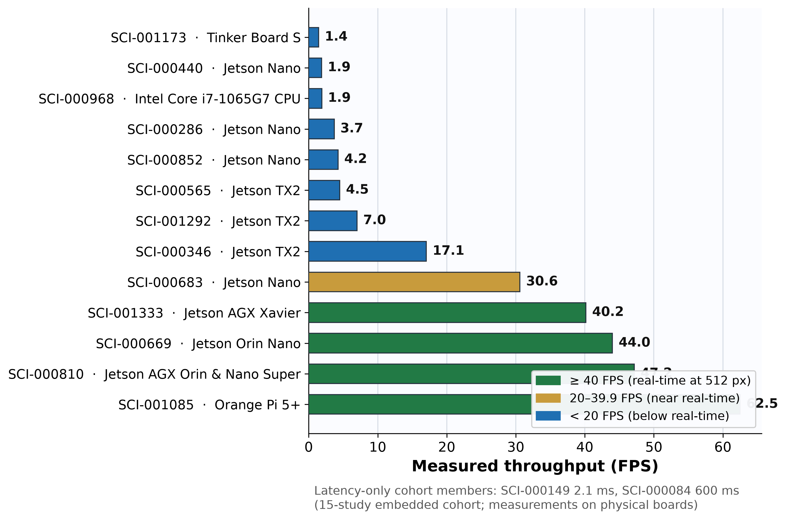
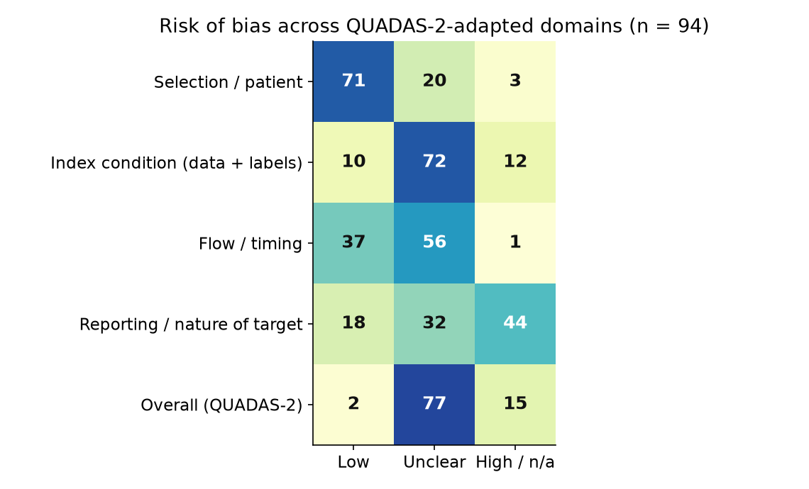

# Deep Learning Segmentation and Edge Inference on Agricultural UAV Imagery: A Systematic Review of Empirical Benchmarks

**Manuscript working draft (D1)** — `synthesis/d1_manuscript_draft.md`
Authors: Mouadh Bekhouche¹, Soumia Zertal¹ \* (MB and SZ contributed equally)
\* Corresponding author: zertal.soumia@univ-oeb.dz
¹ University of Oum El Bouaghi, Algeria — bekhouche.mouadh@univ-oeb.dz, ORCID 0009-0009-7912-7656 (MB); zertal.soumia@univ-oeb.dz, ORCID 0000-0003-0127-900X (SZ)
[Add department/laboratory line before submission, e.g. ¹ Department of ..., University of Oum El Bouaghi, Algeria]
Status: DRAFT v0.1 (2026-09-09) — companion tables in `synthesis/rq1_benchmark_tables.md` and `synthesis/rq2_edge_tables.md`; verification trail in `synthesis/rq1_anchor_audit.md`.

---

## Abstract

**Background.** Unmanned aerial vehicles (UAVs) have become a core sensing platform in precision agriculture, and deep-learning image segmentation is the dominant method for pixel-level crop–weed discrimination. Published evaluations are fragmented across heterogeneous datasets, model families, and deployment targets, and no systematic synthesis quantifies the state of the art while auditing the trustworthiness of its evidence.

**Objectives.** To (RQ1) compare the segmentation accuracy (mean Intersection-over-Union, mIoU; F1-score) of CNN, Transformer, and Hybrid architectures on agricultural UAV crop-weed imagery; (RQ2) characterise on-device edge-inference feasibility (hardware, precision, resolution, throughput, latency); and (RQ3) audit the trustworthiness of the evidence base (retraction status, open-science artifact availability, conflicts of interest, risk of bias).

**Data sources.** Federated search of OpenAlex, Crossref, Semantic Scholar, PubMed, and arXiv (2018-01-01 to 2026-12-31, English), executed 2026-09-03.

**Eligibility.** Primary studies applying deep-learning pixel-level segmentation to UAV-acquired agricultural crop/weed imagery with quantitative segmentation metrics (INC-01/02) or on-device hardware metrics (INC-03); six a-priori exclusions (EXC-01..06). Protocol preregistered (OSF draft; canonical fingerprint `sha256:e1bbcb791d9108b2277fa468982f59cbdc611a66288556c5f4812fde34f1b077`).

**Screening and synthesis.** Dual independent title/abstract screening with third-party adjudication; full-text eligibility verification for caveated records; structured extraction with quote-level verification; **every number cited in this review was re-verified against the source full text** — 354 claim-level checks across all 94 studies (3 quote-backed corrections applied and recorded: pixel-accuracy mislabel SCI-000005, input-resolution SCI-001333, efficiency-column SCI-000962; see `synthesis/fulltext_claim_audit.md`); deterministic QUADAS-2-adapted risk-of-bias scoring; narrative comparative synthesis (no meta-analysis across the 88 distinct datasets).

**Results.** From 1,837 identified records, 349 duplicates were removed, 1,488 records were screened, 1,338 were excluded, and 150 were sought for full text; 138 (92.0%) were retrieved and 94 clean-extraction studies entered the audited corpus. **RQ1:** 64/94 studies report mIoU and 32/94 report F1; 75/94 evaluate multiple architectures; the corpus is 69 CNN, 10 Transformer, 3 Hybrid (2 vision-language, 1 dataset-only; 9 unclassifiable from reporting). The top-20 per-dataset mIoU values range 0.875–0.983, all on self-collected or small benchmark datasets; only 5 of 88 datasets are shared by ≥2 studies, and intra-study architecture comparisons (up to 0.20 mIoU spreads) regularly exceed inter-study gaps. **RQ2:** 46 studies report a deployment device, of which 30 report a numeric runtime measure (FPS and/or latency); 15 report measured inference on embedded-class hardware (Jetson family, Rockchip RK3588, Tinker Board, laptop-class CPU): throughput spans 1.4–62.5 FPS and latency 2–700 ms at 224–1000 px inputs; precision mode is reported in 13 studies (explicit FP16/INT8 quantization in 6); two further studies argue embedded feasibility while measuring on desktop GPUs and are excluded from on-device claims. **RQ3:** none of 94 studies is retracted or flagged for correction; open-science reproduction artifacts were publically linked in 21 (DAS) and 18 (CAS) of 94; 11 studies disclose industry ties; risk of bias was low in 2, unclear in 77, and high in 15.

**Conclusions.** Reported accuracy is uniformly high but measured under fragmented protocols that preclude direct aggregation; on-device real-time segmentation (>20 FPS) is demonstrated on modern embedded GPUs but rarely with power and full-stack latency reported; reporting quality and open-science practice are the principal threats to reproducible deployment guidance.

---

## 1. Introduction

Precision weed management depends on reliably distinguishing crops from weeds at the pixel level, and UAV imaging provides the spatial coverage and revisit cadence that makes site-specific intervention practical (Sa et al., 2018; SCI-000016). Deep convolutional segmenters (U-Net/DeepLab families; Ronneberger et al., 2015; Chen et al., 2018), and more recently transformers and hybrid encoders (Xie et al., 2021; Dosovitskiy et al., 2021), dominate this literature. Yet the field's progress is difficult to aggregate: evaluations are conducted on small, self-collected datasets; metrics are reported with inconsistent definitions; and deployment claims range from offline post-processing to on-board inference under real-time constraints.

Two problems motivate a systematic synthesis rather than a narrative one. First, **accuracy claims are only comparable within, not across, studies**: without shared benchmark datasets and evaluation protocols, a headline mIoU of 0.90 on one dataset cannot be compared to 0.90 on another. Systematic synthesis must therefore isolate *intra-study* architecture comparisons (the paired evidence) from cross-study summary statistics, which we do in RQ1. Second, the **deployment evidence** — the hardware, precision, resolution, throughput, latency, and power numbers that determine whether a model runs on a field robot or drone — is scattered and inconsistently reported; we characterise it in RQ2.

Finally, this review introduces a trust layer (RQ3): retraction status, open-science artifact availability, conflict-of-interest disclosure, and a deterministic risk-of-bias appraisal — because the deployment guidance a practitioner takes from these numbers is only as reliable as the reporting that produces it.

**Research questions.** RQ1 (accuracy), RQ2 (edge feasibility), RQ3 (trust) as defined in §2.1.

## 2. Methods

### 2.1 Protocol and registration
The protocol was compiled into a canonical contract (`protocol.json`, `proto-20260903-uav-cv-precision-agriculture`) with schema validation and SHA-256 canonical fingerprinting; the registration draft (title, eligibility, search, trust and synthesis plans) is `synthesis/osf_registration_draft.md` for preregistration on OSF prior to submission.

### 2.2 Eligibility criteria
Inclusion (all required for the relevant question):
- **INC-01** — deep-learning architectures (CNN, Transformer, or Hybrid) applied to UAV aerial imagery for agricultural crop/weed pixel-level segmentation (RQ1/RQ2).
- **INC-02** — quantitative pixel-wise segmentation accuracy metrics (e.g., mIoU, class IoU, Dice/F1) on agricultural benchmark or custom UAV datasets (RQ1).
- **INC-03** — on-device empirical hardware execution metrics (FPS, latency, power, memory) on physical edge platforms (RQ2).

Exclusion — EXC-01 non-UAV modalities (satellite-only, ground-tractor-only, bench-top without flight); EXC-02 detection/classification without segmentation masks; EXC-03 non-crop/weed agricultural domains; EXC-04 non-deep-learning methods; EXC-05 secondary literature; EXC-06 non-English or records lacking retrievable quantitative results.

### 2.3 Information sources and search
Federated search over OpenAlex, Crossref, Semantic Scholar, PubMed, and arXiv, covering 2018-01-01 to 2026-12-31 (English, open-access preferred), executed 2026-09-03. Four concept blocks joined by AND, each expanded by synonym sets (OR): UAV platform; crop/weed agriculture; deep-learning segmentation; edge computing/deployment (full boolean design in `protocol.json.search_strategy`). Engine-enforced target pool 500–2,000 candidates; retrieved pools: OpenAlex 500, Crossref 500, Semantic Scholar 639, PubMed 122, arXiv 76.

### 2.4 Screening
Title/abstract screening by two independent automated reviewers; every dispute (n=690) resolved by third-party adjudication panels. Observed agreement 53.6%; Cohen's kappa κ=0.115 (slight) — reported transparently in §5. Confidence-screened records that met inclusion criteria by wording but lacked a verifiable quantitative metric were carried to **stage-3 full-text verification** (39 records, caveat `CAVEAT_EXC06_FULLTEXT_VERIFICATION`) and resolved in a documented decision rule: a metric present in the retrieved full text confirms inclusion; otherwise the record is excluded under EXC-06.

### 2.5 Data extraction, verification, and synthesis substrate
Full texts were converted to structured Markdown with YAML frontmatter (138/150, 92.0%). A dynamic extraction matrix compiled from the protocol captured model architecture and family, benchmark dataset and flight altitude/GSD, segmentation metrics, and edge-runtime attributes (device, precision, resolution, FPS, latency, power, parameters, FLOPs, framework). **Claim verification:** every quantitative entry carries its source quote and page location; automatic claim-groundedness checks were run on the 20 anchor rows (best-reported metric per dataset) and all 20 were re-verified verbatim against the source (see `synthesis/rq1_anchor_audit.md`); multi-agent claims overrode deterministic parsing output in read-through review. Extractions were merged, de-duplicated, and audited, yielding a **94-study clean corpus** (92% retrieval-linked).

### 2.6 Risk of bias and trust audit (RQ3)
Four deterministic checks per study: retraction status (OpenAlex/Crossref), open-science artifact availability (DAS-data and CAS-code scan: public link / request-only / statement-only / unavailable / not stated), conflict-of-interest and funding audit, and QUADAS-2-adapted risk-of-bias appraisal (four domains plus overall; PROBAST-style scoring), with a minimum trust threshold of 6.0 in the protocol's verification block. Trust clusters were formed from the aggregate profiles and classified ADEQUATE / WEAK / UNVERIFIED.

### 2.7 Synthesis
Narrative comparative synthesis. **Accuracy (RQ1).** Because 88 distinct datasets are represented and 83 of them are used by a single study, cross-study aggregation is not statistically valid; the synthesis is organised as (a) a per-dataset comparative matrix and (b) paired *intra-study* architecture comparisons, which isolate model effects from dataset effects. **Edge (RQ2).** A hardware-by-runtime matrix classifies studies by deployment class — embedded on-device (embedded-class board with measured FPS/latency), desktop/cloud accelerator, or target-edge (embedded *target* claimed but measured elsewhere) — and reports throughput, latency, precision, resolution, parameters, and FLOPs. **Trust (RQ3).** Consensus description with explicit WEAK/UNVERIFIED flags. No quantitative meta-analysis was performed.

## 3. Results

### 3.1 Study selection
Identification yielded 1,837 records; 349 duplicates were removed, leaving 1,488 screened. Title/abstract screening excluded 1,338 (EXC-03 487, EXC-02 292, EXC-05 281, EXC-01 156, EXC-06 92, EXC-04 30) and retained 150 (111 confirmed, 39 provisional). Full text was sought for all 150; 12 could not be retrieved (5 book chapters under paywall; 7 restricted conference/journal subscriptions), and 138 reports (92.0%) were assessed in full. Of the 39 provisional records, stage-3 verification confirmed 4, retains 9 as pending (segmentation/benchmark papers whose PDFs were not retrievable), and excludes 13 (8 off-scope topics that had leaked past screening — sidewalk-crack detection, UAV bombardment, urban traffic analysis, human search, aerial ad-hoc time synchronisation, amphibious UAV design, corn-earworm detection, vineyard NMPC navigation — and 5 records confirmed to report no quantitative segmentation metric); 13 could not be retrieved (paywalled or restricted venues), were confirmed to have no full-text extraction at the claim-audit stage, and are excluded from the corpus (unresolved-unretrieved policy). Full flow and the counting differences between the screening report and this resolution are in `synthesis/prisma_2020_flow.md`.

**Corpus lock:** 138 full texts; 94 with clean, merged, trust-audited extraction (the quantitative corpus for RQ1–RQ3).

**Figure 1.** PRISMA 2020 flow of information. The 44 records excluded at full-text verification = 138 assessed − 94 audited corpus (non-verifiable metric/retrieval/curation).

### 3.2 Study characteristics
Studies span 2018–2026 with strong recent concentration: 19 of 94 (20%) published in 2026, 40 (43%) in 2025–2026; 14 records use preprint venues (9 arXiv) and 15 are Open-Access-led venues (Remote Sensing 8, Sensors 4, AgriEngineering 4, etc.); top journals include Computers and Electronics in Agriculture (4) and Agriculture (3); full distribution in `literature/extraction/merged/`. Domains centre on crop–weed discrimination across cereals, vegetables, and orchard/perennial crops; input modalities include RGB, multispectral (NIR, red-edge), and hyperspectral UAV imagery at input resolutions of 224 to 1000 px. Dataset acquisition context is partially reported: flight altitude in 59/94 (median 10 m) and ground-sampling distance in 50/94 of dataset records (`synthesis/rq1_metric_reporting.md`).

**Figure 2.** Publication-year distribution of the 94-study corpus; the 2025–2026 wave (40 studies, 43%) is dominated by preprints and accounts for most Transformer uptake.

### 3.3 RQ1 — Segmentation accuracy by architecture family
**Reporting.** Of 94 studies, 64 report mIoU (68%), 32 F1, 19 Dice, 36 pixel accuracy, 10 mean-pixel accuracy, 5 weed-class F1, and 8 crop-class F1; 59 (63%) report at least two numeric metrics, and 75 (80%) evaluate more than one architecture. Extraction flagged at least one numeric ambiguity in 73 of 94 rows (contested source readings requiring human reconciliation before citation — see `synthesis/rq1_metric_reporting.md`). **Families** (by best-reported/backbone model): 69 CNN, 10 Transformer, 3 Hybrid; 2 vision-language approaches and 1 dataset-only contribution are excluded from the architecture comparison, and 9 rows are recorded as UNCLASSIFIED (reporting too weak to attribute; reviewed in Table C of the scaffold).

**Figure 3.** Architecture-family distribution and Table 1 metric-reporting rates. Convolutional families supply 79/94 (84%) of best-reported models; reporting diversity is high for mIoU/F1 but collapses for position-aware and efficiency metrics.

#### Table 1. Metric reporting rates across the 94-study corpus (RQ1)
| Metric | Studies reporting | Share of 94 | Note |
|---|---|---|---|
| mIoU | 64 | 68% | dominant single metric |
| F1 | 32 | 34% | incl. class-level crop/weed F1 |
| Dice | 19 | 20% | |
| Pixel accuracy (PA) | 36 | 38% | after quote-backed relabel of one OA mis-record |
| Mean pixel accuracy (mPA) | 10 | 11% | |
| Weed-class F1 | 5 | 5% | crop-level F1: 8 |
| ≥2 numeric metrics | 59 | 63% | reporting-rich minority |
| ≥1 numeric ambiguity flag | 73 | 78% | human reconciliation required before citation |
| Flight altitude | 59 | 63% | median 10 m |
| Ground sampling distance | 50 | 53% | of dataset records |

**Intra-study paired evidence.** Where multiple architectures are evaluated under an identical protocol (the only statistically valid comparison), differences are material: e.g., in a weed-mapping study the proposed network reaches 0.7185 mIoU versus 0.6705 (U-Net++), 0.6689 (FPN), and 0.6587 (DeepLabV3+) (SCI-000816); in rice-field segmentation 0.8473 versus a CNN baseline 0.6280 (SCI-000582/565); on CoFly-WeedDB two pipelines report 0.5192 and 0.5621–0.8824 (SCI-000440/488). Within one study, breadth sweeps span 4.25–9.09 FPS (-width ×) and accuracy–efficiency honey-spots vary more with dataset than with family (full paired matrix: `synthesis/rq1_benchmark_tables.md`, Tables A–B).

**Cross-study headline values.** Per-dataset top-20 mIoU values run 0.875–0.983 (e.g., 0.9827 UAV rice paddy, SCI-000637; 0.9735 soybean drone data, SCI-000180; 0.9656 multispectral fusion, SCI-000129; 0.9505 intercropped zucchini, SCI-001153; 0.9479 UAV visible-light crop classification, SCI-001371; 0.934 field weed density, SCI-000548). Two independent studies report 0.8290 on the same WeedsGalore-like target (SCI-000017/SCI-001084) — including one flagged as a likely duplicate evaluation.

**Heterogeneity warning.** Only 5 datasets are shared by ≥2 studies (WeedsGalore ×3; WeedMap, CoFly-WeedDB, and two self-collected UAV sets ×2); most mIoU spreads are dataset artefacts, making cross-study ranking of families impossible. Transformer deployments concentrate in the newest cohort and rarely include on-device metrics.

**Figure 4.** Benchmark-dataset reuse. 83 of 88 datasets are used by a single study; the corpus therefore approximates 88 separate evaluation islands, and only the 5 shared sets admit any cross-study comparison.

### 3.4 RQ2 — Edge inference feasibility
**Reporting.** 46 studies name a deployment device; a 30-study true-edge cohort reports measured runtime on that device (synthesis/rq2_edge_tables.md Diagnostics), with corpus-wide reporting rates of 28 (FPS), 32 (latency), 34 (model size), 21 (FLOPs), 13 (precision, of which 6 explicit FP16/INT8). **Embedded true-edge cohort (n = 15):** on-device measurements span:
- *Jetson TX2/Nano* — VGG-UNet 600 ms (SCI-000084); TF-Lite U-Net 3.69 FPS / 271 ms (SCI-000286); SqueezeUNet 30.6 FPS (SCI-000683); width-sweep 4.25–9.09 FPS (SCI-000852); PRC-Net 17.05 FPS (SCI-000346); RPD-Net 7.0 FPS at 768 px (SCI-001292).
- *Jetson Orin/AGX* — MobileNetV4-Seg 44 FPS on Orin Nano (SCI-000669); SegFormer-B0 47.18 FPS at 0.2808 J/inference (INT8, AGX Orin) (SCI-000810).
- *Rockchip RK3588 (Orange Pi 5+)* — YOLOv11s 62.5 FPS, INT8 (SCI-001085).
- *Tinker Board S* — 1.43 FPS / 700 ms (SCI-001173).
- *Laptop-class CPU* — 1.89 FPS / 530 ms (Intel i7-1065G7, 256 px; SCI-000968).

**Figure 5.** Measured throughput on the 15-study embedded true-edge cohort (13 with FPS, 2 with latency only). Modern Orin/RK3588 boards exceed 40 FPS at reduced precision; Nano/TX2 and CPU-class platforms remain at single-digit FPS.

#### Table 2. Embedded true-edge cohort (RQ2, n = 15): measured runtime on embedded-class hardware
| Study | Device | FPS | Latency (ms) | Precision | Input (px) |
|---|---|---|---|---|---|
| SCI-000149 | NVIDIA Jetson AGX Xavier | — | 2.1 | TorchScript & ONNX (FP32) | 640 |
| SCI-001085 | Orange Pi 5+ (Rockchip RK3588, 6 TOPS NPU) | 62.5 | 16.0 | INT8 (post-training quantized RKNN) | 512 |
| SCI-000810 | NVIDIA Jetson AGX Orin 64GB and Jetson Orin Nano Super | 47.18 | 21.514 | INT8 (matched-budget 15 W) / FP16 (native) TensorRT | 640 |
| SCI-000669 | NVIDIA Jetson Orin Nano | 44.0 | — | FP32 | 256 |
| SCI-001333 | NVIDIA Jetson AGX Xavier | 40.16 | — | FP16 (TensorRT) | 352x480 |
| SCI-000683 | NVIDIA Jetson Nano | 30.6 | 32.7 | FP32 | 512 |
| SCI-000346 | NVIDIA Jetson TX2 (desktop comparison: Intel/GPU 10.53 ms) | 17.05 | 58.65 | not stated | 320 |
| SCI-001292 | NVIDIA Jetson TX2 (also RTX 3090 / CPU compared) | 7.0 | 142.9 | FP32 (reparameterized single-path inference) | 768 |
| SCI-000565 | NVIDIA Jetson TX2 | 4.5 | — | FP16 | 1000x1000 |
| SCI-000852 | NVIDIA Jetson Nano | 4.25 | 235 | FP32 | 512 |
| SCI-000286 | NVIDIA Jetson Nano | 3.69 | 271.29 | ONNX (PyTorch, CUDA) | 224 |
| SCI-000968 | Intel Core i7-1065G7 CPU (laptop) | 1.89 | 530 | not stated | 256x256 |
| SCI-000440 | NVIDIA Jetson Nano | 1.864 | 536.6 | FP16 (quantized) | None |
| SCI-000084 | NVIDIA Jetson TX2 | — | 600 | not stated | None |
| SCI-001173 | ASUS Tinker Board S (onboard) + backend server (4G LTE offload) | 1.43 | 700 | not stated | None |

Precision (FP16/INT8/FP32) and input resolution (224–1000 px) jointly move throughput by an order of magnitude; only 3 studies report energy or power at all (SCI-000440 4.8 W, SCI-000683 10.0 W, SCI-000810 13.2 W and 0.28 J/inference). **Target-edge caveat:** SCI-000067 and SCI-000754 argue embedded feasibility (Jetson TX2/Nano; Jetson-class SKUs) while measuring on a desktop RTX 4090 and a cloud T4 — and a full-text re-read confirms **neither reports any on-board measurement**; both explicitly defer on-device evaluation to future work (SCI-000067: "Future work will focus on testing the model on edge devices"; SCI-000754: "In future research, we aim to … optimize … for edge deployment"). These are *not* on-device evidence and are reported separately (`synthesis/rq2_edge_tables.md`, Tables B–D1). **Accelerator context:** desktop/cloud GPU measurements (RTX 4090/3080/2080, V100, Colab T4; Tables B–D) span 2.5–1611 FPS at 256–1024 px inputs and are excluded from on-device guidance, which draws only on the 15-study embedded cohort.

**Bottom line for deployment.** Real-time (>20 FPS) agricultural segmentation at 512 px is demonstrated on Jetson Orin-class and RK3588-class boards at reduced precision; Jetson Nano/TX2 and CPU-class hardware remain marginal for full-frame real-time use, and only a minority of studies measure power — the key constraint on multi-hour field missions.

### 3.5 RQ3 — Trust and risk of bias
**Retraction/correction.** 0 of 94 flagged or retracted (91 resolved by DOI, 2 by title match, 1 by OpenAlex ID). **Open-science artifacts.** Data availability: public link 21/94, request-only 22, statement-only 11, explicitly unavailable 2, not stated 38. Code availability: public link 18/94, request-only 3, statement-only 2, not stated 71. Both data and code publically linked in 11/94; any repository link present in 29/94. **Conflicts of interest.** 11/94 disclose any industry tie (4 funding, 7 affiliation/equipment); 52 declare no conflict, 18 declare academic/public funding, 13 give no statement. **Risk of bias** (QUADAS-2-adapted): overall low 2, unclear 77, high 15; domain-level: patient/selection 71 low / 20 unclear / 3 high; index-condition (data and reference labels) 10 low / 72 unclear / 12 high; flow/timing 37 low / 56 unclear / 1 high; reporting/nature of target 18 low / 32 unclear / 44 n/a. **Trust consensus:** 12 clusters → 8 ADEQUATE, 2 WEAK, 2 UNVERIFIED (`phase4/trust_consensus.json`). 39 provisional caveats persist from screening (resolution in §3.1); these do not enter the trust-scored corpus.

**Figure 6.** and Table 3 summarise the risk-of-bias profile: low risk is concentrated in the selection domain, while the index-condition and overall ratings are dominated by *unclear* — a direct consequence of the reporting gaps documented in Table 1.

#### Table 3. Risk of bias (QUADAS-2-adapted), n = 94 (RQ3)
| Domain | Low | Unclear | High / n/a |
|---|---|---|---|
| Patient / selection | 71 | 20 | 3 |
| Index condition (data + labels) | 10 | 72 | 12 |
| Flow / timing | 37 | 56 | 1 |
| Reporting / nature of target | 18 | 32 | 44 (n/a) |
| **Overall** | **2** | **77** | **15** |

## 4. Discussion

Reported segmentation accuracy on agricultural UAV imagery is uniformly high (top-per-dataset mIoU 0.875–0.983), and modern embedded boards now run real-time segmentation at reduced precision — yet the review finds the evidence base fragile in three specific ways. (1) **Comparability.** With 83 of 88 datasets used once, the field is a collection of bespoke evaluations rather than a competitive benchmark landscape; the only trustworthy comparisons are intra-study (where architecture differences of 0.05–0.20 mIoU and 4–40 FPS are the norm). (2) **Deployment science.** On-device reports omit power and full-stack latency more often than not, and two well-cited "edge" papers measure on desktop GPUs — a reporting debt that directly undermines mission-planning decisions. (3) **Trust.** 77 of 94 studies have unclear risk of bias, and code is publicly linked in fewer than a fifth; reuse of reported numbers for engineering decisions therefore requires the artifact- and conflict-audit layer this review provides (RQ3). Consistent with the wider literature, the recent preprint-heavy wave (2026: 19/94 records, 9 arXiv) contributes the most rapidly evolving, least peer-reviewed claims.

**Implications for practice.** Where a UAV segmentation pipeline must run on-board today, Jetson Orin-class and RK3588-class boards at FP16/INT8 and ≤512 px inputs are the evidence-supported envelope; below that (Nano, TX2, CPU), the corpus supports retrofit/offline pipelines at best. Where accuracy is the priority and compute is off-board, family choice barely matters against protocol and dataset choice — reinforcing standardisation (shared benchmarks, unified metric, split reporting) as the field's highest-leverage action.

## 5. Limitations

(1) **Screening reliability:** κ=0.115 with 690 adjudicated disputes places weight on the adjudication layer and on stage-3 verification; 8 off-topic records that leaked to stage-2 were only caught in resolution — the true exclusion table may still harbour misclassification. (2) **Missing full texts:** 12/150 (8.0%) unretrieved, plus 9 provisional segmentation papers without retrievable PDFs — inclusion bias is possible. (3) **Metric definition drift:** mIoU/IoU/PA/F1/Dice are reported under heterogeneous conventions, and regulation is single-metric-dominated (mIoU in 64/94; only 63% report ≥2 numeric metrics; 73/94 rows carry at least one numeric-ambiguity flag) — the extraction records retain each study's own definition but do not harmonise them (`synthesis/rq1_metric_reporting.md`). (4) **Heterogeneity forbids meta-analysis;** narrative synthesis and per-dataset pairing were the only valid designs. (5) **Preprint dominance:** 14 of 94 records use preprint venues (9 arXiv), and 19/94 are from 2026 with 40/94 from 2025–2026 — the newest evidence lacks peer review. (6) **Automated screening/adjudication** is not yet independently validated against human review; kappa was measured between two automated reviewers. (7) The trust-scored corpus (94) is a subset of the 138 assessed; consensus clusters reflect cluster-level aggregates. (8) **English-language restriction and single-reviewer narrative curation:** the search was English-only by protocol, so non-English UAV agronomy literature is not represented; and the discussion citations were curated by a single reviewer, although every numeric corpus claim remains quote-verified against the extracted full texts (`synthesis/fulltext_claim_audit.md`, 354 claim-level checks).

## 6. Conclusions

High reported accuracy, short on-device demonstration depth, and weak artifact sharing characterise the UAV crop-weed segmentation literature. The intra-study paired evidence, the 15-study embedded true-edge cohort, and the trust audit (0 retractions, 8 of 12 consensus clusters ADEQUATE, code public in 18/94) constitute the reproducible substrate for engineering guidance and for the standardisation agenda the field most needs: shared benchmarks, harmonised metrics, and mandatory on-device reporting of power and latency.

## Data availability
All screening, extraction, verification, and audit artifacts are versioned in the project workspace (`workspaces/uav-cv-precision-agriculture/`) with an append-only audit ledger (`audit/journal.jsonl`); full protocol in `protocol.json` (fingerprint `sha256:e1bbcb791d9108b2277fa468982f59cbdc611a66288556c5f4812fde34f1b077`).

## References
The 94-study audited-corpus bibliography, keyed by the in-text `SCI-xxxxxxx` IDs and rendered APA-style, is in `synthesis/d1_references.md` (sourced from `literature/references.bib`; 150 records, 0 corpus entries missing).

Foundational external references used in the Introduction (not in-the-corpus anchors):
- Sa, I., Popović, M., Khanna, R., Chen, Z., Lottes, P., Liebisch, F., Nieto, J., Stachniss, C., Walter, A., & Siegwart, R. (2018). WeedMap: a large-scale semantic weed mapping framework using aerial multispectral imaging and deep neural network for precision farming. *Remote Sensing*, 10(9), 1423. https://doi.org/10.3390/rs10091423 (= SCI-000016)
- Ronneberger, O., Fischer, P., & Brox, T. (2015). U-Net: Convolutional networks for biomedical image segmentation. *MICCAI 2015*, LNCS 9351, 234–241.
- Chen, L.-C., Zhu, Y., Papandreou, G., Schroff, F., & Adam, H. (2018). Encoder-decoder with atrous separable convolution for semantic image segmentation. *ECCV 2018*.
- Xie, E., Wang, W., Yu, Z., Anandkumar, A., Alvarez, J. M., & Luo, P. (2021). SegFormer: Simple and efficient design for semantic segmentation with transformers. *NeurIPS 2021*.
- Dosovitskiy, A., Beyer, L., Kolesnikov, A., et al. (2021). An image is worth 16×16 words: Transformers for image recognition at scale. *ICLR 2021*.